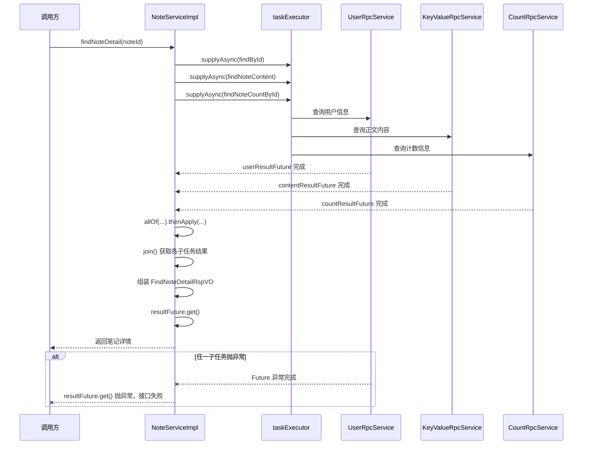

<!-- Auto merged from interview-helper-lite/md. Do not edit this file directly unless you know what you are doing. -->

# AI Coding

> 整理顺序：协作流程 \-\> 验证验收 \-\> 完成标准 \-\> AI 局限 \-\> MCP / Skills \-\> OpenClaw
> 
> 


## Cursor类编程工具和网页版AI的本质区别？除了读写项目文件，还有哪些区别？

## 使用 Cursor / Claude Code / Codex 等 AI 开发项目时，一般流程是什么？

`先让 AI 充分理解上下文，再让它小步实现，再通过人工 review 和自动化验证把结果关进工程闭环里。`

1. 先明确需求和验收标准：先把任务说清楚：要做什么、技术栈是什么、不能改哪些东西、完成后怎么验收。

2. 让 AI 理解上下文：让 AI 查看目录结构、核心文件、命名规范。

3. 制定实现方案：让 AI 先给方案，再开始改代码。**方案应该包括**：涉及哪些文件；是否影响旧逻辑；如何验证；

4. 小步实现、小步验证：一轮只改一类问题，每轮改动后都做编译、测试。出问题方便回滚。

5. 人工 Review：检查AI写的代码有没有满足需求，有没有破坏原有接口，有没有破坏代码风格和命名规范。

## 如何验证 AI 产出是否符合要求？

- 首先对照需求，确认功能点是否全部覆盖到了。

- 然后阅读核心代码，重点检查条件分支、数据处理、异常处理。

- 然后进行单元测试、集成测试和回归测试来验证结果。

- 然后人工进行一个 Code Review，看代码是否规范，以及是否具备可维护性。

- 还要看交付物是否完整，如果是修 Bug，需要有问题原因、修复方案和验证结果；如果是开发功能，需要有代码实现、测试用例和说明文档。

## AI 能否进行代码审查（CR）或者单元测试，集成测试的工作？

- 代码审查方面，AI 可以承担辅助 Review 的工作，比如检查代码规范、重复代码、空指针风险、异常处理、性能问题和一些安全风险。但最终是否合并代码，仍然需要开发人员结合业务逻辑、项目架构和上线风险来判断。

- 单元测试方面，AI 可以承担一些辅助工作，比如生成测试用例、编写 JUnit 测试、补充边界值和异常场景测试。但测试逻辑是否符合真实业务，还需要人工确认。

- 集成测试方面，AI 可以帮助设计测试场景、生成接口测试代码、准备测试数据，但集成测试依赖真实环境、数据库、中间件和外部接口，最终必须通过实际运行来验证。

## AI 目前的不足之处是什么？

- AI 对业务上下文理解仍然有限，还容易遗漏边界场景和异常场景；对项目架构和团队规范的理解有限，它可能会写出不符合项目规范的代码，短期能用，长期会影响项目可维护性。所以涉及业务规则是否正确、架构设计是否合理、是否可以合并上线等问题，仍然需要开发人员最终判断。

## **MCP 在实际开发中的作用是什么？**

- **补充上下文**：让 AI 看到真实项目资料，而不是只依赖用户手动复制。

- **连接工具链**：让 AI 能连接 Git、数据库、接口文档、日志等。

- **减少手动复制粘贴**：开发者不用反复把文件、错误日志、接口文档贴给 AI。

- **提升定位问题能力**：AI 可以结合代码、日志、报错、测试结果分析问题。 

## **Skills 在实际开发中的作用是什么？**

Skills 是一个包含 `SKILL.md` 的目录，里面可以附带脚本和参考资料；

Skills 在实际开发中解决的是 AI 执行任务时的**标准化**问题。比如团队希望 AI 每次写 Java 代码都遵守统一的分层结构、日志规范、测试要求和Bug 排查，就可以把这些规则沉淀成 Skill。

这样 AI 每次处理类似任务时，不需要写重复的提示词，而是自动加载对应 Skill，按照团队约定完成任务。

它的价值在于提高 AI 输出的一致性、可维护性和可复用性。

实际场景：

1. 测试生成

    - 根据 Service 方法生成单元测试

    - 根据接口生成 MockMvc / 集成测试

    - 根据业务场景补充边界用例，比如重复点赞、取消点赞、并发发布笔记

2. 代码审查

    - 检查事务边界是否合理

    - 检查 Redis 缓存一致性问题

    - 检查 MQ 消息是否可能重复消费、丢失、顺序错乱

    - 检查接口幂等性、参数校验、异常处理

## **MCP 和 Skills 的关系是什么？**

- 我理解 MCP 和 Skills 是互补关系。MCP 负责让 AI 连接真实工程环境，比如代码仓库、数据库、日志之类的系统；Skills 负责让 AI 按正确流程完成任务，它告诉 AI 面对某类任务时应该遵循什么步骤、标准和检查清单。

## **OpenClaw 是什么？主要作用是什么？**

- OpenClaw 是一个开源的个人 AI Agent 平台，可以部署在自己的设备或者服务器上，主要作用是把 AI 从普通的问答助手变成一个可以长期运行、能够执行任务的个人 AI 助手。可以操作 Telegram 这类聊天软件代替我们发信息，也可以处理邮件。

- 不过 OpenClaw 这类工具也有安全风险，因为它可能具备读文件、调用 API、执行命令的能力，所以实际使用时需要控制权限、做好沙箱隔离，并让高风险操作经过人工确认。

## Skill 的例子

- 测试：

1. 规范测试项目结构， 要求测试代码放在 `src/test/java`，并使用 Maven 标准结构。

2. 规范命名，测试类用 `Test` 后缀。

3. 让 AI 根据我的 Service 类的功能，来生成单元测试。

4. 让它注意一些常见的边界值。

https://github\.com/github/awesome\-copilot/blob/main/skills/java\-junit/SKILL\.md

它主要做 6 件事：

1. **规范测试项目结构**
 要求测试代码放在 `src/test/java`，并使用 Maven/Gradle 标准结构；测试依赖包括 `junit-jupiter-api`、`junit-jupiter-engine`、`junit-jupiter-params`，运行测试用 `mvn test` 或 `gradle test`。

2. **规范测试类和方法写法**
 测试类用 `Test` 后缀，例如 `UserServiceTest`；测试方法使用 `@Test`；整体遵循 AAA 模式，也就是 Arrange、Act、Assert；方法名建议写成 `methodName_should_expectedBehavior_when_scenario`。

3. **指导 AI 写普通单元测试**
 每个测试只关注一个行为，避免一个测试方法里测太多条件；测试之间要独立、可重复运行，不能互相依赖。

4. **指导 AI 写参数化测试**
 支持 `@ParameterizedTest`、`@ValueSource`、`@MethodSource`、`@CsvSource`、`@CsvFileSource`、`@EnumSource`，适合测试多个输入、边界值、枚举值等场景。

5. **规范断言和异常测试**
 使用 JUnit 5 的 `assertEquals`、`assertTrue`、`assertNotNull`、`assertThrows`、`assertDoesNotThrow`、`assertAll`，也建议可用 AssertJ 提高可读性。

6. **指导 Mock 和测试组织**
 建议使用 Mockito 的 `@Mock`、`@InjectMocks` 来隔离依赖；也支持 `@Nested`、`@Tag`、`@Disabled`、`@DisplayName` 等方式组织测试。

# JVM

> 整理顺序：高频基础 \-\> GC 核心 \-\> 调优排查 \-\> 进阶专题 \-\> 冷门补充
> 
> 

## **高频基础**


### **Java 是如何实现跨平台的？**

- **Java 源码**先通过 `javac` 编译成平台无关的**字节码**，也就是 `.class` 文件。

- 不同操作系统上都有**各自的 JVM**，JVM 可以把**字节码**翻译成当前平台能识别的**机器指令**。

- 所以只要目标平台有兼容的 JVM，java就可以“一次编译，到处运行”。

### **编译执行与解释执行的区别是什么？JVM 使用哪种方式？**

- **编译执行**是程序运行前先把**源码**整个翻译成**机器码**，运行时直接跑机器码，不用再翻译。

- **解释执行**是运行时逐行翻译逐行执行，不需要提前编译。**跨平台方便**，但每次执行都要重新翻译，效率差。

- HotSpot JVM 是混合模式。程序刚启动时，JVM用**解释器**逐条翻译字节码执行；跑着跑着发现某段代码特别热，**JIT 编译器**就介入把它**编译**成**本地机器码**缓存起来，后面再执行就直接跑机器码了。

### **JVM 由哪些部分组成？**

- **类加载器**：负责把 `.class` 文件加载到 JVM 中。

- **运行时数据区**：用于存放代码、变量这些数据。

- **执行引擎**：把 Java 的字节码变成机器能执行的指令。

- **本地方法接口**：调用 C/C\+\+ 等本地方法。


解释器：一行一行解释执行字节码。

JIT 即时编译器：把热点代码编译成本地机器码，提高执行效率。

垃圾回收器 GC：回收不再使用的对象内存。

### **JVM 的内存区域是如何划分的？**

- **堆**：线程共享，是最大的一块内存，所有 new 出来的对象和数组都放在堆上。

- **方法区**：线程共享，存类元信息、常量池、静态变量等。

- **虚拟机栈**：线程私有，每调用一个方法就压一个栈帧进去，方法执行完就弹出来。栈帧里装着局部变量表、操作数栈、动态链接、方法返回信息。

- **本地方法栈**：线程私有，服务的是 native 方法，也就是外部的 JNI 代码。

- **程序计数器**：线程私有，记录当前线程执行到哪条字节码指令。


### **Java 中堆和栈的区别是什么？**

- 堆是**线程共享**的。栈是**线程私有**的。

- 堆主要**存** new 出来的对象和数组。栈主要存**栈帧**、**局部变量**、方法调用的上下文。

- 堆的**生命周期**由 GC 管理。栈会在方法结束后自动出栈。

- 堆的**空间**较大，**速度**慢。栈的**空间**较小，**速度**快。

- 

- 为什么**栈快堆慢**：

- 栈在方法调用时**创建**栈帧，方法结束时直接**出栈**，本质上只是**移动栈顶指针**，成本很低。

- 而堆中的对象**大小不固定**、**生命周期**不固定，**分配时**需要查找合适空间，**释放时**需要判断对象是否仍然存活，还可能涉及 GC、内存碎片整理。

- 销毁机制：

1. 堆：当对象“失去所有引用”后，由垃圾回收器（GC）在未来的某个不确定时间销毁。

2. 栈：随着方法的结束自动出栈，里面存的变量自动销毁。

### **JVM 有哪几种情况会产生 OOM（内存溢出）？**

- **堆内存溢出：**`Java heap space`。对象太多，堆放不下。

- **GC 开销过大：**`GC overhead limit exceeded`。GC 一直回收但效果很差。

- **栈溢出：**常见是 `StackOverflowError`。调用链太深，比如无限递归。

- **元空间：**加载的类太多，类元信息放不下。

- **直接内存溢出：**比如 NIO 申请太多堆外内存。

- **操作系统线程：**创建线程太多。


### **什么是 Java 中的常量池？**

- 一层是 `class`文件常量池，存字面量和类名、方法名、字段名这些符号引用。

- 另一层是运行时常量池，类加载后会把 class 文件常量池信息放到方法区里。

### **你了解 Java 的类加载器吗？**

- 类加载器负责把 `.class` 文件加载到 JVM 中。

- 它最核心的两个职责：

1. 一是动态加载，程序运行时按需加载类，不会在编译期就把所有类都加载进来；

2. 二是隔离命名空间，不同类加载器加载的同名类互不干扰。

- 常见有**启动类**加载器、**扩展类**加载器、**应用类**加载器。

- Java 默认采用双亲委派模型。也就是先让父加载器尝试加载，父加载器加载不了，子加载器再自己加载。这样做的核心目的是**避免类重复加载**，同时保护核心类库不被随意**篡改**。

### **JVM 方法区是否会出现内存溢出？**

- 会。

- 比如动态生成大量类、频繁加载类又无法卸载，就可能把方法区或元空间撑满。

- 在 Java 8 之后，方法区的 HotSpot 实现主要对应元空间，常见报错是 `Metaspace OOM`。

### **什么是 Java 中的直接内存（堆外内存）？**

- 直接内存是 JVM 向操作系统申请的一块堆外内存，不走GC管理。

- 最大的好处是做 I/O 操作时能省掉一次数据拷贝，适合高性能 IO 场景。

- 风险是如果申请过多，也会导致 OOM，而且排查起来往往比堆内问题更绕。

### 内存泄露是什么，如何排查？

- 内存泄露就是程序向操作系统（或 JVM）申请了内存来使用，但是用完之后却没有归还，导致这块内存永远无法被再次使用。

1. C/C\+\+ 的泄露： 开发者手动 `malloc`/`new` 了一块内存，但忘记写 `free`/`delete` 了。导致内存无法回收。

2. Java 的泄露：Java 有垃圾回收器（GC），不用手动释放内存。但是如果有对象已经不用了，**还有强引用指向它**，GC 就不会回收这个对象。这就是 Java 中的内存泄露。

- 排查：

1. 第一步，确认是不是真的泄漏了。如果老年代使用量在每次 Full GC 后不降反升，一直往上涨，基本就是泄漏了。

2. 第二步，导出**堆快照**定位泄漏对象。用指令生成 dump 文件，然后用 MAT 打开。MAT 会自动给出一份报告，记录哪些对象占了大量内存、被谁引用着。

3. 第三步，顺着引用链找代码。在 MAT 里找到是哪个 static 变量或者哪个线程持有了这个对象。找到代码位置后，分析为什么这个对象没被释放，然后修复。

### **为什么 Java 8 移除了永久代（PermGen）并引入了元空间（Metaspace）？**

- 永久代是 HotSpot 的一种实现，不是 JVM 规范强制要求的。

- 永久代大小固定，比较容易因为类元数据过多而 OOM。

- Java 8 把类元数据放到本地内存里的元空间中，默认可以按需扩展。

- 这样做的好处是减少永久代 OOM 问题，也更便于和 JVM 规范解耦。（和堆放一起导致GC算法设计困难，不同的数据特性混在一起不好优化）


## **GC 核心**

### **你了解 Java 的 GC（Garbage Collector）吗？**

- GC 就是垃圾回收器，负责自动回收不再使用的对象内存。

- Java 通过 GC 把“手动释放内存”这件事交给虚拟机，降低内存管理出错概率。

- 但 GC 不是没有代价，它会带来额外** ****CPU 开销**和**停顿时间**。

### **Java 中有哪些垃圾回收算法？**

- **标记清除**：先遍历一遍，把有用的对象打个标记，然后把没标记的垃圾直接清掉，缺点是会产生内存碎片。

- **复制算法**：把内存一分为二，平时只用一半。回收的时候把活着的对象全部复制到另一半，然后把原来那一半直接清空。优点是快，缺点是浪费了一半的空间。

- **标记整理**：标记\-整理的做法是先标记，然后把所有活着的对象推到一端，最后把剩下的空间清空，代价是移动对象比较耗时。

### **Java 中如何判断对象是否是垃圾？不同实现方式有何区别？**

- 一般有两种思路：引用计数法和可达性分析。

- **引用计数法**给每个对象维护一个**计数器**，有地方引用它就加1，引用失效就减1，计数器归零就说明没人用了，可以回收。但是他无法解决**循环引用**的问题，两个对象互相引用对方，计数器永远不会归零。

- Java采用的是**可达性分析**。它从 GC Roots 出发，顺着引用链往下遍历，能遍历到的对象就是活的，遍历不到的就是垃圾。这种方法能**解决循环引用**的问题，但需要在GC时**花时间做遍历**。

- GC Roots 常见有：栈中引用、静态变量引用、本地方法栈引用等。

### **Java 中常见的垃圾收集器有哪些？**

1. `Serial`：单线程，适合小内存、小程序。

2. `Parallel`：多线程，追求吞吐量。

3. `CMS`：老年代并发收集，低停顿，老版本常见。

4. `G1`：目前服务端常用，分区回收，兼顾吞吐和停顿。

5. `ZGC / Shenandoah`：低延迟 GC，适合大内存场景。

### **Java 中的 Young GC、Old GC、Full GC 和 Mixed GC 的区别是什么？**

- Young GC 只回收新生代。

- Old GC 主要回收老年代。

- Full GC 一般是整个堆，很多时候还会连带方法区一起处理，停顿通常最重。

- Mixed GC 是 G1 的概念，表示回收新生代 \+ 一部分老年代 Region。

- 面试里要记住：Full GC 代价最大，排查时通常最关注它。

### **什么条件会触发 Java 的 Young GC？**

- 最常见的是 Eden 区空间不够，分配新对象失败。

- 也就是新对象分配时发现新生代装不下了，就会先来一次 Young GC。

- 如果 Young GC 后对象仍然放不下，或者晋升老年代也失败，可能进一步触发更重的 GC。

### **什么情况下会触发 Java 的 Full GC？**

- 老年代空间不足。

- 元空间不足。

- 大对象直接进入老年代时分配失败。

- `System.gc()` 可能触发 Full GC。

- CMS 的 `Concurrent Mode Failure`、晋升失败等异常情况也可能触发 Full GC。

- 所以 Full GC 不是单一条件，而是一类“更重回收”的兜底动作。

### **为什么 Java 的垃圾收集器将堆分为老年代和新生代？**

- 这是基于分代假说。

- 绝大多数对象朝生夕死，少数对象会长期存活。

- 所以把堆分代后，可以对新生代用复制算法快速回收，对老年代用更适合长寿命对象的算法处理。**比如**（）

- 这样能显著提高整体回收效率。

### **为什么 Java 新生代被划分为 S0、S1 和 Eden 区？**

- Eden 是对象主要的初始分配区。

- S0 和 S1 是两个 Survivor 区，用来在 Young GC 时复制存活对象。

- 这两个 Survivor 区交替使用，可以减少碎片，并记录对象年龄。

- 对象在 Survivor 区熬过多次 GC 后，再晋升到老年代。

### **什么是三色标记算法？**

- 三色标记是并发标记阶段常见的抽象模型。

- 白色表示还没被访问的对象，灰色表示已经访问到但它引用的对象还没扫描完，黑色表示自身和子引用都扫描完成。

- 并发标记时，核心就是维护三色不变性，避免把仍然存活的对象错标为垃圾。

- 写屏障、SATB、增量更新这些机制，都是为了解决这个问题。

### **Java 中的强引用、软引用、弱引用和虚引用分别是什么？**

- 强引用最常见，只要强引用还在，GC 一般不会回收对象。

- 软引用适合做内存敏感缓存，内存紧张时会被回收。

- 弱引用只要发生 GC，通常就会被回收。

- 虚引用拿不到对象本身，主要是为了在对象被回收时收到通知，常配合引用队列使用。

```Java
//弱引用代码：
import java.lang.ref.WeakReference;
// 1. 先 new 一个对象（暂且叫它本体）
Object data = new Object(); //强引用
// 2. 虚引用：用 WeakReference 把它包装起来（贴上便利贴）
WeakReference<Object> weakRef = new WeakReference<>(data);

// 2. 软引用：用 SoftReference 把它包装起来（发暂住证） 
SoftReference<byte[]> softRef = new SoftReference<>(bigImage);
// 3. 【极其关键的一步】把强引用（铁锁链）砍断！
data = null; 
// 此时，那个 Object 本体只剩下 weakRef 这一个弱引用指着它了。
// 只要此时触发一次 System.gc()，这个本体对象就会瞬间灰飞烟灭。
// 你可以通过 get() 方法尝试获取本体。如果 GC 还没发生，你能拿到；如果 GC 刚扫过，拿到的就是 null
Object survivor = weakRef.get();
```

### **JVM 垃圾回收调优的主要目标是什么？**

- 控制停顿时间。

- 提高吞吐量。

- 控制内存占用。

- 减少 Full GC 次数，提升系统稳定性。

- 面试里一般会说：调优没有绝对最优，核心是在吞吐、延迟和资源占用之间做平衡。

### **如何对 Java 的垃圾回收进行调优？**

- 先选合适的收集器，比如通用服务端多数场景先看 G1。

- 合理设置堆大小、年轻代大小、元空间大小。

- 结合 GC 日志看停顿时间、回收频率、晋升情况。

- 尽量减少大对象分配、长生命周期临时对象和频繁 Full GC。

- 真正调优要靠监控和日志，不能只靠背参数。

### 野指针是什么？

- **声明了但未被初始化**的指针。内部存放的地址值是该栈内存区域之前残留的随机二进制数据。

- （悬空指针）曾指向一块合法的已分配内存，但**该内存块被释放（通过 free 或 delete）后，指针变量本身没有被置为 NULL**。它依然保存着那块已经被收回的地址。

## **调优排查**


### **1\. 常用的 JVM 配置参数有哪些？**

- `-Xms`、`-Xmx`：初始堆和最大堆大小。

- `-Xss`：线程栈大小。

- `-XX:MetaspaceSize`、`-XX:MaxMetaspaceSize`：元空间相关。

- `-XX:+UseG1GC`：指定收集器。

- `-XX:MaxGCPauseMillis`：停顿时间目标。

- `-Xlog:gc*` 或老版本的 GC 日志参数：输出 GC 日志。

- `-XX:+HeapDumpOnOutOfMemoryError`：OOM 时自动 dump 堆。

### **2\. 你常用哪些工具来分析 JVM 性能？**

- `jps`：看 Java 进程。

- `jstat`：看 GC 和内存统计。

- `jmap`：导出堆 dump。

- `jstack`：看线程栈。

- `jcmd`：功能很全，很多 JVM 信息都能查。

- 可视化工具常见有 VisualVM、JConsole、Arthas、MAT。

- 真正线上排查一般是日志 \+ 命令行工具 \+ dump 分析结合。

### **3\. 如何在 Java 中进行内存泄漏分析？**

- 先看现象，比如堆持续上涨、Full GC 后也降不下来。

- 再导出堆 dump。

- 用 MAT 之类的工具看大对象、支配树、引用链、GC Roots。

- 核心是找“谁一直持有对象导致它不能被回收”。

- 常见泄漏点包括静态集合、缓存不清理、监听器没注销、ThreadLocal 没清理。

## **进阶专题**


### **1\. 什么是 Java 中的 JIT（Just\-In\-Time）？**

- JIT 就是即时编译。

- JVM 运行过程中会把热点方法、热点循环编译成机器码。

- 这样可以让热点代码跳过重复解释执行，提升运行效率。

- HotSpot 里常见有 C1、C2 两套编译器。

### **2\. JIT 编译后的代码存在哪？**

- 一般存放在 Code Cache，也就是代码缓存区。

- 这里放的是 JIT 编译后的本地机器码。

- 如果 Code Cache 太小，也可能影响 JIT 效果。

### **3\. 什么是 Java 的 AOT（Ahead\-Of\-Time）？**

- AOT 是预先编译，也就是在程序运行前就把代码编译成更接近机器执行的形式。

- 它和 JIT 最大的区别在于时机，一个是运行前，一个是运行时。

- AOT 的优点是启动更快，缺点是运行时动态优化空间通常不如 JIT 灵活。

### **4\. 你了解 Java 的逃逸分析吗？**

- 逃逸分析就是判断一个对象会不会逃出当前方法或当前线程。

- 如果对象不会逃逸，JVM 就可能做一些优化。

- 比如栈上分配、标量替换、锁消除。

- 它的核心价值是减少堆分配和锁开销，提高运行效率。

### **5\. Java 的 CMS 垃圾回收流程是怎样的？**

- 初始标记：Stop\-The\-World，标记和 GC Roots 直接关联的对象。

- 并发标记：和用户线程并发执行。

- 重新标记：修正并发标记期间的变更。

- 并发清除：清理垃圾对象。

- 它的优点是停顿较短，缺点是会产生碎片，而且对 CPU 资源更敏感。

### **6\. Java 的 G1 垃圾回收流程是怎样的？**

- G1 把堆划分成很多 Region。

- 常见流程包括初始标记、并发标记、重新标记、筛选回收。

- 日常运行时既会做 Young GC，也会做 Mixed GC。

- 它会优先回收收益高的 Region，目标是尽量在可控停顿时间内完成回收。

### **7\. Java G1 相对于 CMS 有哪些进步的地方？**

- G1 采用 Region 化设计，不再是传统固定的新生代和老年代连续布局。

- G1 支持 Mixed GC，能更平滑地处理老年代回收。

- G1 默认会做整理，碎片问题比 CMS 更轻。

- G1 更强调可预测停顿，适合面向服务端的通用场景。

### **8\. VM 垃圾回收时产生的 Concurrent Mode Failure 的原因是什么？**

- 这是 CMS 中的典型问题。

- 本质是 CMS 并发回收还没来得及完成，老年代就已经不够用了。

- 这时 JVM 只能退化成更重的 Full GC 兜底。

- 常见原因包括老年代增长太快、碎片太多、CMS 启动时机太晚。

## **冷门补充**


### **1\. JVM 的 TLAB（Thread\-Local Allocation Buffer）是什么？**

- TLAB 就是线程本地分配缓冲区。

- 它是 Eden 区划给每个线程的一小块私有空间，用来减少多线程分配对象时的锁竞争。

- 大多数小对象都可以优先在 TLAB 中快速分配。

- 所以 TLAB 的核心作用是提高对象分配效率。

### **2\. 什么是 Java 的 PLAB？**

- PLAB 是 Promotion Local Allocation Buffer。

- 它主要出现在 GC 复制和晋升阶段。

- 可以理解成 GC 线程在 Survivor 或老年代里用来暂存复制对象的小缓冲区。

- 它的目的和 TLAB 类似，也是为了减少并发复制时的竞争开销。

### **3\. JVM 新生代垃圾回收如何避免全堆扫描？**

- 关键靠记忆集和卡表。

- Young GC 时不会把整个老年代全扫一遍，而是只扫 GC Roots 和“老年代指向新生代”的那部分引用。

- 也就是通过记录跨代引用，避免全堆扫描，降低回收成本。

### **4\. Java 中的 CMS 和 G1 垃圾收集器如何维持并发的正确性？**

- 因为并发标记期间，用户线程还在改对象引用。

- 所以需要写屏障、重新标记、SATB 或增量更新等机制，保证标记结果最终正确。

- 本质上就是解决“边标记边修改引用”带来的漏标和错标问题。

### **5\. Java 的 CMS 垃圾收集器和 G1 垃圾收集器在记忆集的维护上有什么不同？**

- CMS 更依赖传统卡表这类跨代引用记录方式。

- G1 因为是 Region 化堆结构，所以它的记忆集是按 Region 维度维护的。

- 可以简单理解成：CMS 更偏传统分代收集思路，G1 的记忆集更细粒度、更适配 Region 模型。

### **6\. 为什么 G1 垃圾收集器不维护年轻代到老年代的记忆集？**

- 因为 Young GC 时，老年代本来就不是本轮主要回收目标。

- 真正需要重点记录的是老年代到年轻代的引用，否则年轻对象可能会被漏标。

- 反过来，年轻代到老年代的引用对 Young GC 的根扫描价值没那么大，所以没有必要专门维护这类记忆集。

### **7\. 什么是 Java 中的 logging write barrier？**

- 它是一种写屏障。

- 当程序修改对象引用时，不只是改内存，还会顺手把这次引用变更记录下来。

- 这些日志信息后续会被 GC 用来更新卡表、记忆集或辅助并发标记。

- 所以它的本质是“边写边记”，为并发 GC 提供正确的数据基础。

### **8\. 为什么 Java 中某些新生代和老年代的垃圾收集器不能组合使用？比如 ParNew 和 Parallel Old。**

- 因为不同收集器的设计目标、实现机制、数据结构和配套接口不一样。

- 不是所有新生代收集器都和所有老年代收集器天然兼容。

- 比如 ParNew 主要是为了和 CMS 配套，而 Parallel Scavenge 更常和 Parallel Old 配套。

- 本质上是实现层面没有支持，不是“理论上绝对不可能”。

### **9\. 为什么 Java 中 CMS 垃圾收集器在发生 Concurrent Mode Failure 时的 Full GC 是单线程的？**

- 因为 CMS 失败后的兜底方案 historically 是 Serial Old。

- Serial Old 是单线程的标记整理收集器。

- 所以一旦 CMS 并发回收失败，退化出来的 Full GC 停顿会很重，而且是单线程执行。

- 这也是 CMS 被逐步淘汰的重要原因之一。

### **10\. Java 里的对象在虚拟机里面是怎么存储的？**

- 一个对象通常由三部分组成：对象头、实例数据、对齐填充。

- 对象头里常见有 Mark Word、类型指针等信息。

- 实例数据就是这个对象真正的成员变量内容。

- 对齐填充主要是为了满足内存对齐要求。

- 至于对象引用，一般放在栈、堆里的其他对象字段，指向堆中的对象实例。

### **11\. 说说 Java 的执行流程？**

- 开发阶段先写 `.java` 源文件。

- `javac` 把源码编译成 `.class` 字节码。

- 程序运行时，类加载器把字节码加载进 JVM。

- 经过验证、准备、解析、初始化后，由执行引擎去执行。

- 执行时通常是“解释执行 \+ JIT 编译”混合模式，热点代码会被编译成机器码提高性能。

# Spring

## 什么是 Spring AOP？

- Spring AOP 是 Spring 中的**面向切面编程**。Spring AOP 可以把一些和**业务无关**、但很多地方都要用的**公共逻辑**抽取出来，统一处理。比如：日志记录、权限校验、事务管理、接口限流、性能监控、异常处理。

- Spring AOP 的思想：在不修改原业务代码的情况下，对方法进行增强。比如：

```Java
方法执行前：做权限校验
方法执行中：记录执行时间
方法执行后：记录日志
方法异常：统一异常处理
```

## Spring AOP 有哪些重要概念？

|概念|含义|
|---|---|
|切面 Aspect|公共逻辑的类，比如日志切面、权限切面|
|通知 Advice|具体增强逻辑，比如方法前执行、方法后执行|
|连接点 Join Point|可以被增强的位置，Spring AOP 中主要是方法|
|切点 Pointcut|指定哪些方法需要被增强|
|目标对象 Target|被增强的原始业务对象|
|代理对象 Proxy|Spring 生成的增强后的对象|

## Spring AOP 默认用的是什么动态代理，两者的区别？

- 如果目标类实现了接口，默认使用 **JDK 动态代理**。如果目标类没有实现接口，使用 **CGLIB 动态代理**。

- JDK 动态代理是基于**接口**实现的。它要求**目标类实现接口**，然后在**运行时**生成一个实现相同接口的**代理对象**。**调用方法**时，会先走代理对象，在代理对象里加一些增强逻辑，比如日志、事务、权限校验，然后再调用原来的目标方法。

- CGLIB 动态代理是基于**继承**实现的。它**不要求**目标类**实现**接口，而是在运行时生成**目标类的子类**。调用方法时，会先执行子类中的增强逻辑，然后再调用父类原来的方法。

## 什么是 Spring Bean?

Spring Bean就是被 Spring 容器管理的对象。普通 Java 对象 new 出来之后自己管理，Bean 对象是交给 Spring 容器去创建、装配、管理整个生命周期。

定义一个 Bean 最常见的方式：

```Java
// 方式一：组件扫描，加个注解就行
@Service
public class UserService {
    @Autowired
    private UserDao userDao;
}
// 方式二：Java 配置类，手动声明
@Configuration
public class AppConfig {
    @Bean
    public DataSource dataSource() {
        HikariDataSource ds = new HikariDataSource();
        ds.setJdbcUrl("jdbc:mysql://localhost:3306/test");
        return ds;
    }
}
```

## 什么是 Spring IOC（Inversion of Control）?

IOC 的核心就一句话：对象的创建和依赖关系由容器管理，而不是代码里自己 new。

传统写法里，A依赖B，就得在 A 的代码里 new 一个B出来，A 和 B 是绑定的。用了 IOC 之后，A 只声明"我需要一个B"，至于 B 怎么创建、什么时候创建、用哪个实现类，全交给 Spring 容器决定。容器在创建 A 的时候，发现它需要 B，就自动把 B 注入进去。

```Java
// 传统写法：A 自己控制 B 的创建，耦合死了
public class OrderService {
    private UserDao userDao = new UserDaoImpl(); // 写死实现类
}
// IOC 写法：A 只声明依赖，容器负责注入
@Service
public class OrderService {
    @Autowired
    private UserDao userDao; // 接口，具体用哪个实现由容器决定
}
```


## Spring IOC 有什么好处？

1. 实现了**代码的极致解耦**，组件之间依赖接口而不是具体实现；

2. **简化单元测试，**单元测试时直接注入 mock 对象，不用改被测类代码；

3. 由容器统一管理对象的**生命周期**；

4. IoC 也是 Spring 实现 **AOP 动态代理**的基础。

## 什么是 DI？

DI 就是依赖注入，是IoC控制反转的一种实现手段。核心思路是对象不再自己 new 依赖，而是把"我需要什么"告诉容器，容器负责把依赖塞进来。

## 什么是循环依赖？

循环依赖其实就是两个或多个Bean互相引用，形成了一个闭环。在 Spring 中，最典型的场景就是：

Spring正在创建Bean A,发现它依赖B,于是去创建B；结果创建B的时候，发现它又依赖A。

这里要分两种情况：

- 如果是构造器注入：这种是无解的，Spring会直接抛出 `BeanCurrentlyInCreationException` 错误，因为连对象实例都 new 不出来。

- 如果是 Setter 或字段注入：Spring 是可以通过三级缓存机制来解决的，就是先把半成品的 A 暴露出来给 B 用，但这属于框架的兜底策略。

- 构造器注入为什么解决不了：因为构造器执行时对象还没创建出来，连个内存地址都没有，压根没办法提前暴露给别的 Bean。而 setter 注入是先 new 出空对象，再填充属性，所以能把这个空壳子先暴露出去。

## **Spring 中循环依赖是怎么解决的？**

- 对单例 Bean，Spring 主要通过三级缓存解决。

1. 一级缓存放的都是完全初始化好、可以直接用的Bean。

2. 二级缓存放的是已经实例化\(new出来了\)，但还没填充属性的Bean。

3. 三级缓存放的不是Bean本身，而是一个能生产 Bean 的工厂（Lambda表达式）。

具体步骤：

- 当 A 依赖 B、B 又依赖 A 时，Spring 会先实例化一个 Bean，把它的早期引用暴露出去，另一个 Bean 就能先拿到这个半成品对象，后面再完成注入和初始化。

1. A new出来后（实例化），Spring 把一个**能获取 A 的工厂**放到三级缓存里。

2. A 开始填充属性，发现需要 B,就去创建 B。

3. B 也 new 出来，开始填充属性，发现需要 A。

4. B 找 A：B在三级缓存找到了 A，B 调用三级缓存里的工厂，拿到了 A 的引用（如果是代理对象，这里就会提前生成代理）。

5. B 把拿到的 A **放到二级缓存**，并把三级缓存里的**工厂删掉**（保证单例，只生产一次）。

6. B 拿到了 A，B 创建完成，入驻一级缓存。A 拿到 B，A 也创建完成，入驻一级缓存。

- 但这套机制主要针对单例的 setter 注入或字段注入。

- 如果是构造器循环依赖，Spring 一般解决不了，因为对象还没创建出来。

- 面试里如果继续追问，可以补一句：AOP 代理场景下，提前暴露的通常是代理对象或代理工厂产物。

## 为什么Spring循环依赖需要三级缓存，二级不够吗？

如果仅仅是为了解决循环依赖，二级缓存是够用的。只要我们在 Bean 实例化\(new\)之后，不管它需不需要 AOP，都直接把它的代理对象生成出来，放到二级缓存里，B 就可以拿到了。这样循环依赖就解了。

但这会带来一个问题：我们无法预知这个Bean到底会不会产生循环依赖。如果它没有循环依赖，但我们却提前给它创建了代理，这就打破了 Bean 的标准生命周期（本该最后创建代理，结果一开始就创建了）。

所以，Spring 引入了三级缓存\(singletonFactories\)，里面存的不是Bean,而是一个工厂\(Lambda表达式\)。

这其实是一种延迟加载：

1. A实例化后：我先把一个能创建A代理的工厂放到三级缓存，然后我就不管了，继续按正常流程走。

2. 如果没有循环依赖：这个工厂永远不会被调用，A就在生命周期的最后一步正常创建代理。完美！

3. 如果出现了循环依赖\(B需要A\)：B去三级缓存找，触发了那个工厂，这时候工厂才被迫提前把A的代理对象创建出来，给B用。

# MySQL

# ① 索引

### 1\. 为什么MySQL使用 B\+ 树作为索引结构而不是红黑树或者别的？

- 数据库索引的核心成本通常是磁盘读取，所以首先要减少 IO 次数。

- B\+ 树的层高低，几百万行数据通常也只需要 3 到 4 层，查询路径很短。

- 非叶子节点只存索引键（key）和子节点指针，不存整行数据，内存里能缓存更多索引。

- 叶子节点有序且通过双向链表连接，非常适合范围查询和排序。

- 红黑树是二叉树，每个节点最多两个子节点，数据量一大，树的高度会很高，内存数据库可以用红黑树，磁盘数据库必须用B\+树。

- 哈希O\(1\)查询，更适合纯等值查找，但是不支持范围查询和排序。

### 补充：一条 SQL 语句在 MySQL 中的执行流程是什么？

- 客户端先通过**连接器**建立连接，完成认证、权限校验和会话初始化。

- SQL 进入**分析器**，做词法分析和语法分析，生成语法树。

- 之后进入**优化器**，决定走哪个索引、表连接顺序、是否使用临时表，生成一个执行计划。

- 最后**执行器**按执行计划调用**存储引擎**接口，去 Buffer Pool 或磁盘中读写数据。

### 2\. B\+ 树和 B 树的区别？

|对比维度|B树|B\+树|
|---|---|---|
|**数据存储位置**|**所有节点**（非叶子节点和叶子节点）都存储实际数据。|**仅叶子节点**存储实际数据，非叶子节点只存索引键（Key）和字节点指针。|
|**单节点容量 \(Fan\-out\)**|较小（因为存了整行数据，占空间大）。<br>|**极大**（只存 Key 和指针，一个 16KB 的页能塞下上千个索引）。|
|**树的高度与 I/O**<br>|较高（单节点容量小导致树变高），磁盘 I/O 次数相对较多。|**更矮胖**（通常 3\~4 层即可支撑千万级数据），磁盘 I/O 次数极少。|
|**叶子节点是否有序连接**|无。各个叶子节点相互独立。|有。叶子节点之间通过**双向链表**紧密相连。|
|**范围查询性能 \(Range Query\)**|极差。需要进行繁琐的“树的中序遍历”，跨节点跳跃。|**极佳**。只需找到起始节点，顺着底层的链表直接向后扫描即可。|
|**查询耗时稳定性**|**波动较大**。如果运气好，在根节点就找到数据，直接返回；如果在叶子节点，则慢。|**极度稳定**。所有数据的获取都必须走到最底层的叶子节点，路径长度完全一致。|

### 补充：MySQL 的 BufferPool 和 Redis 有什么区别？（都用内存提速、都有 LRU 机制）

**要点一：定位与数据粒度不同（业务逻辑 vs 物理引擎）**

- **Redis 是“业务级缓存”：** 它面向业务，存储的是组装好的、结构化的业务数据（如 JSON 对象），取出来直接就能给前端用。

- **Buffer Pool 是“引擎级物理缓存”：** 它面向底层存储，以 16KB 的数据页和索引页为基本单位进行缓存。它对业务逻辑一无所知，本质上是在做磁盘数据块在内存中的搬运。

**要点二：开发者的掌控权不同（白盒 vs 黑盒）**

- **Redis 是高度可控的“白盒”：** 开发者可以在代码层面精确控制数据的生命周期，比如主动写入、设置过期时间（TTL）、主动删除等。

- **Buffer Pool 是对开发者透明的“黑盒”：** 我们无法用代码直接操作它，只能通过发送 SQL 语句，由 InnoDB 引擎根据内部算法去自动调度和淘汰。

**要点三：架构位置与性能上限不同（独立服务 vs 内部组件）**

- **Redis 是独立的 KV 高速服务：** 它的请求极其轻量，直接通过 Key 寻址拿 Value，没有繁重的解析包袱，能够扛住极高并发的洪峰（如秒杀场景）。

- **Buffer Pool 依然受限于 MySQL 的整体链路：** 即使查询 100% 命中了 Buffer Pool，这条请求依然要走完 MySQL 的网络传输、SQL 词法解析、优化器生成执行计划等完整流程，这些流程本身的性能损耗限制了它的并发上限。

### 3\. MySQL的索引类型有哪些？

从数据结构角度看，MySQL 支持这几种索引：

1. B\+ 树索引：最常用的，InnoDB 和 MyISAM 默认都用它。只在叶子节点存储整行数据，叶子节点用双向链表连接，既能快速定位单条记录，又能做范围查询。

2. 哈希索引：通过哈希函数直接算出数据位置， O\(1\) 查询，但不支持范围查询和排序。Memory 引擎默认用哈希索引。

3. 全文索引：把文本分词后建倒排索引，类似搜索引擎的原理。适合对 TEXT 类型字段做关键字搜索，比如文章内容检索。

4. 空间索引：基于 R 树实现，专门处理地理坐标这种多维数据，支持区域查询、距离计算。


从 InnoDB 存储方式看，分两类：

5. 聚簇索引：主键索引就是聚簇索引，叶子节点直接存完整的行数据，一张表只能有一个聚簇索引。

6. 非聚簇索引：也叫二级索引，叶子节点只存索引字段值和主键值。查完二级索引，还得拿着主键去聚簇索引里再查一遍，这个过程叫回表。


从索引性质看，有这几种：

7. 主键索引：唯一且非空，每张表只能有一个。InnoDB 里主键索引就是聚簇索引。

8. 唯一索引：保证列值不重复，但允许有 NULL，可以有多个 NULL。

9. 普通索引：没有唯一约束，纯粹为了加速查询。

10. **联合索引**：多列组合成一个索引，遵循最左前缀原则，列顺序很重要。

11. 全文索引：文本搜索用。

12. 空间索引：GIS 数据用。

### 4\. 什么是回表？什么是覆盖索引？

- InnoDB 的二级索引叶子节点里存的是索引列值和主键值，不存整行数据。

- 先走二级索引找到主键，再去聚簇索引中把整行数据查出来，这个过程就叫回表。

- 把需要查询的列都包含在二级索引里，就不需要再回到主键索引取完整数据，这就叫覆盖索引。

### 5\. MySQL索引的最左前缀匹配原则是什么？

- 就是在使用联合索引时，查询条件必须从索引的最左列开始匹配。联合索引包含多个列，查询时必须先有第一个列的条件，然后是第二个列，以此类推。

- 联合索引会按照定义顺序从左到右组织，例如 `(a, b, c)`。

- a相同再按b排序，b相同再按c排序。如果跳过a，后续的b，c是无序的，无法利用索引快速定位。

- 联合索引设计时，本质上就是围绕最左前缀原则来匹配高频 SQL。

### 6\. 什么情况下索引会失效？

- 联合索引没有满足最左前缀匹配原则时，索引可能失效。

- 对索引列做函数或者计算，优化器往往没法直接利用原索引。

- 使用 `like '%xxx'` 这种前置模糊匹配时，B\+ 树无法从左侧开始定位。

- `or` 条件一侧不能走索引时，优化器也可能放弃索引改走全表扫描。

- 数据量很小，也可能会出现“建了索引但没用”的情况。

- **查询时发生****隐式类型转换****，比如字符串和数字比较，也可能导致索引失效。**

**核心规则（避坑指南）：** MySQL 的转换规则是**“字符串转数字”**。

- **失效场景（VARCHAR 存，INT 查）：** 如果索引列是 `VARCHAR`，查询条件传的是数字，隐式转换会作用在索引列上，**必然导致索引失效**。

- **生效场景（INT 存，VARCHAR 查）：** 如果索引列是数字，查询条件传的是字符串，隐式转换作用在查询条件的值上，索引列保持纯粹，**索引依然有效**。


### 7\. 如何设计联合索引的字段顺序？

- 一般把等值匹配字段放前面，把范围查询字段放后面，因为范围条件往往会截断后续利用。

- 区分度强的字段通常更适合放前面。

- 查询频率高的列放前面。保证高频查询能命中索引。

- 利用覆盖索引。如果查询只需要几个固定字段，把这些字段都放进联合索引，能避免回表。

### 8\. 什么是索引下推？

- 是 MySQL 5\.6 引入的一项查询优化技术。它的核心思想是：将本该由 **Server 层**执行的部分 `WHERE` 过滤条件，“下推”给**存储引擎层**去提前执行，从而大幅减少无效的“回表”操作和 Server 层的判断开销。

- **没有索引下推时：**存储引擎只负责在二级索引中匹配部分条件，一查到对应的主键 ID，就**无脑执行“回表”**，去聚簇索引捞出完整数据行。完整数据交给 Server 层后，由 Server 层在内存里用剩下的 `WHERE` 条件进行判断，不符合的直接丢弃。

### 9\. 索引建得越多越好吗？为什么？

- 从时间上看，每次INSERT、UPDATE、DELETE都要同步更新索引。插入或删除一条数据，主键索引要改，如果某个字段还建了二级索引也要改，还可能触发页分裂，页合并。

- 从空间上看，每个索引都维护一个 B\+树，索引一多，磁盘和内存占用飙升，导致 BufferPool 里缓存的**热数据变少**（数据页被索引页挤占空间）。

- 索引太多还会增加优化器的选择成本，索引越多可选项越多，优化器耗时越长。

### 10\.在什么情况下，不推荐为数据库建立索引？

- 数据量小的表。几百上干条数据，全表扫描比走索引还快，B\+树查找、回表这些开销加起来不划算。

- 写多读少的表。每次INSERT、UPDATE、DELETE都要同步更新索引，插入或删除一条数据，主键索引要改，如果某个字段还建了二级索引也要改，还可能触发页分裂，页合并。写密集场景，索引拖慢写入速度，得不偿失。

- 区分度低的字段。性别字段就男女两个值，索引过滤不掉多少数据，还得回表，优化器大概率会选择全表扫描。

- 查询不走的字段。某个字段从来没在WHERE、ORDER BY条件里出现过，建了索引就是白白占磁盘空间。

- 长文本字段。TEXT、BLOB这种大字段，索引 key 长度受限，只能建前缀索引，查询效果差。而且大字段存储本身就分散在额外的页里，随机l/O开销大。这类数据有搜索需求应该放 Elasticsearch。

### 11\. **慢 SQL 一般怎么排查（SQL调优）？**

- 第一步看慢日志，确定到底是哪些 SQL 慢。

- 第二步用 \`EXPLAIN\` 看执行计划，重点看是否走索引、扫描行数、是否回表、是否出现临时表和文件排序。

- 第三步看 SQL 写法本身，有没有函数操作、隐式转换、分页过深、\`select \*\` 等问题。

- 第四步看索引设计是否匹配查询条件和排序条件。

- 第五步再看数据分布、热点行、锁等待这些运行态问题。

### 12\. 连表查询中左右连接的差异？

# ② 事务

### 1\. 事务的四大特性 ACID 是什么？

- 原子性：事务中的操作要么全部成功，要么全部失败回滚。

- 一致性：事务执行前后，数据必须保持一致性状态。

- 隔离性：并发事务之间相互隔离，避免彼此干扰。

- 持久性：事务提交后的结果必须被永久保存，宕机后也不能丢。

- InnoDB 中原子性主要靠 undo log，隔离性主要靠锁和 MVCC，持久性主要靠 redo log。（一致性是事务追求的最终目标）

### 2\. MySQL 的四种事务隔离级别分别是什么？

- `READ UNCOMMITTED`：读未提交，可能出现脏读、不可重复读、幻读。

- `READ COMMITTED`：读已提交，解决脏读，但仍可能出现不可重复读和幻读。

- `REPEATABLE READ`：可重复读，InnoDB 默认级别，解决脏读和不可重复读，并通过 MVCC 与锁机制尽量避免幻读。

- `SERIALIZABLE`：串行化，把并发事务近似串行执行，隔离性最强，但性能开销最大。

### 3\. 脏读、不可重复读、幻读分别是什么？

- 脏读：一个事务读到了另一个事务尚未提交的数据。

- 不可重复读：同一个事务内，两次读取同一行数据，结果不一致，一般是因为中间被别的事务更新并提交了。

- 幻读：同一个事务内，两次按条件查询，返回的记录条数或集合不一致，通常是因为中间有别的事务插入或删除了符合条件的记录。

- 简单理解：脏读关注“读到未提交数据”，不可重复读关注“同一行变了”，幻读关注“结果集变了”。

### 4\. 脏读、不可重复读、幻读分别如何解决？

- 脏读可以通过 `READ COMMITTED` 及以上隔离级别解决，因为只允许读取已提交数据。

- 不可重复读可以通过 `REPEATABLE READ` 及以上隔离级别解决，同一事务内使用一致性视图读取。

- 幻读在理论上需要 `SERIALIZABLE` 才能完全杜绝；但 InnoDB 在 `REPEATABLE READ` 下会结合 MVCC、间隙锁、临键锁尽量避免。

- 面试里可以概括为：提高隔离级别能解决问题，但隔离级别越高，并发性能通常越差。

### 5\. MySQL 是如何实现事务的？（四大特性ACID）

- MySQL 实现事务靠四个核心组件：Redo Log、Undo Log、锁、MVCC，它们分别对应事务 ACID 特性的不同方面。

- 原子性靠 undo log，事务失败时可以回滚到修改前的状态。

- 持久性靠 redo log，事务提交后即使宕机也能把已提交的数据恢复出来。

- 隔离性靠锁和 MVCC：更新时用锁控制冲突，普通查询很多时候用 MVCC 做快照读。

- 一致性本质上是原子性、隔离性、持久性共同作用，再配合约束和业务逻辑一起保证。

### 6\. InnoDB 默认的事务隔离级别是什么？为什么选择这个级别？

- InnoDB 默认的事务隔离级别是 `REPEATABLE READ`。在这个级别下，同一事务中的快照读可以保持结果一致。InnoDB 还会结合间隙锁、临键锁，在当前读场景下尽量避免幻读。

- 选择这个级别的原因：早期 MySQL 的 binlog 只有 statement 格式，记录的是原始 SQL 语句。在读已提交级别下，并发事务提交顺序和实际执行顺序可能不一致，binlog 重放的时候就会导致主从数据不一致。可重复读级别有间隙锁兜底，能保证 binlog 记录顺序和执行顺序一致，所以被选为默认值。现在 binlog 有了 row 格式，记录的是具体的行数据变更而不是 SQL，读已提交级别也不会有主从不一致问题了。但 MySQL 一直没改默认值。现在很多大厂为了进一步提升并发性能、减少死锁，会把默认隔离级别主动降级为 **读已提交（RC）**。

### 7\. MVCC 是什么？没有 MVCC 会发生什么？

1. MVCC 是多版本并发控制，核心思想是“让读写操作互不阻塞”。

- 具体实现是：InnoDB 里每条记录都有两个隐藏字段：**trx\_id** 记录最后修改这条数据的事务ID；**roll\_pointer** 指向 undo log 的指针。

- 写操作修改数据时，MySQL 不会立即覆盖原数据，而是把旧值写到 undo log 里，新值写到数据页，roll pointer指向旧版本，这样就串成了一条版本链。快照读就可以无锁地根据**`事务id`**去版本链上找到属于自己的那个版本，此时读写操作互不阻塞。

2. 没有MVCC的话，读写操作就得靠加锁来保证数据一致性，读要等写完，写也要等读完。具体来说，事务 A 正在改某条记录还没提交，事务B 想读这条记录，因为没有历史版本可用，事务 B 只能干等着事务 A 提交或回滚。要是事务 A 执行时间长，事务 B 就一直卡在那。高并发场景下锁竞争严重，性能很差。

### 8\. MySQL 中长事务可能会导致哪些问题？

- 锁竞争严重，事务持有锁的时间越长，其他事务**等待的时间**就越久。如果连接池被占满，上游服务超时，容易雪崩。

- 死锁风险增加。事务执行时间越长，持有的锁越多，和其他事务产生**循环等待**的概率就越大。

- undo log 膨胀。MVCC 机制需要保留事务开始时的数据版本，长事务不提交，版本链就一直不能清理。导致磁盘空间暴涨。

- 主从延迟。主库执行一个大事务要10分钟，binlog传到从库后，从库也要重放10分钟。这期间主从数据不一致，从库读到的都是脏数据。

- 回滚代价大。事务执行了20分钟，突然报错要回滚，之前的活全白干了。而且回滚本身也需要耗时间，可能又需要二十分钟。

### 9\. 并发事务会带来哪些问题？

- 并发事务带来的问题，核心可以分成两类：一类是**读异常**，另一类是写操作互相冲突。

1. **读异常**里最经典的就是脏读、不可重复读、幻读。

- 脏读：一个事务读到了另一个事务还没提交的数据，如果对方后面回滚，那这个数据就是脏数据。

- 不可重复读：同一个事务里，两次读取同一行数据，结果不一致，通常是中间被别的事务更新并提交了。

- 幻读：同一个事务里，两次按条件查询，返回的记录条数变了，通常是中间有别的事务插入或删除了符合条件的数据。

2. **写冲突**里常见的是丢失更新。比如两个事务同时修改同一行，后提交的事务把前一个事务的结果覆盖掉了。

- 还经常会出现锁等待、死锁、热点行竞争。

- 锁等待：一个事务持有锁不释放，其他事务只能阻塞等待，请求耗时就会升高。

- 死锁：两个或多个事务互相等对方释放锁，形成循环等待，最后 InnoDB 只能主动回滚其中一个事务。

- 热点行竞争：大量请求同时更新同一条记录，比如库存、计数、余额这类字段，会导致吞吐下降、RT 抖动。

### 10\. 你们生产环境的MySQL中使用了什么事务隔离级别？为什么？

- 我项目中用的是 InnoDB 默认的 `REPEATABLE READ`。

- 因为项目里走 MySQL 本地事务的，主要是发笔记、改资料、消息会话这类单服务写操作，用 `REPEATABLE READ` 在一致性和性能之间比较平衡。

- 另外点赞、收藏、关注、评论计数这类高频写，我们已经用了 Redis \+ RocketMQ 做了削峰和异步化，MySQL 更多是做最终落库，所以默认级别基本够用。

- 如果后面真的出现明显锁冲突，我会优先从缩短事务、命中索引、异步削峰这些方向优化，而不是先改隔离级别。

### 11\. MySQL 事务的二阶段提交是什么？

- 二阶段提交是 MySQL 用来保证 redo log 和 binlog 数据一致性的机制。因为 redo log 是引擎层的， binlog 是 server 层的，如果写入过程中宕机，就可能出现两边数据不一致的问题。二阶段提交就是用来解决这个问题的。二阶段分为：

- Prepare 阶段：事务提交时，存储引擎层先把修改写到 redo log ，状态标记为 prepare，表示"准备好了，但还没真正提交"。

- Commit 阶段：redo log 写完后，Server 层再把操作写到 binlog。写入成功后，再通知存储引擎层把 redo log 状态改成 commit ,整个事务才算提交完成。

# ③ 锁

### 1\. MySQL中有哪些锁类型？

- MySQL InnoDB的锁可以从粒度和模式两个维度来分：

- 粒度上分为表锁和行锁。表锁锁整张表，行锁只锁具体的行，行锁又细分为三种：`记录锁`锁住具体那一行，`间隙锁`锁住两条记录之间的空隙防止插入，`临键锁`是记录锁加间隙锁的组合。

- 模式上分：共享锁 S 锁和排他锁 X 锁。S锁允许多个事务同时读，X锁读写都是独占的。

### 2\. 行锁是锁记录本身，还是锁索引？

- InnoDB 的行锁本质上是加在**索引**上的，不是直接按“物理行”加锁。

- 如果 SQL 命中了索引，InnoDB 会锁住对应的索引项，从而间接锁住对应记录。

- 如果没有合适索引，InnoDB 可能会扫描并锁住大量记录，表现上看起来像“锁了很多行”，并发会明显变差。

- 所以想让行锁真正“锁得准”，前提通常是让查询条件命中索引。

### 3\. MySQL 的乐观锁和悲观锁是什么？

- 乐观锁假设冲突很少发生，先不给数据库加锁，等到真正更新的时候再检查数据有没有被别人改过。一般用 version 版本号字段来实现，读的时候把版本号一起读出来，更新的时候在 WHERE 条件里带上这个版本号，如果版本号变了说明被别人改过，就不会去更新。

- 悲观锁假设冲突一定会发生，所以操作数据前先把锁拿到手，别的事务想操作这条数据就得排队。MySQL里用 Select FOR UPDATE 拿排他锁，用 SELECT\.\.\.LOCK IN SHARE MODE 拿共享锁。

### 4\. 共享锁和排他锁有什么区别？

- 共享锁也叫 S 锁，多个事务可以同时持有共享锁，适合“读与读不互斥”的场景。

- 排他锁也叫 X 锁，事务持有排他锁后，其他事务不能再对这条记录加共享锁或排他锁。

- 共享锁允许别人读，不允许别人改；排他锁既不允许别人改，也通常不允许别人再加读锁。

### 5\. MySQL中如果发生死锁应该如何解决？

- MySQL InnoDB 自带死锁检测机制，默认开启。一旦检测到死锁，存储引擎会自动选择一个代价最小的事务回滚，释放它的锁让另一个事务继续执行。

- 另外还有个兜底机制是锁等待超时，默认50秒，等锁超过这个时间就自动放弃并回滚。

- 手动干预主要用在自动机制不够快或者需要立刻恢复的场景。先用 `SHOW ENGINE INNODB STATUS` 查看死锁信息，然后手动关掉线程（KILL thread\_id）。

### 6\. 如何减少锁等待和锁冲突？

- 让更新条件尽量命中索引，缩小加锁范围，避免“扫很多行再加锁”。

- 事务尽量短，不要在事务里做网络调用、用户交互或长时间计算。

- 多表或多行更新时尽量固定访问顺序，减少死锁概率。

- 大批量修改尽量分批执行，避免一次持有过多锁。

# ④ 日志与主从

### 1\. redo log、undo log、binlog 分别是什么？

- redo log 是 InnoDB 层的重做日志，记录物理页修改，主要用于崩溃恢复，保证持久性。

- undo log 是回滚日志，记录数据修改前的旧版本，用于事务回滚和 MVCC。

- binlog 是 MySQL Server 层的归档日志，主要用于**主从复制**和基于时间点的数据恢复。

### 2\. 什么是两阶段提交？它解决了什么问题？

- 二阶段提交是 MySQL 用来保证 redo log 和 binlog 数据一致性的机制。因为 redo log 是引擎层的， binlog 是 server 层的，如果写入过程中宕机，就可能出现两边数据不一致的问题。二阶段提交就是用来解决这个问题的。二阶段分为：

- Prepare 阶段：事务提交时，InnoDB 先把修改写到 redo log ,状态标记为 prepare ,表示"准备好了，但还没真正提交"。

- Commit 阶段：redo log 写完后，Server 层再把操作写到 binlog。写入成功后，再通知 InnoDB 把 redo log 状态改成 commit ,整个事务才算提交完成。

### 3\. 什么是 MySQL 的主从同步机制？它是如何实现的？

- 主从同步就是将一台 MySQL 服务器（主库 Master）的数据，实时地复制到几台 MySQL 服务器（从库 Slave）上的机制。它的核心目的是为了实现**读写分离**（主库负责写，从库负责读以提升并发）、**数据备份**以及**高可用容灾**。

1. 主库写日志**：** 当主库发生数据变更时，会将这些变更记录到本地的 Binlog（归档日志） 中。主库会开启一个 Binlog Dump 线程，专门负责把这些日志推送给从库。

2. 从库拉日志： 从库上有一个 I/O 线程，它会连接主库，接收 Dump 线程发来的 Binlog 数据，并把这些数据存放到本地的 Relay Log（中继日志） 中。

3. 从库重放： 从库上还有一个 SQL 线程，它会不断地读取 Relay Log 中的事件，并在本地重新执行（重放）一遍这些操作，最终使得主从数据保持一致。

### 4\. 主从延迟一般是怎么产生的？如何排查和缓解？

- 常见原因包括：

1. 主库通常是高并发、多线程写入，而从库默认只有一个 SQL 线程在“单线排队”回放日志，跟不上主库的速度。

2. 主库大事务：如果主库执行了耗时很长的大事务,从库回放时也会被卡住同样长的时间。

3. 从库慢查询多，SQL 线程抢不到资源。

- 解决方法：

- 数据库层面（提升同步速度）：
开启 MTS 并行复制：配置多个 SQL 线程，让从库也能“多线程并行同步”。
拆分大事务：严禁在主库执行超大事务，比如大批量数据更新/删除必须通过 LIMIT 拆分成小批次，给从库喘息的时间。

- 业务架构层面（容忍或掩盖延迟）：
强制读主：对于“写完必须立刻看到”的核心高优业务（如支付成功后查订单状态），代码层面直接强制路由到主库去查询。
引入（Redis）缓存：数据写入主库的同时，顺手更新一份到 Redis 中。读请求先查 Redis，完美掩盖数据库的主从延迟时间窗。

### 5\. MySQL 崩溃恢复依赖哪些日志？

- 实例崩溃恢复主要依赖** redo log** 和 **undo log**。

- redo log 用来把已经提交但还没来得及刷盘的数据页重做到磁盘上。

- undo log 用来回滚那些崩溃前尚未提交的事务。

- binlog 不是实例崩溃恢复的核心日志，但它对主从复制和基于时间点恢复非常重要。

# ⑤ 其他

### 1\. MySQL 常见的存储引擎有哪些？InnoDB 和 MyISAM 的区别是什么？

- 常见存储引擎有 InnoDB、MyISAM、Memory 等，生产环境最常用的是 InnoDB。

- InnoDB 支持事务、行锁、外键、崩溃恢复，适合绝大多数 OLTP 场景。

- MyISAM 不支持事务和行锁，主要是表锁，崩溃恢复能力也弱。

- InnoDB 使用聚簇索引，二级索引叶子节点保存主键值；MyISAM 的索引和数据分离。

- 所以现在大多数业务库都默认优先选择 InnoDB。

### 2\. 一条 SQL 语句在 MySQL 中的执行流程是什么？

- 客户端先通过连接器建立连接，完成认证、权限校验和会话初始化。

- SQL 进入解析器，做词法分析和语法分析，生成语法树。

- 之后进入优化器，决定走哪个索引、表连接顺序、是否使用临时表等执行计划。

- 最后执行器按执行计划调用存储引擎接口，去 Buffer Pool 或磁盘中读写数据。

- 如果是更新语句，还会涉及 undo log、redo log、binlog 等日志流程。

### 3\. MySQL 优化器是如何选择索引的？

- MySQL 优化器是基于成本模型来选执行计划的，不是“有索引就一定用”。

- 它会结合统计信息、索引区分度、预估扫描行数、回表成本、排序成本、连接顺序等因素综合判断。

- 如果优化器觉得全表扫描更便宜，或者索引选择性太差，就可能不走索引。

- 统计信息不准确时，也可能出现“明明有更好索引却没选中”的情况，这时可以考虑 `ANALYZE TABLE` 更新统计信息。

### 4\. 什么场景适合建索引，什么场景不适合建索引？

- 适合建索引的场景：高频查询条件、关联条件、排序分组条件、唯一性约束字段、高选择性字段。

- 适合重点考虑联合索引和覆盖索引的场景：接口访问频繁、性能敏感、查询模式稳定。

- 不适合建索引的场景：区分度很低的字段、很少查询的字段、写多读少的表、数据量很小的表。

- `text`、`longtext` 这类大字段也不适合直接建普通索引，通常要考虑前缀索引或搜索引擎方案。

### 5\. MySQL中如何进行SQL调优？

- 先通过慢查询日志、监控指标或 APM 定位真正慢的 SQL，而不是凭感觉优化。

- 再用 `EXPLAIN` 或 `EXPLAIN ANALYZE` 看执行计划，确认是否走索引、扫描行数是否过大、有没有临时表和 filesort。

- 然后优化 SQL 写法，避免 `select *`、隐式类型转换、函数操作索引列、过深分页等问题。

- 根据查询条件补合适的联合索引、覆盖索引，同时注意索引数量不要失控。

- 如果瓶颈来自锁冲突、事务太大、热点更新，也要从事务设计、缓存、异步化等维度一起优化。

### 6\. 如何使用MySQL的EXPLAIN语句进行查询分析？

- 在待分析 SQL 前面加上 `EXPLAIN`，MySQL 会返回这条 SQL 的执行计划。

- 重点关注 `type`、`key`、`key_len`、`rows`、`filtered`、`Extra` 等字段。

- `type` 看访问类型，越接近 `const`、`ref` 一般越好，`ALL` 往往意味着全表扫描。

- `key` 看实际使用了哪个索引，`rows` 看预估扫描行数，`Extra` 看是否出现 `Using filesort`、`Using temporary` 等风险信号。

- 在 MySQL 8 中还可以用 `EXPLAIN ANALYZE` 结合真实执行耗时，分析会更准确。

### 7\. 如何在MySQL中实现读写分离？

- 最常见的做法是主库负责写，从库负责读，应用或中间件按规则把请求路由到不同实例。

- 实现方式可以放在应用层，也可以用代理层，比如 MySQL Router、Atlas、ShardingSphere 等。

- 读写分离的前提是主从复制稳定，否则会出现读到旧数据的问题。

- 所以通常还要配合延迟监控、写后读主库、事务内强制走主库等策略，处理主从延迟带来的一致性问题。


补充一下，MySQL 中做 SQL 调优，我一般会从这几个方向入手：

1\. 先用 \`EXPLAIN\` 看执行计划，确认有没有走索引，扫描行数大不大。

2\. 优化 SQL 写法，尽量避免 \`select \*\`、函数操作、隐式类型转换、前置模糊查询这些容易让索引失效的写法。

3\. 根据查询条件、排序条件、分组条件补合适的索引，优先考虑联合索引和覆盖索引。

4\. 如果 SQL 里有多表关联，要尽量让关联字段有索引，并控制好 \`join\` 的表数量和顺序。

5\. 深分页场景要重点优化，比如用延迟关联、子查询先定位主键，避免 \`limit 100000, 10\` 这种写法直接扫大量数据。

6\. 对频繁执行的聚合、统计、计数类 SQL，要考虑缓存、异步化、预计算，不要所有压力都压到 MySQL。

7\. 如果问题不是 SQL 本身，而是锁冲突、事务太大、热点更新，那就要缩小事务范围、控制并发、拆分热点，而不是只盯着索引。

8\. 调优不能只凭感觉，最后一定要结合慢日志、执行计划和实际耗时一起验证效果。

### 9\. Binlog 的 statement 格式和 row 格式的区别，分别用于什么场景？

- Statement 常用于大批量更新和删除，只需要记录一个 sql 语句，需要确保语句里没有 NOW\(\)这种不确定函数，当时记录的时间和执行的时间是不一样的，容易导致主从数据不一致。

- Row 目前的主流，常用于要求强一致性的场景，如果一条sql语句改了100行数据，Binlog 里就会完整记录 99 条具体的行修改信息，百分之百保证主从数据一致。为了减少锁冲突，把事务隔离级别降级为 **RC（读已提交）** 时，**必须**强制搭配 Row 格式。

### 9\. 什么是死锁？怎么避免死锁？

# Redis

### Redis 常见数据结构有哪些？你项目里分别用在了什么场景？

- String：用来存普通缓存、验证码、在线状态。

- Hash：键值对集合，适合存对象属性，改单个字段不用整体覆盖。

- List：是有序的字符串列表，底层是双向链表，支持两端操作。可以实现一个简单的消息队列，LPUSH 生产消息，RPOP 消费消息。

- Set 是**无序**且**唯一**的字符串集合。查找和去重效率很高。适合给用户打标签、查找共同好友。

- Zset 在 Set 的基础上，给每个元素都带一个 score 分数用来排序，底层用跳表实现。Redis 会根据 Score 自动进行排序，常用于游戏积分榜或者是热搜榜。

- Bitmap ：适合做用户是否点赞、是否收藏这种布尔状态判断。

### Redis 通常应用于哪些场景？

1. **缓存：**因为 MySQL 是存磁盘的，并发一高就容易挂。Redis 是纯内存操作，读写速度非常快。我们通常用String 类型缓存用户信息、Session 会话，或者缓存一些复杂的查询结果，比如热点商品的详情页。这样能挡住绝大部分请求，保护后端的数据库。

2. **分布式锁**：现在都是微服务集群部署，Java 自带的 synchronized 锁不住别的机器上的线程。我们利用 Redis 的 SETNX 命令或者 Redisson 框架。因为 Redis 是单线程处理命令的，它天生能保证原子性，谁先写入谁就拿到锁，非常适合用来防止超卖或者重复提交。

3. **计数器与限流**：如果用 MySQL 做计数，比如文章阅读量、点赞数，每次都要 update 数据库，锁竞争太严重了。Redis 基于内存性能高很多，还是因为 Redis 单线程原子性的特点，用 INCR 命令自增，性能极高且不会算错。另外，我们还会用 Lua 脚本配合 Redis 做 API 的限流，比如一分钟只能调 100 次。

4. **排行榜**：如果在数据库里做实时排名，需要全表扫描排序，数据量一大数据库就崩了。Redis 有个专门的数据结构叫 ZSet，它写入时就自动排好序了。我们在做直播间贡献榜、游戏战力榜时，直接用 ZADD 和ZRANGE 就能毫秒级拿到前 10 名。

5. **轻量级的消息队列**：有时候不想引入 Kafka 那么重的中间件，只是做个简单的异步处理。我们会用List结构的LPUSH和RPOP来做简单的任务队列。当然，如果对消息可靠性要求很高，我们还是会选专业的MQ。

### Redis的持久化机制有哪些？

Redis 提供两种主要的持久化机制：**RDB** 和 **AOF**，4\.0 之后又引入了混合持久化。

- RDB 是**快照持久化**，定期把内存中的数据生成快照文件保存到磁盘。优点是文件小，恢复快。**缺点**是两次快照之间的数据如果 Redis 挂了就丢了。

- AOF 是**日志持久化**，会把每条**写命令**追加到 AOF 文件中。Redis 重启时通过重放日志恢复数据，优点是数据安全性更高，缺点是文件体积大、恢复速度慢。

- **混合持久化**：AOF 重写的时候先写一份 RDB 快照，后面的增量命令再用 AOF 格式追加。恢复时先加载 RDB 部分，再回放 AOF 部分，兼顾了恢复速度和数据安全性。

### Redis 的 hash 是什么？

Redis 的 Hash 是一种**键值对集合**，能把多个字段和值存在同一个key下面，特别适合存对象的属性。比如存用户信息，用 user:1001 作为 key，里面放 name、age、city 这些字段，改单个字段不用整体覆盖，比用 String 存 JSON 灵活。

Hash 底层有两种编码方式。数据量小的时候用 **listpack** 存储，紧凑省内存；数据量大了自动切换成 **hashtable**，查询效率 O\(1\)。切换阈值默认是512个字段或者单个值超过64字节。

### Redis 为什么快？

- Rdis 快的核心原因有三个：纯内存操作、单线程\+IO 多路复用、高效的数据结构。

1. Redis 是基于内存的，内存访问本身就远快于磁盘。

2. Redis 用单线程执行命令，没有**锁竞争**和**线程切换开销**。

3. IO 多路复用，一个线程就能同时盯着几万个 socket 连接，哪个连接有请求，就处理哪个连接。

4. Redis 的数据结构设计的很高效。String 底层是 SDS ,O\(1\)获取长度；Hash 小数据量用 ziplist 省内存，大数据量用 hashtable 保证O\(1\)查询；ZSet 用跳表，插入查询都是O\(logN\)。

### Redis 缓存穿透、击穿、雪崩。

- 缓存穿透是查不存在的数据，缓存和数据库都没有，每次都打到 DB。常见方案是缓存空值、布隆过滤器。

- 缓存击穿是某个热点 Key 恰好过期，大量请求瞬时打到数据库，把数据库打穿。

- 解决方案：互斥锁重建缓存：缓存失效时只让一个请求去数据库加载，其他请求等着或者返回旧值。热点数据永不过期：物理上不设过期时间，逻辑上存一个过期时间戳。后台起个线程定期检查，快过期了就主动刷新。

- 缓存雪崩是大量 Key 同时过期，导致大量请求同时打到 DB。常见方案是过期时间加随机值、分批过期、多级缓存、限流降级。

### Redis 的主从复制原理是什么？

- Redis 主从复制的核心思路是：一个主节点 Master，配置多个从节点。主节点负责写，从节点复制主节点的数据，分摊读请求的压力。

- **流程：**

- 从节点连上主节点后，会发起复制请求。

- 如果是第一次复制，或者断线太久导致复制积压缓冲区里的数据不够了，就会走全量复制。

- **全量复制**时，主节点会生成一份 RDB 快照发给从节点，同时把这段时间新的写命令暂存在复制缓冲区里。从节点加载完 RDB 后，再继续接收缓冲区里的增量命令。

- 后续就进入增量复制阶段，主节点把新的写命令实时发给从节点，从节点按顺序回放。

- 如果只是短暂断开连接，会优先尝试**增量复制**，主节点把最近的写命令保存在复制缓冲区，从节点根据自己的复制偏移量，只同步缺失的那部分数据。

### 如何解决 Redis 中的热点 key 问题？

- 热点 Key 指的是某一个 Key 的访问量特别高，请求都集中打到同一个 Redis 节点，容易把这个节点的 CPU、带宽或连接数打满。

1. 在 Redis 前面加一层**本地缓存**，比如 Caffeine，热点数据先从本地缓存里读。

2. **热点 Key 拆分**。把一个 Key 复制成多份，分散在不同节点上，用户请求时根据用户 ID 取模选一个。

3. **读写分离**。配置多个从节点，读请求分摊到多个从库上，主库只负责写。

4. **限流降级**。在网关层或客户端对热点 Key 做限流，超过阈值的请求直接返回降级数据或友好提示。

### Redis Zset 的实现原理是什么？

ZSet 的底层是**跳表\+哈希表**。跳表按 score 排序，支持 **O\(log N\) **的插入、删除和**范围查询**；哈希表存 member 到 score 的映射，支持**0\(1\)的查询**。

为什么要两个结构？各取所长：

1. 通过member查score,比如ZSCORE key member,走哈希表，O\(1\)搞定

2. 按score范围查member,\.比如ZRANGEBYSCORE key19,走跳表，O\(IogN\+M\)

3. 插入和删除同时更新两个结构，跳表部分O\(log N\),哈希表部分O\(1\),整体O\(ogN\)

如果只用跳表，按 member 查 score 就得遍历，复杂度退化到 O\(N\)。如果只用哈希表，无法范围查询。两个结构各管各的，互补短板。

当元素少的时候，ZSet 会用 listpack 来存，省内存。触发条件是元素个数不超过 128 且每个元素长度不超过 64 字节，任意一个条件破了就自动升级成跳表\+哈希表。这俩阈值可以通过 zset\-max\-listpack\-entries 和 zset\-max\-listpack\-value 配置。

### Redis 中跳表的实现原理是什么？

- 跳表本质上是一个**多层链表**，底层链表保存所有元素，上层链表是下层的子集，通过这种分层索引结构把链表的O\(n\)查找优化到O\(logn\)。

- 查找的时候从最高层开始，先往右走，遇到比目标值大的节点就往下走一层，重复这个过程直到找到目标或确定不存在。

- 插入的时候，先用查找的方式定位到插入位置，然后随机决定新节点要建几层索引。Rdis用25%的概率往上加一层，所以大部分节点只在底层，少部分节点会出现在高层索引中。

- 删除就是先找到节点，然后把这个节点在各层的前后指针都接上，跟普通链表删除一样，只是要在多层都操作一遍。


### 为什么 Redis Zset 用跳表实现而不是红黑树？B\+树？

Redis的Zset底层选择跳表主要有三个原因：实现简单、范围查询高效、结构灵活可调。

为什么不用红黑树？

1. 实现简单：跳表就是多层链表，通过概率算法动态生成索引层级，没有左旋右旋那套东西，代码写起来清爽很多。红黑树要维护平衡，插入删除都得搞旋转代码量和理解成本都高不少。Redis 作者antirez自己也说过，跳表简单到他收到一个补丁就能快速实现 ZRANK 的 O\(logN\) 查询，改动量很小。

2. 范围查询高效：Zset 最常用的操作就是 ZRANGE、ZREVRANGE 这类范围查询。跳表通过 O\(logN\) 定位到起点后，直接沿着底层链表往后遍历就行，缓存局部性很好。红黑树从结构上就不支持这种操作，要做范围查询得中序遍历，跳来跳去的效率差远了。

3. 结构灵活：跳表的层数是动态的，节点要升几层完全靠概率决定，数据量大就多几层，数据量小就少几层，自动适应。红黑树的结构是定死的，没法调整。

### Redis中如何保证缓存与数据库的数据一致性？

- 常见的基础思路是旁路缓存模式，不直接双写缓存和数据库，而是通过“更新数据库 \+ 删除缓存”来降低不一致概率。

- 我项目里主要分两种场景处理。

- 第一种是用户信息更新这类对一致性更敏感的场景，比如修改昵称、头像。我用的是延时双删：先删 Redis 缓存，再更新数据库，最后通过 RocketMQ 延时再删一次，尽量避免并发读把旧值重新写回缓存。

- 第二种是笔记详情这类读多写少的场景。我用的是 `Redis + Caffeine` 二级缓存，再通过 RocketMQ 广播删除各实例本地缓存，让缓存状态最终收敛一致。

- 对一致性敏感的数据偏向延时双删，对热点读场景偏向二级缓存加失效通知。

### 为什么不推荐更新缓存而是删缓存？

更新缓存有两个坑：

1. 缓存可能需要复杂计算才能得到最终值，每次更新都算一遍，浪费资源。直接删掉让下次查询时重新计算更划算。

2. 并发更新时顺序不可控。A 把数据库改成 10，B 把数据库改成 20，但网络抖动导致 B 的缓存更新先到达，A的后到达，最后数据库是 20 缓存却是 10。

### 如何保证多级缓存的一致性，也就是 Caffeine、Redis、MySQL 之间的一致性？

- 核心原则是 MySQL 作为唯一事实源，Redis 和 Caffeine 都只是缓存，无法保证三者绝对一致，只能让它们尽快收敛到一致，保证最终一致性。

- 读链路一般是先查 Caffeine，再查 Redis，最后查 MySQL。查到数据库后，通常先回填 Redis，再回填本地 Caffeine。

- 写链路不去同步更新三份数据，而是先更新 MySQL 后删除缓存。

- 在我项目里，如果是多级缓存场景，更新数据后会先删 Redis，再通过 RocketMQ 广播通知所有实例删除各自的 Caffeine 本地缓存。

- 这么做的原因是删 Redis 只能清掉分布式缓存，机器内存里的旧数据，所以必须再做本地缓存失效通知。

- 本地 Caffeine 的 TTL 一般会比 Redis 更短。即使某次广播失败，旧本地缓存也会更快过期。

- 如果是用户信息这种对一致性更敏感的场景，还会在 Redis 这一层加延时双删，避免并发读把旧值重新写回缓存。

### Redis 中的 Geo 数据结构是什么？

- Redis的Geo是专门用来存储和查询地理位置信息的数据结构，可以在里面存经纬度坐标。底层实现其实是ZSet,每个位置点用 Geohash 算法编码成一个分数，利用有序集合的范围查询能力来实现地理搜索。

- 常用命令：

1. GEOADD key longitude latitude member 存入一个位置点。

2. GEODIST key member1 member2 km 计算两个位置点之间的距离。

3. GEOSEARCH key FROMMEMBER member BYRADIUS 10km 以某个位置为圆心，搜索10公里范围内的点。

- 点评中如何使用GEO查询最近商户？

- 在商户入驻时，先把商户的经纬度和 ID 按类型（typeId）分组写入 Redis 的 GEO 集合中。（如1代表美食，2代表娱乐），用户查询时，先调用 GEOSEARCH 命令，传入用户坐标和指定的半径范围，让 Redis 帮我算出附近的商户 ID 以及具体距离。

- 由于 GEO 不支持原生的逻辑分页偏移量，所以在分页处理上，我会先让 Redis 返回从第 1 条到当前页末尾的所有 ID，然后在 Java 代码中进行截取（skip 掉前面的记录）。最后拿着这批 ID 去查数据库获取详情，与距离信息组装后返回给前端。

### Redis支持事务吗？如何实现？

- Redis支持事务，但它和 MySQL 的事务不太一样。Redis事务只保证命令打包执行不被其他客户端插队，不支持回滚。
Redis 事务用 MULTI、EXEC、WATCH、DISCARD四个命令实现：

1. MULTI 开启事务，之后发的命令不会立即执行，而是进入一个队列排队，队列里可以塞任意多条命令，Redis 会回复 QUEUED 表示入队成功。

2. EXEC 一次性把队列里的命令全部执行，期间不会被其他客户端的命令打断

3. 如果中途不想执行了，用 DISCARD 丢弃整个队列

4. WATCH 可以在 MULTI 之前监视某些 key,如果这些 key 在 EXEC 之前被别人改了，整个事务作废。

### 什么是分布式锁**？**Redis 中如何实现分布式锁？

- **分布式锁**就是在分布式系统中，用来控制多个服务实例对同一份共享资源的并发访问。单机情况下，可以用：synchronized，ReentrantLock。但如果服务部署了多台机器：它们不在同一个 JVM 里，`synchronized` 和 `ReentrantLock` 就管不住其他机器了。这时候就需要分布式锁。

- **分布式锁完整流程**：

1. 加锁：`SET lockKey uuid NX PX expireTime`

    1. lockKey：锁的 key

    2. uuid：当前线程/请求的唯一标识

    3. NX：只有 key 不存在时才设置成功

    4. PX：设置锁的过期时间，防止服务宕机后锁无法释放

2. 如果 SET 返回失败，说明锁已经被其他线程持有，可以选择等待、重试或直接返回失败；如果 SET 返回成功，说明当前线程获取锁成功，开始执行业务代码。

3. Watch Dog 自动续期：如果业务执行时间较长，Watch Dog 会定期检查当前线程是否还持有锁。如果还持有锁，就自动延长锁的过期时间，防止业务还没执行完锁就过期。

4. 释放锁：必须先判断 Redis 中 lockKey 对应的 value 是否等于当前线程自己的 uuid。相等才能释放锁。

5. 使用 Lua 脚本原子释放锁：Lua 脚本会保证“**判断是不是自己的锁**”和“**删除锁**”两个操作是原子执行的：

```Java
if redis.call("get", KEYS[1]) == ARGV[1] then
    return redis.call("del", KEYS[1])
else
    return 0
end
```

- **为什么必须用 Lua 脚本：**释放锁时，“**判断是不是自己的锁**”和“**删除锁**”必须保证原子性。如果不用 Lua，而是先 `GET` 再 `DEL`，中间可能发生锁过期并被其他线程重新获取的情况，导致当前线程误删别人的锁。Lua 脚本可以保证原子性，只有当 value 等于自己的 uuid 时才删除锁，从而避免误删问题。

### Redisson 看门狗机制了解吗？如果任务一直卡住，其他人是不是都拿不到锁？

- Redisson 的看门狗就是用来解决**分布式锁续期**问题的。场景很常见：业务逻辑还没执行完，锁的超时时间先到了，锁被自动释放，别的线程就能抢到锁，两个线程同时操作临界资源，数据就乱了。

- 看门狗的**原理**：不设置 leaseTime 的时候，Redisson 会启动一个定时任务，默认每 10 秒往 Redis 发一次请求，把锁的过期时间重置为30秒。只要业务还在跑，锁就一直续着。释放锁的时候，看门狗定时任务会被取消。就算客户端宕机了，定时任务自然也就没了，不会再续期，等30秒超时一到锁自动释放，不会死锁。

- 任务卡住如何解决：

1. 业务代码要设置超时时间：数据库查询超时；HTTP 请求超时；RPC 调用超时；消息处理超时。

2. 加锁代码必须放在 try\-finally 中释放：lock\.lock\(\);try \{ // 执行业务逻辑  \}  finally \{ lock\.unlock\(\); \}，这样只要业务代码能退出，就一定会释放锁。

3. 可以设置固定锁过期时间，不使用自动续期：Redisson 里手动指定 `leaseTime`，锁到时间会自动释放，不会一直续期。`lock.lock(60, TimeUnit.SECONDS)`；缺点：如果业务超过60秒还没执行完，锁会提前释放。

### 说说 Redisson 分布式锁的原理?

- Redisson 分布式锁的核心就是用 Redis 的 Hash 结构\+Lua 脚本保证原子性，再加上一个后台线程做自动续期。

- 加锁时 Redisson 执行一段 Lua 脚本，逻辑分三步：

1. 锁不存在，直接创建 Hash 结构，field 是线程标识，value 设为1，然后设置过期时间，加锁成功。

2. 锁存在且 field 匹配当前线程，说明是重入，value加1，刷新过期时间，加锁成功。

3. 锁存在但 field 不匹配，说明被别人占着，返回锁的剩余存活时间，加锁失败。

- 用 Hash 而不是 String 的好处是天然支持可重入，同一个线程多次加锁只需要累加计数。

- 自动续期：加锁成功后（不手动设置过期时间），Redisson 会启动一个后台定时任务，默认每隔10秒把锁的过期时间重置为30秒。只要业务线程还活着、还持有锁，这个续期任务就会一直跑。业务执行完调用 unlock 或者线程挂了，续期任务才停止，锁自然过期。这套机制叫 WatchDog，解决了"业务还没跑完锁就过期"的难问题。

### Zset 和 Bitmap 有哪些常见指令？

### Redis的哨兵机制是什么？

RedisSentinel就是一套高可用监控系统，专门盯着主从集群，主节点挂了能自动把从节点提上来顶替，客户端也能自动感知到新主节点的地址。

它干三件事：

1. 监控：每秒给所有Redis节点发PING，看谁没响应

2. 故障转移：主节点挂了，从从节点里选一个升级成新主节点

3. 通知：把新主节点的地址推送给客户端和其他从节点

典型的哨兵架构长这样：

- 3个哨兵节点组成集群，互相通信

- 1个Redis主节点处理写请求

- 2个Redis从节点做读请求和数据备份

- 哨兵节点监控所有Redis节点的状态

- 主节点挂了，哨兵选出新主节点并通知客户端


### Redis集群的实现原理是什么？

Redis集群主要解决了单机内存和并发的瓶颈，它通过多个 Redis 实例组成，每个实例存储不同的数据分片。

它的实现原理，可以用三个关键词来概括：分片、Gossip 协议、去中心化。

1. **数据怎么存**：Rdis集群引入了哈希槽的概念，把整个数据集群划分为 16384 个槽。集群里的每个主节点负责维护一部分槽。存一个Key时，Redis 先对 Key 算一个 CRC16 值，然后对 16384 取模，算出它属于哪个槽，再把数据存到负责这个槽的节点上。这样做的好处是扩容缩容非常方便。要加一个新节点，只需要把其他节点身上的一部分槽"过户"给新节点就行了，不需要像传统哈希那样重新计算所有数据的位置。

2. **节点之间怎么联系**：集群里的节点是去中心化的，没有所谓的"中心大脑"。它们之间通过 Gossip 协议互相通信。每个节点定期随机选几个邻居，交换彼此的状态信息，比如"我负责哪些槽"、"我是否还活着”。这样只需要很短的时间，集群的所有节点就能达成一致，知道整个集群的拓扑结构。

3. **客户端怎么找数据**：客户端可以连接集群的任意一个节点。如果客户端要找的 Key 刚好在这个节点上，那就直接返回；如果不在，这个节点不会充当代理去转发请求，而是会返回一个 MOVED 错误，告诉客户端："这个Key 不归我管，你去连 IP:Pot 这个节点吧。"

### 为什么 Redis 设计为单线程？6\.0版本为何引入多线程？

- Redis用单线程是因为它的瓶颈压根不在 CPU，而在内存和网络IO。

- 单线程的好处很明显：代码简单不容易出bug,没有锁竞争，没有上下文切换开销。一个线程配合IO多路复用，单机就能跑到10万\+QPS,大多数业务够用了。

- 6\.0引入多线程，是因为业务量上来之后，网络IO成了瓶颈。数据从内核拷贝到用户空间这一步是同步的，并发量高的时候，单线程处理不过来。多线程分摊网络读写的工作，命令执行还是单线程，既提升了吞吐量，又不用担心线程安全问题。

1. 4\.0之前：纯单线程，网络IO、命令执行都在主线程。

2. 4\.0引入：后台线程处理大 key 删除、AOF 刷盘这些耗时操作。

3. 6\.0引入：多线程处理网络IO,主线程只负责执行命令。

### Redis数据过期后的删除策略是什么？

Redis过期key的删除靠惰性删除\+定期删除两种策略配合使用。

- **惰性删除**是被动触发的：每次读写某个 key 之前，Redis 先检查这个 key 是不是过期了，过期了就顺手删掉，然后返回空。这样做的好处是不用额外占 CPU 去扫描，坏处是如果一个 key 过期了但一直没人访问，它就一直赖在内存里不走。

- **定期删除**是主动清理的：Redis 每 100ms 触发一次定时任务，随机抽一批设了过期时间的 key 检查，发现过期的就删掉。但它不会一次性把所有过期 key 都扫一遍，而是有限制地做采样清理，避免清理动作本身把CPU吃满。

### Redis中有哪些内存淘汰策略？

Redis内存淘汰策略一共8种，分成两大类：不淘汰数据和淘汰数据。淘汰数据又能细分成针对设了过期时间的ky和针对所有ky两种。

- 不淘汰数据：noeviction：内存满了直接报错，禁止写入，Redis 默认就是这个策略。

- 针对设了过期时间的key淘汰：

1. volatile\-\-random：随机干掉设了过期时间的key

2. volatile\-\-tt：优先干掉剩余存活时间最短的key

3. volatile\-lru：淘汰最久没被访问的key

4. volatile\-lfu：淘汰访问频率最低的key,Redis4\.0新增

- 针对所有 key 淘汰：

1. allkeys\-random：随机干掉任意key

2. allkeys\-lru：淘汰最久没被访问的key

3. allkeys\-lfu：淘汰访问频率最低的key,Redis4\.0新增

### Redis的Lua脚本功能是什么？如何使用？

Redis允许用户在Redis服务器端执行自定义的Lua脚本，用来实现原子操作和复杂逻辑。

其核心点包括：

- 原子性：Lua 脚本的所有命令在执行过程中是原子的，避免了并发修改带来的问题。

- 减少网络往返次数：通过在服务器端执行脚本，减少了客户端和服务器之间的网络往返次数，提高了性能：

- 复杂操作：可以在 Lua 脚本中执行复杂的逻辑，比如批量更新、条件更新等，超过了单个 Redis 命令的能力。

### Redis 在生成 RDB 文件时如何处理请求？

Redis 生成 RDB 快照用的是 bgsave 命令，核心机制就是 fork 子进程。主进程把内存页表复制一份给子进程，子进程拿着这份页表去遍历数据、写磁盘，主进程该干嘛干嘛，继续处理客户端请求。

整个流程大致是这样：

1. 客户端发起bgsave命令

2. 主进程 fork 出一个子进程，这一步会短暂阻塞

3. fork 完成后，主进程立刻恢复正常处理请求

4. 子进程在后台遍历内存数据，写入 RDB 文件

5. 子进程写完后退出，通知主进程 RDB 生成完毕

### Redis的 ListPack 数据结构是什么？

ListPack 是 Redis6\.0 引入的一种紧凑型序列化数据结构，专门用来替代 ziplist。它把数据直接按字节序列存储，不走Redis常规的对象模型，内存占用极低。

Redis7\.0 开始，List、Hash、ZSet 在数据量小的时候底层都改用 ListPack 了，彻底把 ziplist 换掉了。

ListPack 的结构很简单：

1. header占6字节，前4字节存总长度，后2字节存元素个数。

2. 中间是一个个 element 紧挨着排列。

3. 末尾一个 0xFF 字节标识结束。

### Redis 中的 Big Key问题是什么？如何解决？

Redis中的"big Key"是指一个内存空间占用比较大的键\(Key\),它的危害是：

- 内存分布不均。在集群模式下，不同 slot 分配到不同实例中，如果大 key 都映射到一个实例，则分布不均，查询效率也会受到影响。

- 由于Redis单线程执行命令，操作大Key时耗时较长，从而导致Redis出现其它命令阻塞的问题。

- 大Ky对资源的占用巨大，在你进行网络/O传输的时候，导致你获取过程中产生的网络流量较大，从而产生网络传输时间延长甚至网络传输发现阻塞的现象，例如一个key2MB,请求个1000次2000MB。

- 客户端超时。因为操作大 Key 时耗时较长，可能导致客户端等待超时。

解决 Big Key 问题可以从三个方向入手：

- 开发层面：把大对象拆成小对象，一个Hash100万个field可以按D取模拆成100个Hash;对存储的数据做压缩，比如用 Snappy、LZ4压一下再存进去；选合适的数据结构，有些用String存JSON的场景换成Hash能省不少内存\.

- 业务层面：只存必要的数据，用户的详细地址、历史订单这些低频数据没必要全塞Rdis里，用的时候再查数据库；从根源上避免大 Key 产生，比如评论列表只缓存前100条热门的

- 架构层面：用 Redis Cluster 部署，把大Key拆分后散落到不同节点，响应速度能快一截。

# RocketMQ

### **1\. 说一下 RocketMQ 中关于事务消息的实现？ **

RocketMQ中的事务消息通过**两阶段提交**的方式来确保**消息**与**本地事务**的一致性。

第一阶段（消息发送）：

- 生产者先将消息发送到 RocketMQ 的 Topic ，此时消息的状态为半消息（Half Message）,消费者不可见。

- 然后，生产者执行本地事务，并根据本地事务的执行结果来决定下一步的操作。

第二阶段（提交或回查）：

- 如果本地事务成功，生产者会向 RocketMQ 提交 Commit 操作，把半消息变为正式消息，消费者可见。

- 如果本地事务失败，生产者会向 RocketMQ 提交 Rollback 操作，RocketMQ 会丢弃这条半消息。

- 如果生产者没有及时提交 Commit 或 rollback 操作，RocketMQ 会定时检查生产者本地事务状态，决定是否提交或回滚消息。

### **2\. 什么是消息队列？**

- 消息队列就是一个异步通信中间件，生产者把消息发到 Broker，消费者再异步去消费。

- 它的核心作用是把发送方和接收方在时间上和系统职责上解耦。

- 生产者不需要等消费者当场处理完，只要消息可靠进队，就可以先返回。

- 在我项目里，点赞、收藏、缓存失效这些动作，都是通过 MQ 事件异步串起来的。

### 补充：Topic 和 Broker 分别是什么？

- **Topic 是业务层面的逻辑分类**，生产者将特定业务的消息发送到指定的 Topic 中，消费者根据业务需求订阅对应的 Topic 从而获取消息。

- 而 **Broker 是底层承载这些 Topic 的****物理服务器节点**。一个 Broker 可以管理成百上千个不同 Topic 的数据；反过来，为了实现高可用和负载均衡，一个海量数据的 Topic 也会被物理打散，分布存储在集群中的多个 Broker 节点上。

### **3\. 为什么需要消息队列？**

1. 异步：将非核心流程（如发短信、发邮件）放到 MQ 后台执行，主流程立刻返回结果。极大地缩短核心接口的响应时间，提升系统整体吞吐量。

2. 解耦：上游系统不直接调用下游接口，而是通过 MQ 传递消息。下游系统宕机或修改代码，完全不影响上游系统，做到物理隔离，提升稳定性。用户关注别人时，`user-relation `服务只负责发 FollowUnfollow`Topic`，`message `服务自己订阅后生成通知，`count `服务再异步更新关注数/粉丝数。

3. 削峰：在高并发场景下，先把请求先全部放入 MQ 排队。后端服务根据自身最大处理能力，匀速拉取处理，可以保护数据库不被“打崩”。

### **4\. 说一下消息队列的模型有哪些？**

- 从经典模型看，消息队列主要有两种：点对点模型和发布订阅模型。

- 点对点模型就是一条消息只会被一个消费者消费。

- 发布订阅模型就是生产者把消息发到 Topic，所有订阅了这个 Topic 的消费者，都能收到这条消息。

- RocketMQ 中：集群消费更像点对点，广播消费更像发布订阅。

- 我项目里缓存失效通知就用了广播思路，因为每个实例都要删自己的本地缓存；而关系落库、计数更新这类场景，更常见的是集群消费。

### **5\. 消息队列如何保证消息不丢失？**

- 保证消息不丢失需要生产、存储、消费三个环节共同配合。

- **生产者**发送消息后，必须等待 Broker 返回确认。如果在规定时间内没收到，或者收到报错，生产者就要重试发送。

- **Broker**收到消息后必须先把**消息持久化到磁盘**再返回成功。主从架构中，消息不仅要写入主节点，还必须**同步复制**到至少一个从节点之后，才算真正的保存成功。

- **消费者**必须在业务逻辑真正执行完之后再给 Broker 发 ACK。如果业务执行失败或中途宕机，MQ 没收到确认，会自动把消息重新发给其他消费者。

#### 扩展：消费者处理失败进入死信队列后怎么处理？

- 重试机制：采用阶梯式的延迟时间，比如：10秒、30秒、1分钟、2分钟、3分钟……一直到 2 小时。默认情况下，RocketMQ 最多会帮消费者重试 **16 次**。如果还是失败，RocketMQ 会把他移到**死信队列**（DLQ）中，死信队列里的消息默认是不能被普通消费者再次拉取到的，后续必须**人工介入**。在生产环境中，一般要对死信队列做监控。只要死信队列里出现了消息，立马触发告警，并通知相应开发人员去处理，查看死信消息的具体内容后，修复代码然后在控制台重新发送，让消费者再跑一次。

### **6\. 消息队列如何处理重复消息（保证消息的幂等性）？**

- **幂等性**：同一个操作执行一次和执行多次，最终结果是一样的。

- 消息队列里重复消息是不可避免的，只能靠消费端做幂等处理，保证同一条消息消费多少次结果都一样。

- 常见做法有：**基于唯一标识去重**、**数据库唯一索引**。

- 首先根据业务场景生成一个全局唯一标识，点赞场景中，like:userId:noteId:type ，拿到唯一标识后，先用 Redis 的 `setIfAbsent`做一个短窗口去重。因为 MQ 的重复投递通常发生在短时间内，我们会给这个 Key 设置一个较短的过期时间。如果能成功 set，说明是新消息，继续往下走；如果 set 失败，说明是重复消息，直接拦截。

- 第二层是数据库唯一索引兜底，重复插入会触发唯一约束直接失败。（捕获到唯一索引冲突的异常后，不能直接把异常抛给 MQ。应该在代码里捕获并且吃掉这个异常，给 MQ 返回 ACK，让 MQ 把这条重复消息丢掉。如果抛出异常，MQ 会以为你消费失败，从而不断重试，造成资源浪费。）

### **7\. 消息队列如何保证消息的有序性（顺序性）？**

- **局部有序**：

- **生产端：**同一个业务 key 发到同一个队列，比如订单场景：订单创建，支付，发货，完成。同一个订单的这些消息必须按顺序处理。所以发送消息时，要用同一个业务标识

- **Broker 端：**消息进入同一个 MessageQueue 后，Broker 会按照写入顺序存储。

- **消费端：**同一个 MessageQueue 同一时间只被一个消费者线程消费，如果消费失败，后面的消息不能直接跳过去消费。

- 如果要**全局有序**，使用单个生产者，把消息全发到一个单一队列中，再由单个消费者去处理。

### **8\. 消息队列如何处理消息堆积（积压）？**

- 先判断是生产太快，还是消费太慢。

- 如果是消费太慢，再看是消费者能力不够、下游 MySQL/Redis 太慢、还是热点 Key 导致顺序队列阻塞。

1. 如果是消费者能力不够，就扩容消费者、增加线程数，或者做批量消费。

2. 如果是下游 MySQL/Redis 太慢，就优化 SQL、**批量写库**、减少慢调用，不能只靠扩消费者。

3. 如果是热点 Key 导致顺序队列阻塞，就要拆热点或者调整分片规则，不然这个队列会一直被卡住。

- 除此之外还可以对消息生产端进行限流，降低生产速率，避免消息积压进一步恶化。对非关键消息进行丢弃或延迟处理，只保留高优先级的消息，提高系统的响应速度。

### **9\. RocketMQ 和 RabbitMQ / Kafka 相比？**

- RocketMQ 更偏业务消息队列，顺序消息、延时消息、事务消息这些能力比较完整。

- RabbitMQ 的路由能力很灵活，协议更通用，适合很多传统消息分发场景，但在超高吞吐链路上通常不是最强项。

- Kafka 更偏高吞吐日志流平台，特别适合日志采集这类场景。

- 站在我项目里看，我们更关注的是点赞、收藏、关注、评论、计数、通知、缓存失效这些业务事件链路，还需要顺序、延时、广播、最终一致性这些能力，所以 RocketMQ 更匹配。

# 操作系统

> 整理顺序：锁与并发基础 \-\> 进程线程 \-\> 中断与调度 \-\> 内存管理 \-\> I/O 模型 \-\> 网络事件驱动
> 
> 


### **如果面试官问了解到的锁有哪些，一般怎么回答？是否要兼顾数据库层面的锁？**

- 编程语言 / 并发层：比如 `synchronized`、`ReentrantLock`、读写锁、乐观锁、悲观锁。

- 数据库层：比如共享锁、排他锁、行锁、表锁、间隙锁。

### Java 中什么情况会导致死锁？如何避免？

死锁就是两个或多个线程互相持有对方需要的锁，谁都不肯放，结果全卡住了。

发生死锁必须同时满足四个条件：

1. 互斥条件：资源同一时刻只能被一个线程占用。

2. 持有并等待：线程拿着一个锁的同时，还想要另一个锁。

3. 不可剥夺：线程拿到的锁不能被强行抢走。

4. 循环等待：线程之间形成环形的锁依赖链路。

这四大必要条件，只要能够破坏其一，就能避免死锁，可以采取以下几种措施：

1. 避免互斥条件：尽量**减少资源的独占性**，使用非阻塞同步机制。

2. 破坏持有且等待：采用**资源预分配**策略，即线程一次性请求所需的所有资源。

3. 破坏不可剥夺：如果一个线程得不到所需的资源，应**释放**它所持有的资源，或者按照**优先级**来剥夺资源。

4. 破坏环路等待：对系统中的**资源进行排序**，每个线程按序请求资源，避免形成环路。

非阻塞同步机制：尽量不用“拿不到锁就一直等”的方式。如 CAS、tryLock、乐观锁。

对系统中的资源进行排序：统一规定锁的获取顺序。必须先获取 A，再获取 B。

### 什么是分布式死锁？如何避免分布式死锁的产生和恢复？

- **分布式死锁**是指在分布式系统中，多个节点上的进程或事物，它们分别占有某些资源，同时又等待其他节点上的资源，最终形成循环等待，导致死锁。

- 避免方式主要有**全局资源排序**、**一次性申请资源**、**超时机制**、**时间戳策略**以及**减少锁持有时间**。

- 恢复时通常通过构建**全局等待图**检测环路，发现死锁后选择**代价较小**的**事务回滚**，释放资源后让其他事务继续执行，也可以使用超时回滚作为简化方案。

- **避免**分布式死锁的常见方式：

    1. **资源有序申请：**给分布式资源设置全局顺序，所有事务都按相同顺序申请资源，避免循环等待。 

    2. **一次性申请资源：**事务开始前尽量一次性申请所需资源，避免“持有一部分资源再等待另一部分资源”。 

    3. **超时机制：**获取锁或资源时设置超时时间，超过时间就释放已有资源并回滚或重试。 

    4. **死锁预防策略：**例如基于时间戳的策略，老事务和新事务按规则等待或回滚，避免循环等待形成。 

    5. **减少锁粒度和锁持有时间：**尽量缩短事务执行时间，减少跨节点锁的竞争。

- **分布式死锁的恢复方式：**

    1. **检测等待图：**收集各节点的等待关系，构建全局等待图，判断是否存在环路。 

    2. **选择牺牲者回滚：**如果检测到死锁，选择代价较小的事务中止或回滚，释放它持有的资源。 

    3. **释放资源并重试：**被回滚的事务释放资源后，其他事务继续执行；被中止的事务稍后重新提交。 

    4. **超时回滚：**如果系统不方便做全局死锁检测，也可以通过锁等待超时来恢复。

### **操作系统中的****进程****有哪几种状态？**

- 常见的进程状态有：新建、就绪、运行、阻塞、终止。

- **新建**：进程刚被创建，还没进入**调度队列**。

- **就绪**：已经具备运行条件，只要 CPU 空闲就可以运行。

- **运行**：当前正在占用 CPU 执行。如果**时间片用完**或**被抢占**回到就绪态；运行态在**等待I/O**或**请求锁失败**会进入阻塞态。

- **阻塞**：在等待某 I/O 完成、锁释放、定时器到期。等待完成后回到就绪态。

- **终止**：进程**执行结束**或**异常退出**进入终止态。

- 补充：**内存紧张**时，操作系统把暂时不运行的进程从内存换到磁盘的 Swap 分区，给活跃进程腾地方。这就衍生出**就绪挂起**和**阻塞挂起**两种状态。

### **线程的生命周期在 Java 中是如何定义的？**

Java线程的生命周期定义在Thread\.State枚举里，一共6种状态：

1. `NEW:`线程对象刚 new 出来，还没调用 start 方法。

2. `RUNNABLE（可运行）:`调用 start 后进入这个状态，包含了操作系统层面的**就绪**和**运行中**两个状态。

3. `BLOCKED（阻塞）：`线程想拿`synchronized`锁但是没拿到，被挡在同步块外面等着。

4. `WAITING（无限期等待）:`调用了`Object.wait()`、`Thread.join()`或`LockSupport.park()`，线程进入等待，等待其他线程唤醒。

5. `TIMED WAITING（限期等待）:`和`WAITING`类似，但是带超时时间，比如、`Object.wait(timeout)`、`Thread.join(timeout)`、`Thread.sleep`。

6. `TERMINATED（终止）:`run 方法执行完毕或者抛了未捕获异常，线程挂了。

### **线程和进程有什么区别？**

1. **资源分配（本质区别）：**

- **进程**是操作系统进行**资源分配**的基本单位，每个进程拥有**独立**的**内存地址空间**和**系统资源**。

- **线程**是 **CPU调度**的基本单位。基本**不拥有**独立的系统资源，而是与这个进程内的其他线程**共享**这个**进程**的资源。

2. **系统开销：**

- **进程**的创建、销毁和上下文切换需要操作系统**分配和回收内存**，保存和恢复上下文信息，因此**开销较大，速度较慢**。

- **线程**的切换只需保存少量的**寄存器状态**，无需切换内存地址空间，因此**开销极小，速度更快**。

3. **健壮性：**

- **进程的健壮性较高**，进程之间**相互隔离**，一个进程异常崩溃一般不会波及其他进程。

- **线程的健壮性较弱**，一个线程的崩溃（如内存非法访问）往往会导致**整个进程**被系统强行终止。

4. **通信：**

- **进程间通信相对复杂**，由于内存相互独立，必须借助操作系统提供的机制（如**管道**、**消息队列**、共享内存等）。

- **线程间通信非常便捷**，可以直接读写进程的**共享内存**。但也因此引入了同步问题，需要使用互斥锁（Mutex）等机制来保证数据的一致性和线程安全。

补充：正因为线程的创建和销毁需要经历系统调用，且要分配栈内存和线程控制块\(TCB\)，这个过程的绝对开销依然很大。频繁地创建和销毁线程，会导致系统把大量 CPU 资源浪费在这些准备工作上。所以在实际开发中，必须要使用‘线程池（ThreadPool）。 

### **进程之间的通信方式有哪些？**

- 管道：是基础的进程通信方式。适合**有亲缘关系**的进程，比如父子进程之间通信。

- 命名管道：可以让没有亲缘关系的进程通信。适合本机进程之间简单通信。

- 消息队列：是操作系统维护的消息链表。进程可以往队列里发送消息，也可以从队列里读取消息。

- 共享内存：多个进程共享一块内存，速度最快，但通常要配合信号量、**互斥锁**来保证同步。

- 信号：信号是一种比较轻量的进程通信方式。适合做**事件通知**，不适合传输**大量数据**。

- Socket：最通用，既能用于本机，也能用于跨机器通信。

### 多进程和多线程的区别？

- 多进程是多个独立进程协作，每个进程有独立资源；多线程是在同一个进程内创建多个线程，共享进程资源。

### 操作系统是怎么分配内存的？

- **虚拟内存**配合**分页机制**。

- 应用程序申请内存的时候，操作系统先给他分配虚拟内存，只有代码真正往这块内存里存数据的时候，才会触发**缺页中断**，然后再分配物理内存。

### 什么是虚拟内存？**为什么要有虚拟内存？**

- **虚拟内存**是操作系统提供的一种内存管理机制。它会给每个进程提供一块**逻辑上连续且独立**的地址空间，让进程以为自己拥有一整块连续的内存。

- **为什么要有虚拟内存（虚拟内存的作用是什么）？**

1. 物理内存有很多碎片，虚拟内存可以给进程提供**连续虚拟地址**空间。 

2. 进程隔离：不同进程使用各自**独立的虚拟地址空间**，避免互相非法访问。 

3. 扩大可用内存空间：通过**页面置换**算法，把不常用的页面暂时放到**磁盘**，这样程序的可用内存大于实际内存。 

4. 提高内存利用率：通过**按需加载**、**按页分配**，只在需要时把页面调入内存。

- 虚拟内存如何与物理内存映射？

    - 虚拟地址被逻辑上划分为**虚拟页号**和**页内偏移**两部分。CPU 通过 MMU 查询页表，找到对应的物理页号，然后和页内偏移拼接，得出最终的物理地址。

- 页面是什么？

    - 操作系统把进程的**虚拟地址空间**切分成一个个固定大小的小块，这些小块就叫**页面**。

    - 对应地，物理内存也会被切分成同样大小的小块，叫做：页框 / 页帧 Page Frame。

### 页面置换算法有哪些（争夺内存）？

- 最佳置换算法（OPT）：淘汰**未来最长时间不用**的页，理论最优，但无法实际实现。

- 先进先出（FIFO）：淘汰**最早进入**内存的页。

- 最近最久未使用（LRU）：淘汰最近最久未使用的页，性能较好，但实现成本较高，需要维护**双向链表**。 

- 最不经常使用（LFU）：淘汰访问次数最少的页，但可能受**历史热点**影响。

- 时钟置换算法（Clock）：是 LRU 的平替版，Clock 按循环扫描方式淘汰页面，效率比较平衡。

### **进程的调度算法有哪些？**

- 先来先服务：谁先到谁先执行，实现简单，但**短任务可能被长任务拖住**。

- 短作业优先：优先执行预计运行时间短的任务，平均等待时间更低，但**长任务可能饥饿**。

- 时间片轮转：每个进程分配固定时间片，用完就切换，适合分时系统。

- 优先级调度：优先级高的先进 CPU，但可能**低优先级进程**可能长期得不到执行。

- 多级反馈队列：综合多种策略，既兼顾响应速度，也兼顾吞吐量，是现实系统中常见思路。

### **什么是用户态和内核态？**

- 用户态和内核态是操作系统中的**两种不同权限级别。**

- 用户态的权限低，不能直接**访问硬件**，必须通过**系统调用**让内核来执行敏感操作。用户态的优势是**安全性高**，即使程序出现问题也不会影响操作系统的稳定性。

- 内核态的权限高，可以直接访问**硬件资源**和执行各种**特权操作**，比如**内存管理**、**进程调度**。

- 切换：当程序执行**系统调用**或**硬件中断**时，操作系统会将其切换到内核态。

- 这样做的核心目的是保护系统安全和稳定，避免普通程序随意操作底层资源。

### 信号量的原理是什么？

- 信号量本质上是操作系统维护的一个**计数器**，外加一个**等待队列**。

- 申请资源时，如果计数器 \> 0，就把它减 1 并放行；如果计数器 = 0，就去排队。

- 释放资源时，把计数器加 1，并唤醒一个正在排队的进程。

### **Java 中线程之间如何进行通信？**

- 共享变量：线程之间最基本的通信方式就是共享变量，多个线程读写同一块数据。需要解决三个问题：        `可见性、原子性、有序性`。volatile关键字能保证可见性，但解决不了复合操作的原子性；

- **synchronized \+ wait / notify：**`synchronized` 用来加锁，`wait()` 让线程等待，`notify()` 或 `notifyAll()` 用来唤醒等待线程。

- **Lock \+ Condition：**`synchronized`的增强版。可以创建多个等待队列。比 `wait/notify` 更灵活。

- **BlockingQueue：**内部已经封装好了加锁和等待唤醒机制。如果队列满了，`put()` 会阻塞。如果队列空了，`take()` 会阻塞。

### **什么是软中断、什么是硬中断？**

- **硬中断**是硬件设备触发的中断。比如**键盘输入**、**网卡收到数据包**、**定时器到期**，都会触发硬中断。CPU 收到后暂停当前任务，转去执行对应的中断处理程序。

- **软中断**是由**软件触发**或由**内核延迟执行**的一类中断处理机制。通常用于处理硬中断中没有完成的耗时任务。比如网卡收到数据包时，硬中断只做最紧急的工作，然后把后续较复杂的协议栈处理交给软中断。

### **同步和异步的区别？**

- 核心区别在于：调用方是否需要主动等待结果。

- **同步**是指调用方发起请求后，需要等待返回结果，才能继续往下执行。

- **异步**是调用方发起请求后先去做别的事，等被调用方处理完成后主动通知它。

- 简单说，同步关注“调用方自己等”，异步关注“完成后别人通知你”。

### **阻塞和非阻塞的区别？**

- 核心区别在于：当前这次调用会不会立刻让线程卡住。

- **阻塞**是调用后如果条件不满足，线程会一直等待。

- **非阻塞**是调用后如果条件不满足，会立即返回，不会挂住当前线程。

### **I/O 是什么？**

- I/O 就是 Input / Output，也就是输入输出。

- 本质上是 CPU / 内存 和外部设备之间的数据交换过程。

- 常见 I/O 包括磁盘读写、网络收发、键盘输入、屏幕输出等。

- 对应用程序来说，I/O 通常比纯 CPU 计算更慢，所以很多性能问题本质上是 I/O 等待问题。

### **为什么网络 I/O 会被阻塞？**

- 因为数据不是随时都准备好的。

- 比如调用 `read` 读取 socket 时，如果内核接收缓冲区里还没有数据，线程就可能等待。

- 再比如调用 `accept` 时，如果没有新连接到来，也会等待。

- 这种等待本质上是在等网卡、内核缓冲区、对端发送数据、网络传输完成。

- 所以网络 I/O 阻塞，不是 CPU 算不过来，而是线程在等外部事件就绪。

### **I/O 模型有哪些？**

- 阻塞 I/O：调用后如果数据没准备好，线程一直等。

- 非阻塞 I/O：调用后如果没准备好，立即返回错误或状态码。

- I/O 多路复用：通过 `select`、`poll`、`epoll` 等先等多个 fd 就绪，再处理对应 I/O。

- 信号驱动 I/O：内核在 I/O 就绪时通过信号通知进程。

- 异步 I/O：应用发起 I/O 后立即返回，真正完成后由内核通知应用。

### **什么是分段、什么是分页？**

- 分段是按逻辑意义划分内存，比如代码段、数据段、栈段，每段大小可以不同。

- 分页是把虚拟内存和物理内存都切成固定大小的页和页框，通过页表建立映射。

- 分段更符合程序逻辑，但容易产生外部碎片。

- 分页便于内存管理和离散分配，解决了外部碎片问题，但会有页内碎片。

- 现代操作系统通常主要使用分页机制，分段的概念更多保留在逻辑组织层面。

### **操作系统在进行线程切换时需要进行哪些动作？**

- 保存当前线程的上下文，比如寄存器、程序计数器、栈指针。

- 把当前线程状态从运行态切回就绪态或阻塞态。

- 从就绪队列中选出下一个要执行的线程。

- 恢复目标线程的上下文，切换到它的栈和寄存器状态。

- 如果是不同进程之间的线程切换，还可能涉及页表切换、TLB 刷新等更重的动作。

- 所以同进程内线程切换通常比进程切换轻，但也不是零成本。

### **同步、异步、阻塞、非阻塞的 I/O 有什么区别？**

- 这是两个不同维度的问题。

- 同步 / 异步，关注的是“结果完成后谁通知谁”。

- 阻塞 / 非阻塞，关注的是“当前调用会不会把线程挂住”。

- 阻塞 I/O 通常是同步的，比如直接 `read`，没数据就卡住。

- 非阻塞 I/O 仍然可能是同步的，因为应用还是要自己反复检查结果。

- `select`、`poll`、`epoll` 本质上一般也归到同步 I/O，因为就绪后应用仍然要自己调用 `read` / `write` 完成数据拷贝。

- 真正的异步 I/O 通常是应用发起请求后立即返回，内核在数据准备好且拷贝完成后再通知应用。

### **到底什么是 Reactor？**

- Reactor 是一种事件驱动的网络编程模式。

- 它的核心思想不是“处理业务”，而是“监听事件并分发给对应处理器”。

- 典型流程是：事件分离器先监听多个连接上的事件，哪个连接可读 / 可写了，就把事件分发给对应 handler 去处理。

- `select`、`poll`、`epoll` 这类 I/O 多路复用机制，通常就是 Reactor 模式的底层基础。

- Reactor 更适合“就绪通知”模型，也就是告诉你“可以读了 / 可以写了”，而不是“数据已经帮你处理完了”。

### **Select、Poll、Epoll 之间有什么区别？**

- `select` 使用位图记录 fd，默认可监听的 fd 数量有限，而且每次调用都要把整个 fd 集合从用户态拷到内核态。

- `poll` 解决了 `select` 的 fd 数量限制问题，但本质上仍然需要遍历整个 fd 集合，规模大时效率一般。

- `epoll` 把“注册 fd”和“等待就绪事件”拆开了，内核里维护就绪队列，不需要每次线性扫描所有 fd。

- `epoll` 更适合高并发场景，尤其是大量连接但只有少量活跃连接时优势明显。

- `epoll` 还支持水平触发和边缘触发，灵活性更高，但使用时也更容易因为处理不当导致漏读。

### 进程和线程分别拥有什么独立的资源？

- **进程拥有什么资源？**

进程拥有的是**资源分配单位级别的资源**，主要包括：

1. **独立的虚拟地址空间**

    - 代码段 

    - 数据段 

    - 堆区 

    - 共享库映射区等 

2. **系统资源**

    - 打开的文件描述符 

    - socket 连接 

    - 信号处理方式 

    - 当前工作目录 

    - 环境变量 

    - 用户权限信息 

    - 进程 ID、父进程 ID 等 

- **线程拥有什么资源？**

线程共享进程的大部分资源，但线程自己也有一些**私有资源**：

1. **线程 ID**

2. **程序计数器 PC：**记录当前线程执行到哪条指令。 

3. **寄存器上下文：**线程切换时需要保存和恢复。 

4. **线程栈：**每个线程有自己的栈，用来保存局部变量、函数调用栈、返回地址等。 

5. **线程局部存储TLS：**Thread Local Storage，例如 Java 中的 `ThreadLocal`。 

6. **调度相关信息**

    - 线程状态 

    - 优先级 

    - 调度信息等

### 代码编译的大致过程是什么？

# 点评

### **如何基于拦截器链实现登录校验与 Token 刷新？**

- **第一个拦截器（全局拦截）**：不管这个请求需不需要登录，都会进行拦截。只要请求头里带有 Token，它都会去 Redis 里查一下。查到了，就刷新这个 Token 的过期时间（TTL），并把用户信息存入 `ThreadLocal`。这保证了只要用户在使用，登录状态就会一直续期。

- **第二个拦截器（登录校验）**：只拦截**需要登录**的特定路径。然后去检查 `ThreadLocal` 里有没有用户信息，没有就直接拦截（返回 401），有就放行。

### 基于 Redis \+ Lua \+ RabbitMQ 实现秒杀资格校验与异步下单，结合数据库乐观锁防止库存超卖。

- **Redis \+ Lua（秒杀资格校验）**：把库存数量和用户购买记录提到 Redis 中。利用 Lua 脚本的**原子性**，在 Redis 里一步完成“**判断库存是否充足**”和“**判断该用户是否已经买过**（保证一人一单）”以及“**扣减Redis库存**”。这一步把绝大部分无效请求直接挡在了内存层面，速度极快。

- **RabbitMQ（异步下单）**：Lua 脚本执行成功后，说明用户已经抢到了。此时不急着去写数据库，而是发送一条消息到消息队列，然后直接给前端返回“抢购成功/排队中”。后台消费者慢慢从队列里取消息，去写 MySQL。

- **乐观锁（防超卖）**：在最后异步写 MySQL 扣减库存时，使用乐观锁机制（通常在 SQL 里加个判断 `UPDATE table SET stock = stock - 1 WHERE id = ? AND `**`stock > 0`**），作为最后一道防线，绝对保证库存不会扣成负数。

### **旁路缓存是什么？**

**读**：先读缓存，没有再读数据库，然后写入缓存。**写**：先更新数据库，然后再**删除**缓存（而不是更新缓存，以防并发下的脏数据）。

### 使用 ZSet 的 score 机制实现防重复点赞与点赞时间线排行；利用 Bitmap 完成用户的签到与连续签到统计；基于 GEO 实现附近商户 查找功能。 

- **ZSet（点赞排行）**：Member 存用户 ID（天然去重，防止重复点赞），Score 存点赞的时间戳。这样不仅能判断用户是否点过赞，还能直接利用 ZSet 根据时间戳进行排序，轻松实现类似朋友圈的“点赞时间线”列表。

- **Bitmap（签到统计）**：底层是基于 String 类型的位操作。一年 365 天的签到记录，只需要 365 个 bit（不到 50 个字节）就能存下。用 0 和 1 代表未签到和已签到，利用位运算（Bitfield）可以极快地统计出当月连续签到天数，极其节省内存。如何统计连续签到天数：一次性取出从 1 号到今天的 N 个 bit，并转换成一个整数。最低位代表今天，所以可以从低位开始判断。如果最低位是 1，说明今天签到了，连续天数加 1，然后右移继续判断昨天；直到遇到 0，说明连续签到中断。

- **GEO（附近商户）**：Redis 提供的地理位置数据结构。底层实际上是 ZSet（将经纬度编码成了一维的 score）。member 存商户 ID，经纬度由 Redis 编码后作为 ZSet 的 score 存储。用户查询附近商户时，前端会传入用户当前经纬度，后端使用 `GEOSEARCH`，以用户坐标为中心，查询指定半径内的商户，并按距离排序。

### Redis 缓存穿透、击穿、雪崩。

- **缓存穿透**是查不存在的数据，缓存和数据库都没有，每次都打到 DB。常见方案是缓存空值、布隆过滤器。

- **缓存击穿**是某个热点 Key 恰好过期，大量请求瞬时打到数据库，把数据库打穿。解决方案：

1. 互斥锁重建缓存：缓存失效时只让一个请求去数据库加载，其他请求等着或者返回旧值。

2. 热点数据永不过期：物理上不设过期时间，逻辑上存一个过期时间戳。后台起个线程定期检查，快过期了就主动刷新。

- **缓存雪崩**是大量 Key 同时过期，导致大量请求同时打到 DB。常见方案是过期时间加随机值、分批过期、多级缓存、限流降级。

### RabbitMQ和RocketMQ的区别是什么

RabbitMQ 更偏传统消息队列，基于 AMQP 协议，路由模型灵活，适合业务解耦、普通异步任务、延迟不特别高的企业应用。

RocketMQ 更偏高吞吐分布式消息中间件，适合高并发写入、削峰填谷、顺序消息、事务消息、延迟消息和大规模消息堆积场景，在互联网业务里更常用于高并发链路。

### Lua 脚本如何保证原子性？


# 计算机网络

### **在浏览器中输入一个网址到跳转到网页，这中间的过程是什么（HTTP 访问网页的全流程是什么）？**

- 第一步是先解析 URL，拿到协议、域名、端口、路径这些信息。然后做 DNS 解析，把域名解析成 IP 地址；如果浏览器缓存里有结果，就可以直接复用。否则还需要去本地域名服务器发起请求，如果本地域名服务器也没有缓存，从根域名服务器找到顶级域名服务器，再找到权威域名服务器，最终拿到 IP 地址并返回。

- 第二步是用 TCP 三次握手去建立连接。HTTP 如果是明文，一般是 TCP 三次握手；如果是 HTTPS，还会在 TCP 之上再做 TLS 握手，协商证书、密钥和加密算法。

- 第三步是浏览器向服务端发送 **HTTP 请求**，把请求行、请求头、和请求体发给服务端。

- 第四步是服务端返回** HTTP 响应**报文，里面包括状态码、响应头和响应体，比如 HTML、CSS、图片等内容。

- 第五步是浏览器**收到响应**后开始解析渲染，再经过布局和绘制，把页面展示给客户端。

### WebSocket 与 HTTP 有什么区别？

- `WebSocket` 和 `HTTP` 最本质的区别就在于通信方向。

- `HTTP` 是单向的，客户端问一句，服务器答一句，答完就断；`WebSocket` 是双向的，建立连接后，双方随时都能主动给对方发消息。

- HTTP 的问题在于实时性太差。比如要做一个在线聊天室，用 HTTP 只能靠客户端不停地轮询，每隔1秒发一个请求问"有新消息没”，服务器每次都要回"没有”或者"有”。10万用户同时在线，每秒就是10万个请求，服务器容易扛不住，消息延迟还高。

- WebSocket 就是为了解决这个问题。它复用了 HTTP 的握手流程，**第一次请求**还是走 HTTP，带上`Upgrade:websocket `头告诉服务器要升级协议，服务器同意后返回101状态码，之后整个 TCP 连接就切到WebSocket 协议了，双方可以随时推送数据，连接一直保持着，省掉了反复建连的开销。

### HTTPS 是怎么保证数据安全的？

- HTTPS 主要通过 **TLS/SSL 协议** 来保证数据安全。通过**加密**防止**窃听**、**数字证书**防止**冒充**、**完整性校验**防止**篡改**。

- 实际传输数据时，主要使用的是**对称加密**。客户端和服务端协商出一个会话密钥：`session key = abc123`。之后双方都用这个密钥**加密和解密数据**。这个密钥是通过**非对称加密协商**的。非对称加密有一对密钥：公钥：可以公开。私钥：服务器自己保存。后续真正传输 HTTP 数据时，用这个会话密钥做对称加密。

- 数字证书：浏览器会验证证书：证书**是否由可信 CA 签发**；证书**域名**是否和当前访问域名一致；证书**是否过期**；证书**是否被吊销**；证书**签名是否合法**。

- 完整性校验：发送方会把**数据**和**校验信息**一起发送。接收方收到后重新校验。如果校验不一致，说明数据被篡改。

### HTTPS 建立连接的过程？

包含三次握手？还是从对称加密开始。

### 为什么要分非对称加密和对称加密，为什么不从头到尾使用非对称加密？

### 如果使用HTTPS协议做传输，是不是一定不会被中间人攻击？

### HTTP 和 HTTPS 的区别？

### HTTP 各个版本有什么区别？

- HTTP/1\.0 默认短连接，**每次请求**都要重新建立和关闭 TCP 连接，成本比较高。

- HTTP/1\.1 默认长连接，可以**复用**同一个 TCP 连接，减少三次握手和四次挥手的开销，还引入了 **Host 头**，服务器可以根据 Host 区分不同网站，允许一台服务器部署多个**虚拟主机（域名）**。但是它还是存在**队头阻塞**问题。

- HTTP/2\.0 改成了**二进制分帧协议**，支持**多路复用**，可以在一个 TCP 连接上**并发传输**多个请求和响应，还支持 头部压缩，在客户端和服务端各维护一张**索引表**。重复的 Header 只需要发一个索引 ID，减少了传输量。HTTP/2\.0 解决的是 **HTTP 层面**的队头阻塞，但 **TCP 层面**的队头阻塞仍然存在。

- HTTP/3 基于 **UDP** 上的** QUIC **协议，不再使用 TCP。QUIC 支持**多路复用**、**可靠传输**、**拥塞控制**和 **TLS 加密**。QUIC 的多个 Stream 之间相对独立，当某个数据包丢失时，不会像 TCP 那样阻塞整个连接上的所有请求，可以减少 TCP 层队头阻塞带来的影响。QUIC 还支持连接迁移，网络从 WiFi 切换到 4G 时，连接更容易保持。

- 补充：

- 文本协议：人能直接看懂的文本格式。如：HTTP/1\.1 200 OK；Content\-Type: application/json。

- 队头阻塞：同一个 TCP 连接上有 3 个请求：A，B，C。A 没处理完，B、C 等着。

- 分帧：把一个完整的 HTTP 请求或响应拆成多个小的数据单元，每个小单元叫 Frame，也就是帧。

- Stream 可以理解为：一条连接里的“逻辑数据通道”。

面经：

8. 如果有1亿用户都建立长连接不断开，对后台压力巨大，如何优化？（既要快和稳定，又要扛住压力）

9. 长连接会对后台造成压力，如何设计后台机制来管理用户状态？

### 加密算法有哪些？

#### 1\. 对称加密（Symmetric Encryption）—— “单挂锁”

- **特点：** 加密和解密用的是**同一把钥匙（密钥）**。

- **优点：** 速度极快，CPU 计算开销小，非常适合用来加密大量的数据。

- **缺点：** 钥匙的配送是个大难题。如果你想把钥匙发给对方，在半路上被黑客截获了，那加密就形同虚设。

- **代表算法：** **AES**（目前最主流、最绝对的王者）、DES、3DES（后两者已过时）。

#### 2\. 非对称加密（Asymmetric Encryption）—— “公私钥对”

- **特点：** 有两把钥匙，一把叫**公钥（公开给所有人）**，一把叫**私钥（自己死死藏好）**。**用公钥加密的数据，只有用私钥才能解开！**

- **优点：** 极度安全！你不用担心在网络上传输公钥被截获，因为黑客拿到公钥也解不开密文。

- **缺点：** 算法太复杂，速度极慢（比对称加密慢上百倍），不能用来加密大文件。

- **代表算法：** **RSA**（最经典老牌）、**ECC**（椭圆曲线加密，性能更好，比特币和现代 HTTPS 都在用）。

### HTTP 中 GET 和 POST 的区别是什么？

- GET 主要用于获取资源，参数一般放在 URL 中，容易被缓存，但不适合传输大量或敏感数据。

- POST 主要用于提交数据，参数一般放在请求体中，不默认缓存，适合提交表单、上传文件。

- 需要注意的是，GET 和 POST 本身都不保证传输安全，真正的安全要依赖 HTTPS。

### TCP 和 UDP 有什么区别？

- TCP是面向连接、可靠的传输协议，它保证数据不丢、不乱、不错，适合对准确性要求高的场景，如传文件、浏览网页。

- UDP是无连接、不可靠的数据报协议，它主打一个快字，发出去就不管了，适合对实时性要求高、能容忍少量丢包的场景，如视频通话、直播、在线游戏。

### TCP 是如何保证可靠传输的？

- TCP 传输数据前，会先通过三次握手建立连接。

- TCP 会给发送的数据带上 **Seq 序列号**。接收方可以通过序列号判断：数据有没有丢失、重复、乱序。

- 接收方收到数据后，会返回ACK确认。TCP 使用的是**累计确认**，ACK表示这个序号之前的数据都已经成功收到。

- 重传机制：分为超时重传和快速重传。**超时重传**：发送方发送数据后，如果长时间没有收到 ACK，就认为数据可能丢了，然后重新发送。**快速重传**：如果接收方发现中间缺了一段数据，会不断发送重复 ACK。发送方连续收到多个重复 ACK 后，不等超时，直接重传丢失的数据。

- 滑动窗口。滑动窗口允许发送方在没有收到 ACK 的情况下，连续发送多个数据包。滑动窗口会记录：哪些数据已经发送并确认，哪些数据已经发送但未确认，哪些数据还可以发送，哪些数据暂时不能发送。

### 如果希望让UDP也具备一定的可靠性，你会考虑怎么去优化？


### 三次握手、四次挥手是什么？

- 三次握手：

1. 客户端发送 `SYN` 给服务端，请求建立连接。带上自己的初始序列号 x。

2. 服务端收到 `SYN` 后，回复 `SYN + ACK`。带上自己的初始序列号 y，以及 ACK：x\+1；

3. 客户端收到服务端的 `SYN + ACK` 后，再回复一个 `ACK`。ack = y \+ 1。连接建立成功，可以开始传输数据。

- 四次挥手：

1. 客户端发送 `FIN` 给服务端，表示自己没有数据要发送了。客户端进入：`FIN_WAIT_1`。

2. 服务端收到 `FIN` 后，回复 `ACK`。服务端进入：`CLOSE_WAIT`。客户端收到 ACK 后进入：`FIN_WAIT_2`。

3. 服务端数据发送完后，也发送 `FIN` 给客户端。服务端进入：`LAST_ACK`。

4. 客户端收到服务端的 `FIN` 后，回复 `ACK`。客户端进入：`TIME_WAIT`。服务端收到 ACK 后进入：`CLOSED`。客户端等待一段时间后，也进入：`CLOSED`。

### 为什么要三次握手而不是两次或者四次？

- TCP 是全双工通信，连接建立时双方都要确认：自己的发送能力、接收能力，以及对方的发送能力、接收能力都正常。同时还要同步双方的初始序列号。三次刚好是完成这些确认的最少次数。

- 两次握手不够，因为服务端无法确认客户端是否收到自己的响应，也容易因为网络中的历史 SYN 报文导致服务端建立无效连接。

- 四次握手可以完成，但服务端对客户端 SYN 的 ACK 和服务端自己的 SYN 可以合并成 `SYN + ACK`，所以三次已经足够，没必要四次。

### OSI 七层模型是什么？

OSI 七层模型是国际标准化组织搞的一个网络通信分层框架，把网络通信拆成七层，每层只管自己的事，通过接口跟上下层打交道。

从下往上依次是：

1. 物理层：最底层，管的是比特流怎么在物理介质上传输。网线、光纤、无线电波这些都是物理层的东西

2. 数据链路层：把比特流组织成帧，用MAC地址在局域网内寻址，还负责差错检测。以太网、PPP协议在这层。

3. 网络层：管的是跨网络的数据传输，用 IP 地址寻址，负责路由选择。

4. 传输层：提供端到端的通信，管的是进程级别的通信。TCP提供可靠传输，UDP提供快速但不保证可靠的传输。

5. 会话层：管理通信会话的建立、维护和终止。NetBIOS、RPC这些在这层。

6. 表示层：管数据格式转换、加密解密、压缩解压。JPEG、MPEG、SSL/TLS的加密功能在这层。

7. 应用层：最上层，直接跟用户打交道。HTTP、FTP、SMTP、DNS这些都是应用层协议。

### HTTP 的 SSE 和 WebSocket 有什么区别？

# 客户端

### 客户端岗位主要每天在干什么？

很多没接触过客户端的同学以为客户端就是“画画界面的”，这其实是极大的误解。一个资深的客户端开发，日常工作极其硬核，主要分为以下五大块：

#### ① UI 与交互开发（“砌砖与装修”） 

这是最基础的工作。拿着 UI 设计师给的设计稿（比如 Figma），用代码把界面一比一还原出来。不仅要长得一样，还要处理各种极其复杂的跟手动画、滑动冲突、页面跳转的转场效果。

#### ② 接口对接与数据绑定（“端盘子”）

客户端本身是不产出核心业务数据的。你需要调用 Java 后端写好的 API 接口，把后端传过来的 JSON 数据拿到手，解析成对象，然后塞到界面的文本框、图片框里展示给用户。同时，你还要把用户的点击、点赞、评论等操作，打包发送给后端。

#### ③ 硬件与系统特性调用（“玩转底层硬件”）

这是客户端真正不可替代的护城河！**Web 网页很难做到，必须靠客户端来做的事情。** 比如：调用手机摄像头做美颜滤镜、调用 GPS 获取精准定位、连接蓝牙设备（耳机、智能手表）、调用本地相册、使用指纹/面容 ID 支付、利用手机底层的 GPU 进行视频渲染和加速。

#### ④ 本地存储与离线能力（“本地小仓库”）

为了让用户在没网的时候也能看之前加载过的数据（比如微信的聊天记录），客户端需要在手机本地维护一个小型的数据库（如 SQLite 或 Room）。你需要决定哪些数据存在本地，什么时候和服务器去同步更新。

#### ⑤ 性能优化（“戴着镣铐跳舞”）

后端的服务器性能不够了，老板可以花钱加机器；但**客户端运行在用户的手机上，用户的手机性能是锁死的，电池是有限的**。 所以客户端进阶的核心工作就是：

- 怎么让 App 秒开？

- 怎么滑动列表绝对不掉帧（丝滑）？

- 怎么保证 App 切到后台不疯狂耗电发热？

- 怎么避免内存泄漏导致 App 闪退（OOM）？

### C\+\+11的新特性。

1. auto 类型推导：利用 auto 可以通过 = 右边的类型推导出变量的类型。简单类型其实没必要使用 auto，某些复杂类型就有必要使用 auto，比如 lambda 表达式的类型。

2. 智能指针。

3. 左值右值：左值：可以放到等号左边的东西叫左值。右值：不可以放到等号左边的东西就叫右值。

4. RAll lock

5. std：thread

6. std：function 和 lambda 表达式

### 智能指针的作用以及应用场景

1. `std::unique_ptr`

`std::unique_ptr` 是一种**独占所有权**的智能指针，意味着同一时间内只能有一个 `unique_ptr` 指向某一个对象。当 `unique_ptr` 被**销毁**时，它所指向的对象也会被销毁。

**使用场景**：

- 需要确保一个对象只被**一个指针**所拥有时。

2. `std::shared_ptr`

`std::shared_ptr` 是一种**共享所有权**的智能指针，多个 `shared_ptr` 可以指向同一个对象。内部有一个引用计数，用于确保只有当最后一个**指向对象**的 `shared_ptr` 被销毁时，对象才会被销毁。

**使用场景**：

- 当你需要在**多个所有者**之间**共享对象**时。

3. `std::weak_ptr`

`std::weak_ptr` 是一种**不拥有对象所有权**的智能指针，它指向一个由 `std::shared_ptr` **管理的对象**。`weak_ptr` 一般和 `shared_ptr` 搭配使用，用于解决 `shared_ptr` 之间的循环引用问题。解决方法：

weak\_ptr 不增加引用计数。

`父对象 -> 子对象：shared_ptr`

`子对象 -> 父对象：weak_ptr`

### 哈希表是什么？如何解决哈希冲突？

- 哈希表是一种键值对集合，通过**哈希函数**将 Key 映射到数组的某个下标，从而实现 O\(1\) 时间复杂度的快速查找。但由于数组空间有限，不同的 Key 经过运算可能会落到同一个下标上，这就是**哈希冲突**。

- 哈希函数如何计算下标：

1. 比如有一个 Key：`key = "apple"`，哈希函数会把它转换成一个整数：hash\("apple"\) = 93029210，这个整数叫做 **哈希值**，也可以叫 hash code。

2. 然后再通过数组长度计算出下标：index = hash值 % 数组长度例。如：index = 93029210 % 16 = 10 所以 `"apple"` 这个键值对就会被放到数组下标 `10` 的位置。下标如何计算，最常见的方式是：index = hash\(key\) % （table\.length）也就是：数组下标 = 哈希值 对 数组长度取模。

- 主要有两种解决方法：

1. **第一种是拉链法：** 这是最常见的方式。发生冲突时，将所有冲突的元素以链表的形式挂在同一个位置上。**实际案例：** Java 的 `HashMap` 就采用了拉链法。为了防止极端情况下链表过长导致查询退化，JDK 1\.8 引入了优化：当链表长度超过 8 且数组容量达到 64 时，会将链表转化为**红黑树**，保证查询效率。

2. **第二种是开放寻址法：** 这种方式不需要额外的数据结构。如果当前算出的槽位被占用了，就按照一定的规则（比如线性探测，即挨个往后找）在数组里寻找下一个空闲的位置。**实际案例：** Java 中 `ThreadLocal` 底层的 `ThreadLocalMap` 就是采用这种线性探测的开放寻址法。

### 程序进入 main 前发生了什么？

- 操作系统会为程序**创建进程**，分配**虚拟内存**，并将可执行文件的代码段和数据段**加载到内存**中，同时在栈区准备好命令行参数和环境变量。

### **Java 中堆和栈的区别是什么？**

- 堆是**线程共享**的。栈是**线程私有**的。

- 堆主要存 new 出来的对象和数组。栈主要存栈帧、局部变量、方法调用的上下文。

- 堆的生命周期由 GC 管理。栈会在方法结束后自动出栈。

- 堆的空间较大，速度慢。栈的空间较小，速度快。

- 

- 为什么**栈快堆慢**：

- 栈在方法调用时创建栈帧，方法结束时直接出栈，本质上只是移动栈顶指针，成本很低。

- 而堆中的对象大小不固定、生命周期不固定，分配时需要查找合适空间，释放时需要判断对象是否仍然存活，还可能涉及 GC、内存碎片整理和多线程同步。堆是线程共享的，访问和管理成本更高。

- 销毁机制：

1. 堆：当对象“失去所有引用”后，由垃圾回收器（GC）在未来的某个不确定时间销毁。

2. 栈：随着方法的结束自动出栈，里面存的变量自动销毁。

### 讲一下红黑树？

- 红黑树的根节点和叶子节点是黑色，非叶子节点要么红色要么黑色。一个节点是红色的，那么它的两个子节点必须都是黑色的。平衡规则：从任意一个节点出发，走到它底下任意一个叶子节点，**这条路径上经过的黑色节点数量必须完全一样**。结果：**最长路径（红黑交替）最多是最短路径（全黑）的两倍长**。保证了树的高度维持在 O\(log n\)，从而确保了增删改查的效率。

- 如何维持平衡：

1. 变色（Recoloring）： 把红色变成黑色，或者把黑色变成红色。

2. 旋转（Rotation）： 改变节点之间的父子关系。分为**左旋**（逆时针转）和**右旋**（顺时针转）。

### 你项目中用了哪些设计模式？

- 在 OSS 文件上传模块中，用了**策略模式**加**简单工厂模式**。我定义了一个文件上传策略接口，分别实现了 Minio 和 Aliyun 两种模式。然后**工厂类**根据配置文件选择具体实现，业务层只依赖策略接口，不关心底层是哪一种文件上传方式。这样做的**好处是**切换存储方案时，业务代码基本不用改，扩展新的存储实现也比较方便。

- 第二类是发布\-订阅模式，主要体现在 RocketMQ 的异步解耦上。比如笔记发布、点赞、评论、通知、计数更新这些场景，生产者先发送消息，不同消费者按 topic 订阅后各自处理自己的逻辑。这样可以把核心业务和扩展逻辑解耦，提高系统的可扩展性，也能削峰和提升吞吐。

### 工厂模式是什么，有什么好处？

- 可以把对象的创建过程封装起来，让调用方不直接 `new` 对象，而是通过工厂来创建对象。

- 好处：

1. 降低耦合，可以把对象创建细节集中在工厂里，调用方不用关心具体创建过程。

2. 有些对象创建过程可能很复杂。工厂模式可以把这些创建逻辑统一管理。

3. 更容易扩展：新增一种支付方式，只需要在工厂里增加创建逻辑，业务调用方可以不用改。

### 单例模式是什么，有什么好处？

- 一个类只能创建一个对象，其他地方都通过统一方法拿这个对象。

- 好处：

1. 保证全局只有一个实例，比如配置中心对象，防止创建多个实例导致配置状态不一致。

2. 节省资源：有些对象创建成本比较高。如果频繁创建和销毁，会浪费内存和 CPU。单例可以复用同一个对象，减少资源开销。

3. 方便全局访问：单例会提供一个统一访问入口，不需要在很多地方反复传递对象引用。

### 指针和引用的区别？

- 指针是一个**变量**，存放的是地址；可以直接对这块地址做一些地址运算。

- 引用是**变量的别名**，不能拿它做地址计算。

- C / C\+\+ 里的指针能力更强，但也更容易带来问题：

1. 空指针访问：指针可以是 `nullptr`，如果没有判断就解引用，会导致程序报错。

2. 野指针：指针没有初始化，里面可能是随机地址。

3. 悬空指针：指针原来指向的对象已经被释放，但指针本身还保存着原来的地址。

4. 内存泄漏：手动 `new` 出来的内存，如果忘记 `delete`，就会造成内存泄漏。

5. 越界访问：指针可以进行偏移运算，所以容易访问到数组边界之外的内存。

- **补充：**地址运算就是利用指针进行加减操作，其跨度由指针指向的数据类型决定。进行地址运算的核心目的，是为了**极其高效地遍历数组、灵活操控连续的动态内存块（如网络缓冲区），以及满足操作系统/嵌入式底层对内存的直接寻址需求**。

### 野指针是什么？

- **声明了但未被初始化**的指针。内部存放的地址值是该栈内存区域之前残留的**随机二进制数据**。

- 悬挂指针：曾指向一块合法的已分配内存，但**该内存块被释放（通过 free 或 delete）后，指针变量本身没有被置为 NULL**。它依然保存着那块已经被收回的地址。

### **Java 为什么不用指针？**

- 核心原因是**安全性**和**可移植性**。

- 如果把指针直接暴露给开发者，就容易出现野指针、内存泄漏、越界访问等问题。

- Java 的设计目标之一，就是把底层内存管理复杂度尽量藏到 JVM 里，让开发者更专注业务逻辑。

- 所以 Java 选择用“引用 \+ 自动垃圾回收 \+ 边界检查”来替代裸指针操作，提升程序安全性和稳定性。

- 同时这样也更有利于 JVM 屏蔽不同操作系统和硬件平台的底层差异，增强“一次编写，到处运行”的能力。

### 在程序运行进入 main 函数之前有哪些操作？

- 主要经历了**操作系统加载**和**运行库初始化**两个大阶段。

- 计算机会在操作系统层面为程序**创建进程、分配虚拟内存**，并把可执行文件的代码段、数据段加载进内存。同时，如果有外部依赖，会通过**动态链接器**加载共享库。

- 控制权会转移给 C/C\+\+ 运行库的入口函数（如 `_start`）。它负责初始化堆内存分配器和标准 I/O。更关键的是，它会在调用 `main` 之前，**提前执行所有全局变量的赋值以及全局/静态对象的构造函数**。等这些底层环境全部搭建完毕后，才会携带命令行参数正式进入 `main` 函数。”

### C\+\+的文件编译过程?

- 第一步是**预处理**，主要负责宏替换、头文件展开和去注释，生成 `.i` 文件。 

- 第二步是**编译**，编译器进行词法、语法和语义分析，将高级代码翻译成特定的**汇编代码**，生成 `.s` 文件。

- 第三步是**汇编**，将汇编代码翻译成机器可以直接理解的**二进制指令**，生成 `.o` 或 `.obj` 目标文件。 

- 第四步是**链接**，链接器将多个目标文件以及所依赖的库合并在一起，最终生成**可执行文件**。

### 操作系统是怎么分配内存的？

虚拟内存配合分页机制。应用程序申请内存的时候，操作系统先给他分配虚拟内存，只有代码真正往这块内存里存数据的时候，才会触发缺页中断，然后再分配物理内存。

### **为什么要有虚拟内存？**

- 隐藏了底层的物理内存碎片，给每个进程提供连续虚拟地址空间，降低**内存管理**的复杂度。 

- 进程隔离：不同进程使用各自**独立的虚拟地址空间**，避免互相非法访问。 

- 突破物理内存限制：通过页面置换算法，把不常用的数据暂时放到磁盘，使程序可用空间大于实际内存。 

- 提高内存利用率：采用按需加载，只在需要时把页面调入内存。

### 虚拟内存如何与物理内存映射？

- 虚拟地址被逻辑上划分为**虚拟页号**和**页内偏移**两部分。根据虚拟页号去查页表，找到对应的物理页号，然后和页内偏移拼接，得出最终的物理地址。

### HTTP 和 HTTPS 的区别？

### HTTP 状态码有哪些？


### 加密算法有哪些？

#### 1\. 对称加密（Symmetric Encryption）—— “单挂锁”

- **特点：** 加密和解密用的是**同一把钥匙（密钥）**。

- **优点：** 速度极快，CPU 计算开销小，非常适合用来加密大量的数据。

- **缺点：** 钥匙的配送是个大难题。如果你想把钥匙发给对方，在半路上被黑客截获了，那加密就形同虚设。

- **代表算法：** **AES**（目前最主流、最绝对的王者）、DES、3DES（后两者已过时）。

#### 2\. 非对称加密（Asymmetric Encryption）—— “公私钥对”

- **特点：** 有两把钥匙，一把叫**公钥（公开给所有人）**，一把叫**私钥（自己死死藏好）**。**用公钥加密的数据，只有用私钥才能解开！**

- **优点：** 极度安全！你不用担心在网络上传输公钥被截获，因为黑客拿到公钥也解不开密文。

- **缺点：** 算法太复杂，速度极慢（比对称加密慢上百倍），不能用来加密大文件。

- **代表算法：** **RSA**（最经典老牌）、**ECC**（椭圆曲线加密，性能更好，比特币和现代 HTTPS 都在用）。

### C\+\+的多态是什么？

多态就是一个接口可以有多个不同的实现。

就是同一个函数或方法调用，可以根据上下文的不同执行不同的功能。

在C\+\+中，多态主要通过基类的指针或引用，来调用子类的重写函数实现。


- C\+\+ 的多态是指同一个接口在不同对象上表现出不同的行为。C\+\+ 多态主要分为静态多态和动态多态。静态多态在编译期确定，例如函数重载、运算符重载和模板；动态多态在运行期确定，主要通过继承和虚函数实现。

- 动态多态需要满足三个条件：有继承关系，父类中有 `virtual` 虚函数，并且通过父类指针或引用调用虚函数。这样即使指针类型是父类，实际调用的也会是子类重写后的方法。它的底层通常通过虚函数表和虚函数指针实现。

### 单例模式是什么，单例下怎么保证线程安全（我项目中用的密码加密算法是什么）？

### TCP流量控制，滑动窗口？

### 程序是怎么在操作系统上运行起来的。

# 项目


# 项目架构图：


### 前后端如何通信？

### git 常用指令有哪些，合并冲突？

rebase与merge？

回滚操作的命令？

### **讲一下你项目中觉得最难的点。**

- 笔记详情查询这个接口。

- 笔记详情页需要展示笔记主要信息：标题、正文；作者信息：作者头像，作者昵称；点赞收藏评论数等计数数据，这些数据分散在不同服务里。如果串行调用，时延会比较高。我用 CompletableFuture 把用户信息、正文内容、计数信息并行查询，然后聚合结果组装成 VO 数据，整体耗时接近最慢的那个下游，而不是所有下游耗时之和。同时用自定义线程池避免使用公共线程池，保证可控性。

### 网关是怎么实现统一路由分发与负载均衡的？

- 路由分发：客户端只访问网关，网关根据请求路径，把请求转发到对应的后端微服务。

- 负载均衡：

1. 用户请求进入 Gateway。

2. Gateway 根据路径匹配到对应的后端服务。

3. Gateway 从 Nacos 获取该服务的**健康实例列表**。

4. 通过负载均衡算法（轮询、随机）选择一个实例。

5. 将请求转发到这个实例。

### 你项目中是怎么整合美团 leaf 的？

- 把它单独改造成了项目中的一个分布式 ID 生成服务。这个服务里保留了 Leaf 的两种核心模式：Segment 号段模式和 Snowflake 雪花模式，给其他服务提供 api。

- 像用户 ID 这类更适合趋势递增 ID 的场景，我会走 Segment；笔记 ID 这类并发高的场景，我会走 Snowflake。

- Segment 的优点是实现稳定、趋势递增、业务 tag 清晰，缺点是依赖数据库号段表，极端情况下会受 DB 影响。

- Snowflake 的优点是本地生成、吞吐高、延迟低，缺点是依赖机器号管理，还要处理时钟回拨问题。

### CompletableFuture 是如何实现并行聚合的？

- 在笔记详情接口里，我需要查笔记信息，用户信息，计数信息。我用 **supplyAsync** 把这三个调用提交到自定义线程池里并行执行。之后用** allOf\(\) **等待所有任务完成，再在 thenApply 里通过 **join\(\)** 获取各个结果，最后组装成 **VO** 展示数据返回给前端。这样整体耗时接近最慢的那个下游调用，而不是三个调用耗时相加。

### MQ 如何广播删除 caffeine 缓存？

- 发送一条带有笔记 ID 的 RocketMQ 消息，所有 note\-service 实例都收到消息，各自去按照笔记 ID 来删除本地缓存。

### RateLimiter 原理是什么，MQ就有削峰的能力，为什么还要 RateLimiter？

- 原理：有一个令牌桶，系统以固定速率往桶里放令牌：比如每秒生成 1000 个令牌，每处理一条消息、执行一次数据库写入，就需要先拿到一个令牌，如果当前桶里有令牌，消费者立即执行；如果没有令牌，消费者会等待，直到新令牌生成。所以它能把突发流量削平成稳定流量。

- MQ 解决的是**入口流量暂存**，下游消费速度可能也很快，导致数据库承受不住，令牌桶削峰控制的是消费端的速度，保护数据库。

### BufferTrigger 原理是什么？

- MQ 发来消息时，先把消息放进本地内存队列，等满足条件后再批量处理。

- 好处：减少：MySQL update 次数；网络 IO 次数；事务开销；MQ 落库消息数量

- 核心参数：

```Java
BufferTrigger.<String>batchBlocking()
    .bufferSize(50000)  //**缓冲区大小**：本地缓冲区最多缓存 50000 条消息，防止无限堆内存。
    .batchSize(1000)  //**批处理大小**：攒够 1000 条就触发一次批量消费。
    .linger(Duration.ofSeconds(1))  //最大延迟：即使没攒够1000条，最多等1秒也会触发，避免低流量时延迟久。
    .setConsumerEx(this::consumeMessage)  //真正批量处理消息的方法。
    .build();
```

### afterCommit 作用是什么？

- 等**通知记录**真正写入数据库并提交成功后，再执行 WebSocket 推送或发送 MQ。**防止**：推送成功了，但后面事务回滚了，**导致**：用户收到了通知，但数据库里没有这条通知，导致数据不一样。如果事务回滚，afterCommit 不会执行，也就不会推送。

### Sa\-Token 的登录校验流程是怎样的？

- 用户登录成功后，认证服务生成一个 Token 并返回给前端。

- 前端拿到 Token 后保存到用户状态里，后续请求在请求头里携带这个 Token。

- 后续请求进入网关后，`Sa-Token` 过滤器会判断 Token 是否有效。

- 通过校验后，再根据 Token 去 Redis 里查找对应的用户 `userid`，并写入请求头，透传给下游服务。

- 下游服务通常再把这个 `userId` 放进 `ThreadLocal`，业务代码就能直接使用当前登录用户。

### 密码之类的隐私数据怎么加密的？用了什么加密算法？

- 前端传过来的数据，靠 HTTPS / TLS 保证传输过程安全。在后端使用 BCrypt 加密， BCrypt 不是可逆加密，而是一种**单向哈希**算法。BCrypt **不能反解**出原密码，只能在登录时把用户输入的密码再按**同样规则**计算哈希，然后和数据库里的**哈希值做匹配**。

- 原理：它生成 hash 时会先随机生成 salt，再结合 cost 参数对密码做多轮计算，底层基于 Blowfish 的密钥扩展算法。最终存储的字符串里包含版本号、cost、salt 和 hash 结果。

### 为什么要单独做分布式 ID 服务？

- 全局唯一：多个服务生成的 ID 不会冲突。

- 解耦数据库：不依赖 MySQL 自增主键，防止暴露数据量和顺序信息，且业务服务不用为了拿 ID 先插库。

- 统一管理：各个服务的 ID 并发量也不同，分散在各个服务中不利于管理，集中管理便于后续调整算法或者扩容机器。

### 站内消息是怎么实现的？

- 我这个项目里站内消息主要分两类：一类是私信聊天，一类是点赞、收藏、评论、关注这类互动通知。

- **私信**这条链路是同步落库加 WebSocket 实时推送。

1. 用户发送私信时，后端先校验**当前登录用户**和**接收方用户**，然后用 `senderId + clientMsgId` 做幂等判断，防止客户端重试导致重复消息。（`clientMsgId`：前端生成，用于幂等、重试、临时消息匹配）

2. 之后在一个本地事务里写入**消息表** `t_message`，同时更新发送方和接收方各自的会话记录`t_conversation` 。`t_conversation`会话表：快速展示会话列表、未读数、最后一条消息这些信息。消息实体只在 `t_message` 里保存一份。

3. 数据库事务提交成功后，我再通过 afterCommit 触发 WebSocket 推送 `new_message` 给发送方和接收方。这样可以避免消息还没真正提交成功，前端就先收到了推送。

4. 如果接收方在线，服务端直接通过 WebSocket 推送；如果接收方不在线，推送内容会放到 Redis 离线队列里，等用户下次建立 WebSocket 连接后再补发。真正可靠的数据还是 MySQL，Redis 离线队列主要是提高实时事件的送达率。

- **点赞**、收藏、评论、关注这些互动通知不是在主业务链路里同步生成的，而是其他服务发送 RocketMQ 事件，message 服务消费后生成 `t_notification`，再通过 WebSocket 推 `new_notification` 给用户。这样主流程不会被通知逻辑拖慢。

### 那 Websocket 是什么时候建立连接的？

- WebSocket 是用户登录后进入消息页面时建立的。前端消息页初始化时，会根据当前用户 ID 连接 `/ws/message/{userId}`，连接走网关转发到 message 服务。

- 后端收到连接后，会把这个用户的 session 注册到内存里的 `WebSocketSessionRegistry`。

- 建连成功后，后端会做几件事：第一，把用户在线状态写入 Redis，比如 `message:online:{userId}`，并设置 TTL；第二，给当前连接返回 `connected` 或 `reconnected`；第三，从 Redis 离线队列里取出消息补发。

- 建连之后前端会定时发送 `ping` 心跳，服务端收到后刷新 Redis 在线状态。如果某个连接长时间没有心跳，就会主动关闭连接并标记用户离线。

### 那你有没有想过你的这个 websockt 它是有状态的。比如说如果你现在是一台机器也好，如果你是两台机器的话，这中间会不会有会不会有状态问题？

- 有，这个问题是存在的。WebSocket 和普通 HTTP 不一样，它是**长连接。**

- 如果只有一台 message 服务，用户连接和后续推送都在同一台机器上，本机内存里能找到对应连接状态。

- 如果部署两台 message 服务，就会出现**状态分散问题**。连接在服务器 1 上的用户想给服务器 2 上的用户发送消息，服务器 1 发现自己没有 B 的连接状态，可能误判B不在线，或者把消息放到离线队列。

- 解决方案：

1. 用 RocketMQ 做广播，服务器 1 把消息推送广播给所有服务器实例，真正持有 B 的连接的服务器收到事件后完成 WebSocket 推送；

2. 在 Redis 中维护一个连接状态 `userId -> instanceId` ，记录用户当前连接在哪个服务器上，推送时先查路由，再把事件转发到对应服务器。

- 常见方案有两个：第一，用 Redis Pub/Sub 或 RocketMQ 做广播，实例 1 产生推送事件后广播给所有 message 实例，真正持有 B session 的实例 2 收到事件后完成 WebSocket 推送；第二，维护 `userId -> instanceId` 的连接路由，把用户当前连接在哪个实例记录到 Redis，推送时先查路由，再把事件转发到对应实例。

- 无论哪种方案，消息本身仍然要先落 MySQL，WebSocket 推送失败也不能影响数据库事务。

### 除了 Websocket，你还有没有其他的方案来做这个站内消息的通知？

- 有。WebSocket 适合实时性要求比较高的场景，比如私信、在线聊天、已读回执、实时红点变化。但如果只是站内通知，不一定只能用 WebSocket。

- 第一种是短轮询（HTTP）。前端每隔几秒请求一次未读数或通知列表。实现最简单，也不需要维护长连接，但缺点是**实时性不好**，而且用户多了以后会产生**很多无效请求**。

- 第二种是长轮询（HTTP）。前端发起一个请求，服务端没有新消息时**先挂起**，有**新消息**或者**超时**再返回。它比短轮询实时性好一些，也比 WebSocket 简单一些，但服务端会**长期占用请求连接**，用户量大时，服务端会同时维护大量连接，占用** socket**、**内存**等资源。

- 第三种是纯 MQ \+ 客户端拉取。后端只负责把通知落库和更新未读数，前端在页面打开或定时刷新时拉取。这种实时性一般，但可靠性强、实现成本低，适合对实时性要求不高的站内信。

### Mybatis 的作用是什么？

1. 我们只需要写 SQL，然后调用 Mapper 方法，MyBatis 会帮我们执行 SQL。

2. 帮我们封装结果：数据库查出来的是一行一行的数据，MyBatis 可以自动封装成 Java 对象。

3. 支持参数映射：MyBatis 会自动把方法参数填进去。

4. 只需要关注 SQL 本身和 Mapper 接口，MyBatis 代码更简洁。

### Maven 的作用是什么？

Maven 用来管理项目依赖、统一项目结构、编译打包项目，并自动完成构建流程。

1. 管理依赖：以前如果项目要用第三方 jar 包，需要手动下载、导入。有了 Maven，只需要在 `pom.xml` 中配置依赖。Maven 会自动帮我们下载 jar 包，以及这个 jar 包依赖的其他 jar 包。

2. 项目构建：Maven 可以帮我们完成：编译、测试、打包、安装、部署。

3. 统一项目结构：Maven 规定了一套标准目录结构：

```Plain Text
src/main/java        Java 源代码
src/main/resources   配置文件
src/test/java        测试代码
pom.xml              Maven 配置文件
```

4. 管理项目生命周期：Maven 有固定的构建生命周期。执行后面的阶段时，前面的阶段通常也会自动执行。

```Plain Text
clean
compile
test
package
install
deploy
```


### MQ 就有削峰的能力，为什么还要用 RateLimiter？

- MQ 确实有削峰作用，但它削的是入口流量对消费端的瞬时冲击；RateLimiter 控制的是消费端写数据库的速度。

- 如果只有 MQ，没有 RateLimiter，消费者可能会在短时间内快速拉取并并发处理大量消息，数据库仍然可能被消费端打爆。

### 评论表中冗余字段冗余了哪些？

`parentId`：冗余了所属一级评论 ID，方便查某个一级评论下的子评论。

`replyCommentId`：记录当前评论回复的是哪条评论。

### 笔记结构是怎样的，如何存储？

- 分为图文笔记和视频笔记。图文笔记包含多张图片加上笔记正文，视频笔记是一个视频加上正文。

- 图片和视频文件先通过 OSS 服务上传到阿里云 OSS，后端只保存文件访问 URL。

- 笔记表保存标题、类型、图片 URL、视频 URL、正文等元数据。

### **CompletableFuture 并行聚合时，如果某个下游服务超时或者挂掉了，你的系统会怎么样，怎么处理？**

- 我项目里这个场景主要出现在笔记详情接口，会并行查询用户信息、笔记内容、计数数据，再统一聚合返回。

- 如果只是最基础的 `CompletableFuture.allOf(...).get()` 写法，只要其中一个下游抛异常，整个聚合接口就会失败；如果某个下游一直很慢，整体 RT 也会被最慢依赖拖住。

- 所以我的处理原则是：不能让一个下游把整个详情接口拖死，要做超时边界、线程池隔离和降级兜底。

- 第一层是线程池隔离。我没有直接用默认公共线程池，而是用了自定义 `taskExecutor`，避免下游阻塞把公共线程池占满，影响其他异步任务。

- 第二层是超时控制。单个 RPC 调用必须有超时限制，不能无限等；如果用 `CompletableFuture` 做编排，还可以配合 `orTimeout` 或 `completeOnTimeout`，把单个依赖的最长等待时间卡住。

- 第三层是降级兜底。我会把依赖分成核心和非核心两类：像笔记主体、可见性这种核心数据失败了，接口直接失败或者优先走缓存；像计数、扩展信息这类非核心数据超时了，就返回默认值，比如 `0`、`false`、空对象，保证主体功能可用。

- 第四层是熔断限流。如果某个下游在一段时间内持续超时，就要快速失败或直接走降级，避免请求继续堆到故障服务上，防止雪崩。

- 第五层是监控告警。我会重点看下游超时率、异常率、线程池队列堆积、接口 P99，一旦连续升高就及时告警。

- 所以如果面试官问“系统最终会怎么样”，我会回答：理想情况是核心数据正常返回、非核心数据降级返回；最坏情况也要在超时阈值内快速失败，而不是一直卡住把线程池拖满。

- 最后我会补一句：`CompletableFuture` 解决的是并行执行问题，不会天然帮你解决容灾问题，线上必须配合超时、隔离、降级、熔断一起使用。

### **你项目中有没有保证强一致性的场景？**

- 真正偏强一致的，主要是私信发送时，消息表写入、发送方会话更新、接收方会话更新是在一个本地事务里完成的，任何一步失败都会整体回滚，不能出现消息写进去了，但会话列表没更新这种情况。

- 还有消息撤回这类状态变更，也要求强一致。因为它不只是改一条消息的状态，还要同步更新双方会话里的最后一条消息摘要，这种如果拆成异步，就容易出现消息已经撤回了，但会话列表还显示旧内容。

扩展：

- 这个场景里我反而不会让 RocketMQ 参与主链路。因为一旦把“写消息”和“更新会话”拆到 MQ 异步处理，就会从强一致变成最终一致，可能出现消息已经写进数据库了，但接收方会话列表还没刷新出来。所以私信发送这条链路我会明确说：核心状态直接落 MySQL，用本地事务兜住，不靠 MQ 保证一致。

- Redis 在消息中心里是用了的，但它更多承担的是增强能力，不是强一致事务的一部分。比如用户在线状态、离线消息队列、推送失败重试、MQ 消费去重这些都可以放 Redis；但这些动作一般放在事务提交之后做，服务的是“可用性”和“送达率”，不是用来决定消息是否写成功。

- Caffeine 这条私信强一致链路里我没有作为核心方案来讲。因为会话列表、消息状态这类数据更新频繁，如果再加本地缓存，一致性治理成本会更高。Caffeine 更适合像用户信息、笔记详情这种读多写少、允许短暂不一致的热点读场景，不适合拿来承接消息发送这种强一致主流程。

- 另外一个很适合讲的点是“先落库后推送”。像私信和通知，我会在事务提交成功后再做 WebSocket 推送，避免前端先收到了消息，但数据库最终回滚了。这种不算典型的分布式强一致，但它保证了关键时序上的一致性。推送失败后，再借助 Redis 做离线队列和重试，而不是反过来让 Redis 决定数据库事务结果。

- 如果面试官想听安全和身份链路，我还会补一句：像用户注册这类场景，也会用本地事务保证用户表和用户角色表同时成功或同时失败，因为这类数据不能接受半成功状态。

- 所以我一般会这样总结：我项目里不是所有链路都追求强一致，真正做强一致的主要是同库事务里的核心状态变更；这类场景通常以 MySQL 事务为准，不把 Caffeine 和 RocketMQ 放进主链路。Redis 可以用，但更多是做在线状态、离线队列、重试和去重。跨服务、高并发、副作用链路则更多采用最终一致性，用性能和可用性换取整体吞吐。

### **点赞场景里，为什么不用 Set 来判断是否已点赞？为什么不能只用布隆过滤器？为什么我会用 Roaring Bitmap 而不是普通 Bitmap？**

- 不用 `Set`，因为它虽然能精确判重，但每条点赞关系都要把完整 `noteId` 存进去，内存占用太大；而且我的场景还要支持最近点赞列表和按时间排序，所以如果只用 Set，还得再维护一份有序结构，成本偏高。

- 不能只用布隆过滤器，因为它只适合做“快速排除不存在”，会有误判，不能把“可能存在”当成最终事实；同时删除不友好，也不适合直接做列表查询和排序。

- 所以我这里用的是 `Roaring Bitmap + ZSet + MQ`：`Roaring Bitmap` 负责高频判断是否已点赞，`ZSet` 负责维护最近点赞关系和时间顺序，`MQ` 负责异步落库和后续计数更新。

- 我不用普通 `Bitmap`，是因为普通 Bitmap 更适合 ID 连续的场景，直接拿业务 ID 当 offset 才划算。但我这里的 `noteId` 是分布式长整型 ID，天然稀疏、不连续，如果直接用普通 Bitmap，会因为最大 ID 很大而浪费大量空位。

- `Roaring Bitmap` 可以理解成压缩版 `Bitmap`，它对稀疏整数集合更友好，只有有数据的桶才占空间，所以更省内存；同时它又是精确结构，没有布隆过滤器误判，适合做高频 0/1 状态判断和批量判断。简单说就是：`Set` 太重，布隆过滤器不够准，普通 `Bitmap` 对稀疏长 ID 浪费大，所以点赞状态判断我会选 `Roaring Bitmap`，时间顺序和列表能力继续交给 `ZSet`。

### **你为什么用 Roaring Bitmap 判断点赞状态？它和普通 Bitmap 有什么区别？**

**回答：**

- 点赞状态本质上是“某个用户是否点过某条笔记”，这种 0/1 判断非常适合用位图类结构表示，在用户 ID 对应的位上是1就代表已点赞。

- 因为一条笔记对应的点赞用户 ID 通常是稀疏分布的，不会连续。如果直接用普通 Bitmap，以用户 ID 作为下标，**逻辑空间会按最大 ID 拉长**，就会因为最大 ID 很大而浪费很多空位。

- Roaring Bitmap 一般处理 32 位整数。它会把一个整数拆成两部分：高 16 位决定它属于哪个桶，低 16 位表示它在桶内的位置，每个桶最多管理：2^16 = 65536 个数。每个桶内部不是固定用 Bitmap，而是根据桶内数据情况选择不同容器。

### **message 服务里的心跳检测、离线消息补发和失败重试，是怎么实现的？**

- 这块我整体上是用 `WebSocket + Redis` 做的，目标不是追求绝对实时，而是保证连接状态可感知、消息尽量送达、用户重连后能补回来。

- **心跳检测**：客户端定时发 `ping`，服务端收到后更新最近心跳时间 `lastHeartbeatAt`，刷新 Redis 在线状态；如果连接长时间没有心跳，就主动关闭并标记离线。

- **离线补发**：如果发送时发现用户不在线（没有可用 `session`），就先把消息放进 Redis 离线队列；等用户重新建立 WebSocket 连接后，再把这部分积压消息按顺序补发出去。

- **失败重试**：失败重试是“用户看起来在线，但这次 WebSocket 推送失败了”。这种场景下，我会把重试任务写到 Redis 的 `ZSet`，由定时任务按到期时间拉取后重新发送。

- 重试策略上我做了次数和延迟控制，成功就结束；如果重试时发现用户已经离线，或者重试到上限还失败，就转到离线队列，等用户下次上线再补发。

- 所以这套设计我一般会总结成一句话：心跳负责感知连接是否还活着，Redis 在线状态负责跨节点共享状态，离线队列负责兜底未送达消息，重试队列负责处理瞬时发送失败，整体目标就是保证消息尽量送达、重连后尽量补齐。

### 两级评论的数据模型是怎么设计的？

- 一级评论直接挂在笔记下，核心字段会有 `noteId`、`id`、`creatorId`、`content`、`level`。

- 二级评论通过 `parentId` 指向所属一级评论，再通过 `replyCommentId` 表示它具体回复的是哪条评论。

- 这样既能表达“这条回复属于哪个一级评论线程”，也能表达“它是在回谁”。

### 有没有考虑过 API 的版本控制？如果更新后端接口怎么处理前端的兼容？

- 目前项目是前后端一起迭代，所以接口版本没有做得特别复杂，主要通过保持字段向后兼容来处理。

- 如果后端只是新增字段，前端老版本不使用这个字段，不会受影响，这种可以直接在原接口扩展；

- 如果是删除字段、字段改名，就要新开一个 /api/v2/\.\.\. 新版本的接口，老前端继续走 v1，新前端逐步切到 v2。

# Java 并发

> 整理顺序：基础概念 \-\> 线程协作 \-\> 锁与底层 \-\> JUC 工具 \-\> 线程池 \-\> 扩展题
> 
> 


## **Java 中的线程安全是什么意思？**

- 线程安全就是多个线程同时访问同一段代码或数据时，不管执行顺序是怎样的，程序结果都正确，不会出现数据不一致或者逻辑错乱的情况。

## 如何实现线程安全？

实现线程安全一般有四种思路：

1. **加锁**：用 synchronized 或 ReentrantLock 给临界区加锁，**同一时刻**只让一个线程进入，这种方法有一定的性能开销。（临界区：读写共享变量的那几行代码）

2. **线程隔离**：用 **ThreadLocal** 让每个线程持有自己的**变量副本**。**数据库连接池**一般就用这个，每个线程从连接池里拿连接时绑到自己的 ThreadLocal 上。

3. **不可变对象**：用 **final** 修饰字段，数据只能读不能改。

4. **原子操作**：用 Atomiclnteger、AtomicLong 这类**原子类**，底层靠 **CAS** 指令实现无锁的原子更新，比加锁轻量，适合简单的计数场景。

## Java 中的 ThreadLocal 是如何实现线程资源隔离的？

- **存储位置的转移（核心）：** 存数据的不是 `ThreadLocal` 对象本身，而是存在每个 Thread 对象自己的 Map 里。

- **写数据（****`set`****）：** 当我们调用 `set(value)` 时，会先获取当前正在执行的线程，拿到这个线程的 `ThreadLocalMap`。然后，**把当前的 ****`ThreadLocal`**** 实例本身作为 Key**，把要保存的数据作为 Value，存入这个私有 Map 中。

- **读数据（****`get`****）：** 同理，调用 `get()` 时，也是先拿到当前线程私有的 `ThreadLocalMap`，然后用这个 `ThreadLocal` 实例作为 Key，把对应的 Value 查出来。”

## **什么是 Java 中的线程同步？如何实现线程同步？**

- 线程同步的作用就是确保在同一时刻，只有一个线程能够进入临界区去操作共享资源，从而保证数据的安全性和一致性。

1. `synchronized`：是 JVM 层面的内置关键字，可以自动加锁与解锁，可以配合 Object 类的 `wait()` 和 `notify/notifyAll()` 来实现基础的线程间通信与协作。

2. `ReentrantLock`：是 JUC 包下提供的 API 层面的显式锁。必须手动调用 `lock()` 加锁，并且需要在 `finally` 块中手动调用 `unlock()` 解锁。配合 **`Condition`** 接口的 `await()` 和 signal/signalAll\(\)，可以绑定多个条件队列，实现**精确唤醒**。

3. JUC 包下的一些并发工具类：

- **`CountDownLatch`****（倒计时器）：** 允许**多个线程等待**其他线程完成操作后再继续执行。本质上就是一个计数器，**初始值**由构造函数指定，每调用一次`countDown()`减1，减到0时唤醒所有`await()`的线程。

- **`CyclicBarrier`****（循环屏障）：**允许一组线程互相等待，直到所有线程都到达屏障点后再一起继续执行。和`CountDownLatch` 的区别在于它可以重复使用，适合多轮同步的场景。比如有3个线程需要分阶段处理数据，每个阶段结束后必须等其他线程处理完才能进入下一阶段。第一个线程完成后调用`await()`阻塞，第二个线程完成后也调用`await()`阻塞，第三个线程调用`await()`时计数器归零，三个线程同时被唤醒进入下一阶段，屏障自动重置。

- **`Semaphore`****（信号量）：**它维护了一个**许可计数器**，用来控制同时访问某个资源的线程数量。比如数据库连接池，如果最多允许10个连接，就可以用`new Semaphore(10)`来限流。线程调用`acquire()`时，如果许可数大于0，计数器减1，线程继续执行；如果许可数等于0，线程就会阻塞等待。线程完成任务后调用`release()`,计数器加1，同时唤醒一个等待的线程。


## 虚假唤醒是什么？

- 虚假唤醒是指线程在没有收到明确的 `notify/signal` 信号时，或者条件根本不满足时，意外从等待状态中苏醒过来的现象。

- 为了防止虚假唤醒导致程序逻辑错误，**我们必须把 ****`wait()`**** 或 ****`await()`**** 方法包裹在一个 ****`while`**** 循环中**，让线程在醒来后重新验证业务条件是否真正满足，不能只用单次的 `if` 判断。

- 对于绝大多数需要等待唤醒的场景（比如生产者消费者），我会直接使用 JUC 提供的并发工具，例如 **`BlockingQueue`****（阻塞队列）**。这类高级组件在底层源码中已经极其严谨地处理好了 `while` 循环防虚假唤醒的问题。我们可以直接使用这类 API。

## **Java 中如何创建多线程？（结合代码看）**

1. 继承 `Thread` 类并重写 `run()` 方法，然后调用 `start()` 启动。因为`Java`只能单继承，继承了`Thread`就没法继承别的类了，所以这种方式用得很少。

2. 实现 `Runnable` 接口的 `run()` 方法，然后把这个实例作为参数传给 `Thread` 对象，调用 `start()`。解决了单继承的限制，而且把“线程”和“任务”解耦了，是比较推荐的基础用法。

3. 实现 `Callable` 接口的 `call()` 方法。它和 `Runnable` 最大的区别是**它可以有返回值，并且能抛出受检异常**。通常配合 `FutureTask` 包装后，再交给 `Thread` 执行，最后通过 `futureTask.get()` 阻塞获取结果。

4. 使用线程池`ExecutorService`,这是生产环境最常用的方式。线程池能复用线程，避免频繁创建销毁的开销。

5. 使用`CompletableFuture`,`Java8`引入的异步编程工具，底层默认用`ForkJoinPool`。能很方便地组合多个异步任务，处理任务之间的依赖关系。


## **Java 线程池有哪些参数？**

#### 为什么要用线程池？

1. **复用线程：**线程创建和销毁有开销，线程池可以复用已有线程，减少资源消耗。

2. **提高响应速度：**任务来了不用每次都重新创建线程，可以直接用空闲线程执行。

3. **控制并发数量：**可以限制同时运行的线程数，防止占用过多 CPU、内存。

#### 请描述向线程池提交任务（submit）后的完整执行流程。

1. 当前线程数 \< 核心线程数

\-\> 创建核心线程执行任务

2. 当前线程数 \>= 核心线程数，且任务队列没满

\-\> 任务进入队列等待

3. 队列满了，且当前线程数 \< 最大线程数

\-\> 创建非核心线程执行任务

4. 队列满了，线程数也达到最大线程数

\-\> 执行拒绝策略

#### 核心线程满了的情况下为什么任务先放进队列，而不是创建非核心线程？

1. 避免线程数量过多：线程过多会带来：

    1. **上下文切换**开销；（CPU 不能同时执行所有线程，只能在多个线程之间来回切换。切换时要保存当前线程状态，再恢复另一个线程状态）

    2. **CPU 调度**压力变大；（线程越多，操作系统要管理和选择“下一个该运行谁”） 

    3. **内存占用**增加；（每个线程都有自己的栈空间、线程对象、线程本地变量等资源。）

    4. **系统吞吐量**下降。（CPU 时间被大量消耗在调度、切换、锁竞争上，真正执行业务的时间少）

2. 队列可以**缓冲突发流量**：新任务进队列等待，如果直接创建新的线程，可能**短时间内并发太高**，把 CPU、数据库、Redis 或下游服务打爆。

#### 线程池中，线程是在 new ThreadPoolExecutor 时创建，还是在提交任务（submit）时创建？

- 默认情况下，线程是在你**第一次提交任务**（调用 `submit` 或 `execute`）时才被“懒加载（Lazy Load）”创建出来的。

- **为什么这么设计？**因为创建 Java 线程（底层对应操作系统的内核线程）是一个很**耗费系统资源**的操作。如果你建了线程池但一直不用，提前把线程全创建好，就白白浪费了内存和 CPU 资源。

- **补充说明（特例）：** \> 如果你确实有特殊业务需求，希望工厂一建好，核心工人就在岗待命，你可以手动调用线程池的 `prestartCoreThread()`（**预启动一个**核心线程）或 `prestartAllCoreThreads()`（**预启动所有**核心线程）方法。

#### **如何合理地设置 Java 线程池的线程数？**

- 先分任务类型：CPU 密集型和 IO 密集型。

- **CPU 密集型**一般设置`CPU 核数 + 1`。原因：CPU 密集型任务主要消耗 CPU，线程太多不会更快，反而会增加上下文切换。

- **IO 密集型：**任务很多时间在等外部资源（比如数据库查询、Redis、HTTP、RPC），CPU 是空闲的，多开一些线程可以提高 CPU 利用率。按`CPU核数 * (1 + 等待时间/计算时间)` 估算。

#### **Java 线程池有哪些拒绝策略？**

#### **Java 线程池核心线程数在运行过程中能修改吗？如何修改？**

- Java 线程池核心线程数可以动态修改，用 setCorePoolSize\(\)，但不能大于 maximumPoolSize。

- 如果调大核心线程数，后续线程池可以创建并保留更多核心线程，如果队列中有等待任务，也可能立即创建新核心线程来处理。

- 如果调小核心线程数，多余的空闲线程会被回收，但正在执行任务的线程不会被强制中断，会等任务执行完后再根据新的核心线程数进行调整。

## **线程的生命周期在 Java 中是如何定义的？**

Java线程的生命周期定义在Thread\.State枚举里，一共6种状态：

1. `NEW:`线程对象刚 new 出来，还没调用 start 方法。

2. `RUNNABLE（可运行）:`调用 start 后进入这个状态，包含了操作系统层面的**就绪**和**运行中**两个状态。

3. `BLOCKED（阻塞）：`线程想拿`synchronized`锁但是没拿到，被挡在同步块外面等着。

4. `WAITING（无限期等待）:`调用了`Object.wait()`、`Thread.join()`或`LockSupport.park()`，线程进入等待，等待其他线程唤醒。

5. `TIMED WAITING（限期等待）:`和`WAITING`类似，但是带超时时间，比如、`Object.wait(timeout)`、`Thread.join(timeout)`、`Thread.sleep`。

6. `TERMINATED（终止）:`run 方法执行完毕或者抛了未捕获异常，线程挂了。

## **Java 中线程之间如何进行通信？**

- 共享变量：线程之间最基本的通信方式就是共享变量，多个线程读写同一块数据。需要解决三个问题：        `可见性、原子性、有序性`。volatile关键字能保证可见性，但解决不了复合操作的原子性；

- **synchronized \+ wait / notify：**`synchronized` 用来加锁，`wait()` 让线程等待，`notify()` 或 `notifyAll()` 用来唤醒等待线程。

- **ReentrantLock \+ Condition：**可以创建多个等待队列。比 `wait/notify` 更灵活。

- **BlockingQueue：**内部已经封装好了加锁和等待唤醒机制。如果队列满了，`put()` 会阻塞。如果队列空了，`take()` 会阻塞。

## 什么是虚拟线程？虚拟线程的原理是什么？

- 虚拟线程是**用户态**的轻量级线程，不由**操作系统内核**调度，由程序在**用户空间**里管理。创建和切换成本低，内存占用只有几 KB。Java 从 21 开始正式支持协程，叫做**虚拟线程**。

- **核心机制是挂载和卸载：**

1. 虚拟线程需要执行时，调度器把它挂载到一个空闲的**载体线程**上，载体线程开始跑虚拟线程里的代码。

2. 虚拟线程遇到**阻塞**时，JVM 把它的**栈状态**保存到**堆内存**，从载体线程上卸载下来，载体线程空出来去执行别的虚拟线程。

3. 阻塞结束后，调度器找一个**空闲的载体线程**把这个虚拟线程重新**挂载**上去继续跑，不一定是原来那个载体。

- 传统线程遇到 IO 阻塞会死等，整个线程被占用。虚拟线程遇到阻塞就让出载体，载体可以同时服务很多虚拟线程，这就是能扛百万并发的原因。

- 注：虚拟线程是 **Java 堆**里的普通对象，可以创建几百万个。平台线程（普通线程）是传统的 Java 线程，绑定操作系统内核线程，数量有限。载体线程是动态角色，当平台线程正在执行某个虚拟线程时，这个平台线程就叫载体线程。调度器是一个 ForkJoinPool，默认线程数等于CPU核心数，负责把虚拟线程分配给空闲的载体线程执行。

- **协程的三大核心特性：**

1. 轻量级：内存占用只有几KB到几十KB,栈是动态增长的，用多少分配多少。线程的栈创建时就固定分配1MB,即使用不上也占着。单机跑百万协程没问题，线程几干个就到极限了。

2. 用户态调度：线程由操作系统内核调度，是抢占式的，随时可能被打断。协程由 JVM 调度，是协作式的，只在yield、await 或阻塞 IO 这些显式让出点才会切换，能减少上下文切换开销。

3. 高并发：传统的线程池\+阻塞 IO 模型，几干并发线程资源就耗尽了。协程用户态调度开销极低，轻松扛住十万到百万级并发。

## 虚拟线程和普通线程的区别是什么？

- 线程再多也不能突破 CPU 核心数限制，一般用普通线程池控制线程数量。

- IO 密集型任务的瓶颈是等待外部资源，比如数据库、网络、文件 IO。普通线程在等待时会占住 OS 线程，而虚拟线程在 IO 阻塞时可以被 JVM 挂起，释放底层平台线程去执行其他任务，所以虚拟线程更适合高并发 IO 密集型场景。

## 什么是 Java 内存模型\(JMM\)?

- Java 内存模型（JMM）主要解决的是：多线程环境下，变量如何在内存中读写，线程之间如何保证可见性、有序性和原子性。

- JMM 常见实现手段：

## 什么是 Java 的 happens\-before 规则？

- 如果 A happens\-before B，那么 A 的执行结果对 B 可见，并且 A 的执行顺序排在 B 前面。

- 常见 happens\-before 规则：

## **如何在 Java 中控制多个线程的执行顺序？**

- 最简单的是 `Thread.join()`，先等前一个线程执行完。

- 如果任务本身就是串行的，也可以用单线程池或 `CompletableFuture.thenRun` 这种链式写法。

- 可以用 `CountDownLatch`、`CyclicBarrier`、`Semaphore` 控制先后关系。


## **CompletableFuture如何实现串行和并行？（查询笔记接口）**



- 我项目里最典型的场景是笔记详情接口 `NoteServiceImpl.findNoteDetail()`。主数据 `noteDO` 查出来后，会并行查询用户信息、正文内容、计数信息，再统一组装成 `FindNoteDetailRspVO` 返回。

- 第 1 步，**提交异步任务**：对应 3 个 `CompletableFuture.supplyAsync(...)`，分别查询用户、正文、计数。作用是把互相独立的下游 RPC 并行发起，降低整体 RT。线程池用的是自定义 `taskExecutor`，不是默认公共线程池。正文为空时还用了 `CompletableFuture.completedFuture(null)` 做占位，方便后面统一编排。

- 第 2 步，**结果转换与消费**：对应 `CompletableFuture.allOf(...).thenApply(...)` 里的 `thenApply`。它会**在 3 个任务都完成后**，通过 `join()` 取出各自结果，再**组装最终的 ****`FindNoteDetailRspVO`**。这里用 `thenApply`，是因为这个阶段需要返回一个新的聚合结果。

- 第 3 步，异常处理：当前源码里没有显式写 `exceptionally()`、`handle()`、`whenComplete()`。所以现在的实际行为是异常透传，**只要任一子任务抛异常**，`allOf(...)` 就会异常完成，最后 `resultFuture.get()` 也会抛异常，整个接口失败。面试时可以主动补一句：线上如果要更强容错，一般会再配合超时、降级和兜底数据。

- 第 4 步，编排与合并：对应 `CompletableFuture.allOf(userResultFuture, contentResultFuture, countResultFuture)`、`join()` 和最后的 `resultFuture.get()`。`allOf` 负责等待多个任务全部完成，`join()` 负责分别取值，`get()` 负责拿到最终聚合结果。这里实际用的是 `allOf`，没有用 `thenCombine`，因为这是 3 个任务统一汇总，不是 2 个任务两两合并。

- 如果让我用一句话概括这个场景，我会说：笔记详情接口先查主表，再用 `CompletableFuture` 并行查询用户、正文、计数，最后统一聚合返回，把原来的串行等待优化成并行等待。


基础用法：

1. 用 supplyAsync 提交一个有返回值的异步任务，或者 runAsync 提交一个无返回值的任务

2. 用thenApply对结果做转换，thenAccept消费结果，thenRun单纯执行后续动作

3. 用exceptionally或handle处理异常

4. 用thenCombine合并两个任务的结果，用allOf等待多个任务全部完成


- 串行：

`thenApply()`：拿到上一步的结果，处理后**返回一个新的结果**（比如把 User 对象转换成 String）。

`thenAccept()`：拿到上一步的结果，默默消费掉，**不返回任何东西**（比如最后一步打印日志）。

`thenRun()`：上一步执行完就行，我**既不需要你的结果，我也不返回结果**（比如单纯发个通知）。

`thenCompose()`：用来连接两个都会返回 `CompletableFuture` 的方法，防止出现“套娃”（Future 里包着 Future）。

- 并行：

`thenCombine()`：任务 A 和任务 B 同时执行，等它俩都跑完，把两人的结果合并起来。

`CompletableFuture.allOf()`：**大合唱**。塞进去 5 个、10 个任务，它们同时并发执行。直到**所有任务**都执行完毕，主线程才继续往下走。

`CompletableFuture.anyOf()`：**赛马机制**。塞进去一堆任务，只要其中**任何一个**任务最先执行完，就立刻返回那个最快的结果，其他的直接不管了（常用于多机房请求，谁响应快用谁）。

## **volatile 与 synchronized 的区别是什么？**

- `volatile` 主要保证可见性和一定的有序性，不能保证复合操作的原子性。

- `synchronized` 既能保证可见性，也能保证原子性和互斥。

- `volatile` 只能修饰**变量**，不会让线程阻塞，没有加锁解锁开销，但只能用于比较简单的**共享状态**场景。

- `synchronized` 可以修饰**方法**或**代码块**，进入时加锁、退出时解锁。适合保护一整段临界区。同一时刻只有一个线程能持有锁，其他线程只能排队等待。它能保证原子性，也能保证可见性，因为加锁时会清空工作内存从主内存重新读，解锁时会把修改刷回主内存。


## **Java 的 synchronized 是怎么实现的？**

- `synchronized` 的底层依赖 JVM 的对象监视器 **Monitor **和对象头** Mark Word**。

- 锁**代码块**时，编译器会在代码块前后插入 `monitorenter` 和 `monitorexit` 指令，编译器还会自动生成异常处理的 `monitorexit`，保证抛异常也能正常解锁。

- 锁**方法**时，方法上会带 `ACC_SYNCHRONIZED` 标志，线程进入方法前，JVM 检查这个标志，有这个标志就要先拿到对象监视器才能执行方法。在方法调用结束，JVM 会自动解锁。

- 加锁过程：线程尝试获取 Monitor；如果 Monitor 没被占用，线程获取锁成功；如果 Monitor 已被其他线程占用，当前线程阻塞等待；执行完同步代码后，释放 Monitor；其他等待线程继续竞争锁。

- Mark Word如何存锁的状态：

|1bit 偏向标志位|2bit 状态位|锁状态|
|---|---|---|
|0|01|无锁|
|1|01|偏向锁|
||00|轻量级锁|
||10|重量级锁|
||11|GC标记|

## **synchronized 修饰静态方法和修饰普通方法有什么区别？**

- 修饰**普通方法**时，锁的是当前调用这个方法的对象实例 this。

- 修饰**静态方法**时，锁的是这个类的 Class 对象。

- 所以两个不同实例调用同一个普通同步方法，不一定互斥；但调用同一个静态同步方法，会竞争同一把类锁。

- 两个线程分别调用同一个对象的**静态**同步方法和**普通**同步方法，是不会互斥的，因为锁的不是同一个东西。

## `synchronized` 的锁升级机制？

- 对象刚创建时，如果没有线程进入 `synchronized`，对象处于无锁状态。

- 当一个线程**第一次进入**同步代码块时，如果开启偏向锁，锁会偏向这个线程，之后同一个线程再次进入时，只需要判断是否为同一个线程，就可以快速进入。

- 如果另一个线程 B 也来竞争这把锁，偏向锁就会被撤销，升级为轻量级锁。然后通过 CAS 尝试获取锁，失败了就升级为重量级锁。

- 竞争失败的线程会被阻塞，进入等待队列，等锁释放后再被唤醒。

- 锁能**降级**吗：站在业务线程的角度，一旦锁膨胀为重量级锁，在使用期间是**无法降级**的。但站在 JVM 的底层机制来看，当锁对象不再被使用时，系统会进行锁清理和**降级**（Deflation），以回收系统资源。

## **Java 中的 synchronized 轻量级锁是否会进行自旋？**

- 轻量级锁 CAS 失败之后不会自旋，而是直接膨胀成重量级锁。

- 轻量级锁加锁流程是这样的：线程在栈顿中创建 LockRecord，然后尝试用 CAS 把对象头的 MarkWord 替换为指向 LockRecord 的指针。CAS 成功就拿到锁直接返回；CAS失败说明有竞争，直接锁膨胀升级成重量级锁，中间没有任何自旋操作。

- 真正有自旋的地方是在重量级锁阶段。当线程竞争重量级锁失败时，会先自旋一段时间等待锁释放，而不是立刻阻塞。因为线程**阻塞入队再唤醒**的开销是很大的，如果持锁线程很快就释放了，自旋一下就能拿到锁，省去了上下文切换的成本。

## **Java 中 ReentrantLock 的实现原理是什么？**

- `ReentrantLock` 基于 AQS 实现，AQS 主要有两个东西：state 状态变量，等待队列； `state` 表示锁状态，0 表示没被占用，大于 0 表示已被某线程持有。

- **加锁**的时候，线程用 CAS 尝试把 state 从 0 改成1，改成功了就拿到锁，改失败了的话会进入 AQS 队列等待。

- **解锁**的时候，state 减1，如果减到 0 就唤醒队列里的第一个等待线程。

- 同一个线程重复获取锁时，`state` 会递增，所以它是可重入锁。

- 它支持公平锁和非公平锁，默认是非公平锁，吞吐通常更高。

**补充：**

- **可重入的实现**：AQS 内部有一个变量记录了当前持有锁的线程，如果是同一个线程再次加锁，直接把 state 加1，不用排队。释放的时候每次减1，减到 0 才真正释放锁。

- 公平锁和非公平锁的区别：**非公平锁**在加锁时，不管队列里有没有人排队，直接先尝试 `CAS` 抢锁；抢不到再去排队。省去了线程唤醒的上下文切换开销。**公平锁**会先检查队列里有没有人在等，有人等就去排队，没人才用 CAS 抢。

## **AQS 是什么？**

- AQS 全称是 `AbstractQueuedSynchronizer`，是 JUC 里很多锁和同步器的基础框架。

- 它的核心可以概括成：`state + CAS + FIFO 等待队列`。

- state 表示资源状态，具体含义由子类定义。`ReentrantLock` 里 state 表示锁被重入了多少次，`Semaphore` 里 state 表示剩余多少许可，`CountDownLatch` 里 state 表示还剩多少计数。

- 线程获取资源失败后，会进入队列排队；前面的线程释放资源后，再唤醒后继节点。

## 读写锁是什么？

- 读写锁的核心原理是：读读共享，读写互斥，写写互斥。

- 普通锁，比如 `synchronized`、`ReentrantLock`，读写都会上锁，但是有些场景是**读多写少**，多个线程同时读不会破坏数据一致性，所以读写锁把锁拆成了两种：读锁、写锁。

- Java 中常用的是：`ReentrantReadWriteLock`。

- 底层原理：基于AQS实现，把 `state` 拆成两部分：高 16 位：表示读锁数量；低 16 位：表示写锁重入次数。

```Java
private final ReentrantReadWriteLock rwLock = new ReentrantReadWriteLock();
public void read() {   // 读操作
    rwLock.readLock().lock();
    try {
    } finally {
        rwLock.readLock().unlock();
    }
}
public void write() {  // 写操作
    rwLock.writeLock().lock();
    try {
    } finally {
        rwLock.writeLock().unlock();
    }
}
```

## **synchronized 和 ReentrantLock 有什么区别？**

- 区别：

1. `synchronized` 是 JVM 内置的关键字，`ReentrantLock` 是 JUC 提供的 API。

2. `synchronized` 由 JVM 自动加锁解锁，`ReentrantLock` 需要手动在 `finally` 中 `unlock()`。

3. `synchronized` 只支持非公平锁。`ReentrantLock` 支持公平锁、可中断等待、多 `Condition`。

4. 都是可重入的。

- **可中断等待**指的是：一个线程在等待获取锁的过程中，可以响应其他线程发来的中断信号，从而放弃等待锁，去执行其他处理逻辑。

- 多 `Condition`避免了 `notifyAll()` 唤醒大量不相关线程导致的上下文切换开销。经典场景：当队列满了，生产者歇着；当队列空了，消费者歇着。

## **什么是 Java 的 CAS（Compare\-And\-Swap）操作？**

- CAS 是一种无锁原子操作，包含三个值：内存旧值、预期值、新值。

- 只有当内存值等于预期值时，才会把它更新成新值，否则说明有并发冲突。

- 它的优点是避免重量级锁，缺点是可能自旋开销大，还会有 ABA 问题。

- CAS 广泛用于原子类、AQS、并发容器等实现中。

## 如何解决 ABA 问题？

- Java 提供了`AtomicStampedReference`来解决 ABA 问题，思路很简单：给值加个版本号，每次修改版本号加1。CAS 不光比较值，还比较版本号，两个都对上才更新。

## **什么是 Java 的 Semaphore？**

- `Semaphore` 是信号量，用来控制同时访问某个资源的线程数量。

- 它内部维护一组许可证，线程先 `acquire()` 获取许可，用完后 `release()` 归还。

- 常见场景是限流、限并发、保护下游资源。

- 比如只允许同时 100 个线程访问某个外部服务，就可以用 `Semaphore(100)`。

## **什么是 Java 的 CountDownLatch？**

- `CountDownLatch` 是一个倒计时门闩。

- 初始化时给一个计数值，线程完成任务后调用 `countDown()`，等待方调用 `await()`。

- 当计数减到 0 时，等待线程继续执行。

- 它适合一批线程执行完后，再继续主线程的场景。

- 它是一次性的，不能像 `CyclicBarrier` 那样反复复用。

## **什么是 Java 的 CyclicBarrier？**

- `CyclicBarrier` 是循环栅栏，作用是让一组线程互相等待，等都到齐后再一起继续执行。

- 它适合多线程分阶段协同的场景。

- 和 `CountDownLatch` 不同的是，`CyclicBarrier` 可以重复使用。

- 比如多个线程并行计算，等所有线程都算完后，再统一进入下一阶段。

## **你使用过 Java 中的哪些原子类？**

- 基础原子类：`AtomicInteger`、`AtomicLong`、`AtomicBoolean`。

- 我项目里实际用到的原子类主要是 `AtomicLong` 和 `AtomicBoolean`。`AtomicLong` 用在分布式 ID 服务里做号段内的原子自增发号，`AtomicBoolean` 用来控制后台预加载线程只被一个线程触发，避免重复加载。

- 引用类型：`AtomicReference`。

- 数组类型：`AtomicIntegerArray`、`AtomicLongArray`。

- 字段更新器：`AtomicIntegerFieldUpdater`、`AtomicReferenceFieldUpdater`。

- 我项目里更接近实际落地的是 `AtomicLong` 和 `AtomicBoolean`，前者适合无锁自增，后者适合做并发状态标记。

## **你使用过 Java 的累加器吗？**

- Java里的累加器主要就是 `LongAdder` 和 `DoubleAdder`，专门用来解决高并发场景 `AtomicLong`性能不够的问题。

- `AtomicLong` 底层靠CAS实现原子性，但所有线程都在抢同一个变量，并发量一上来就疯狂自旋重试，CPU 白白空转。`LongAdder` 的思路是把热点分散掉，内部维护一个base值加上一个Cell数组，不同线程尽量更新不同的Cell,最后求和的时候把base和所有Cell加起来就行。

- 用过，常见的是 `LongAdder` 和 `LongAccumulator`。

- `LongAdder` 适合高并发计数场景，比 `AtomicLong` 在高竞争下吞吐更好。

- 它的核心思想是分段累加，减少多个线程同时竞争同一个变量。

- 如果只是低并发简单计数，`AtomicLong` 已经够用；高并发热点计数更适合 `LongAdder`。

## **你使用过 Java 中的哪些阻塞队列？**

- `LinkedBlockingQueue`：链表结构，可选有界或无界，最常见。

- `ArrayBlockingQueue`：数组结构，有界队列，内存更可控。

- `SynchronousQueue`：不存元素，生产者和消费者直接交接，常见于 `CachedThreadPool`。

- `DelayQueue`：带延迟特性的队列，元素到期后才能取出。

- `PriorityBlockingQueue`：带优先级的无界阻塞队列。

- 面试里一般会补一句：线程池最常见的是 `LinkedBlockingQueue` 和 `SynchronousQueue`。

## **Java 并发库中提供了哪些线程池实现？它们有什么区别？**

- `ThreadPoolExecutor`：最通用、最常用的线程池实现，可精细控制核心线程、最大线程、队列、拒绝策略。

- `ScheduledThreadPoolExecutor`：支持延时和周期调度。

- `ForkJoinPool`：适合可拆分任务，核心思想是工作窃取。

- `Executors.newFixedThreadPool()`：固定线程数，底层通常是无界队列，简单但有积压风险。

- `Executors.newCachedThreadPool()`：线程数可快速扩张，底层常用 `SynchronousQueue`，高峰时线程数可能过多。

- `Executors.newSingleThreadExecutor()`：单线程串行执行，适合顺序任务。

- `Executors.newScheduledThreadPool()`：适合定时和周期任务。

- 面试里我一般会补一句：生产环境更推荐直接 new `ThreadPoolExecutor`，不要无脑用 `Executors` 默认工厂。

# Java 基础

> 整理顺序：协作流程 \-\> 验证验收 \-\> 完成标准 \-\> AI 局限 \-\> MCP / Skills \-\> OpenClaw
> 
> 

## Java的优点和缺点？

## Java中的基本数据类型有哪些？


## Java 中常见的数据结构有哪些？

1. 数组 Array

2. 链表 LinkedList

3. 栈 Stack

4. 队列 Queue

5. 集合 Set

6. 映射 Map

7. 堆 Heap

8. 树 Tree

## Java 的三大特性是什么？

1. 封装：**封装**就是把属性和方法包装在类里面，对外隐藏实现细节，只暴露访问方式。这里 `name`、`age` 用 `private` 修饰，外部不能直接随便改，只能通过方法访问，这就是封装。作用：隐藏内部实现细节、保护数据安全、提高代码可维护性。

```Java
class User {
    private String name;
    private int age;
    public String getName() {
        return name;
    }
    public void setAge(int age) {
        if (age >= 0) {
            this.age = age;
        }
    }
}
```

2. 继承：**继承**就是子类继承父类的**属性和方法**，从而实现**代码复用**，并在此基础上**扩展自己的功能**。`Dog` 继承了 `Animal`，所以既能调用 `eat()`，也可以有自己的 `bark()`。作用：提高代码复用性、建立类之间的层次关系、便于功能扩展。

    1. 子类只能继承父类的** public **和** protected **成员，**private **成员子类访问不了，只能通过父类提供的 public，protected 方法间接操作。

```Java
class Animal {
    public void eat() {
   System.out.println("吃东西");
    }
}
class Dog extends Animal {
    public void bark() {
        System.out.println("汪汪叫");
    }
}
```

3. 多态：**多态**就是同一个方法调用，因为对象的实际类型不同，表现出不同的行为。虽然都是 `Animal` 类型引用，但实际执行结果不同，这就是多态。作用：提高程序扩展性、降低代码耦合、便于面向接口编程。

```Java
class Animal {
    public void speak() {
        System.out.println("动物叫");
    }
}
class Dog extends Animal {
    @Override
    public void speak() {
        System.out.println("小狗汪汪叫");
    }
}
class Cat extends Animal {
    @Override
    public void speak() {
        System.out.println("小猫喵喵叫");
    }
}
public class Test {
    public static void main(String[] args) {
        Animal a1 = new Dog();
        Animal a2 = new Cat();

        a1.speak();
        a2.speak();
    }
}    
```

## 什么是 Java 的多态特性？多态的必要条件和作用？

多态：父类引用指向子类对象`Animal animal = new Dog()`，调用同一个方法时，会执行子类自己的实现。

- 多态的三个必要条件：

1. 要有继承或实现关系，**子类继承父类**或**类实现接口。**

2. 父类引用指向子类对象。

3. 子类要重写（override）父类的方法。

- 多态的作用：

1. 解耦：调用方只依赖抽象父类或接口，不依赖具体实现。

2. 可扩展：新增一个子类，完全不需要改原有代码。

## `==` 和 `equals()` 的区别？

- `==` 对于**基本数据**类型比较**值**，对于**引用数据**类型比较**地址**。`equals()` 是 `Object` 类的方法，默认比较地址，但可以被重写，比如 `String` 重写后比较的是内容。

- 重写 `equals()` 要注意什么？

    - 先判断是不是同一个对象；（==比较地址是否相同）

    - 判断类型是否一致；

    - 比较关键字段；

    - 重写 `equals()` 必须重写 `hashCode()`。

- 为什么重写 `equals()` 必须重写 `hashCode()`？

    - 像 `HashSet`、`HashMap` 这类哈希集合，底层会先根据 `hashCode()` 定位桶，再通过 `equals()` 判断两个对象是否真正相等。如果只重写 `equals()`，不重写 `hashCode()`，就可能出现两个逻辑相等的对象 hash 值不同，导致它们被放到不同桶里，从而出现 `HashSet` 去重失败、`HashMap` 查询不到值等问题。

    ## Java中 hashCode 和 equals 方法是什么？它们与 == 操作符有什么区别？

    `hashCode`、`equals`和 `==` 是Java中三种不同层面的比较方式：

    1. == 比较的是**内存地址**，看两个引用是不是指向堆里**同一块内存**。对于基本类型，直接比值。

    2. equals 比较的是对象内容，Object 类默认实现就是 ==，但我们通常会重写它来定义"内容相等"的逻辑。比如两个 User 对象，id 一样就算相等。

    3. hashCode 返回一个整数哈希值，主要给 HashMap、HashSet 这类哈希结构用，快速定位对象在数组中的槽位。哈希码不同，对象肯定不相等；哈希码相同，对象不一定相等。

    **引用数据类型（Reference Types）：** 如果比较的是对象（如 `String`, 数组, 自定义类），`==` 比较的是它们在内存中的**地址**。

## 类与接口的区别是什么？

1. 定义方式不同：类用 `class` 定义，接口用 `interface` 定义。

2. 继承关系不同：类是**单继承，**一个类只能继承一个父类。但是一个类可以实现多个接口。

`class`` Dog ``implements`` Runnable, Comparable {}`

3. 成员变量不同：类中可以有**普通成员变量**：`class User { private String name; }`；接口中的变量默认是常量：`public static final`（必须初始化，不能修改），不能有普通成员变量。

4. 方法不同：类中可以有**普通方法**、**静态方法**、**构造方法**等。接口中主要是抽象方法：接口方法默认是：`public abstract`，从 Java 8 开始，接口可以有：default 方法，static 方法，从 **Java 9** 开始，接口还可以有：private 方法。

5. 构造方法不同：类可以有构造方法，接口不能有构造方法，因为接口不能直接创建对象。

6. 使用场景上：当你要描述一个具体对象，并且它有自己的属性和行为时，用**类**。当你要定义一种**能力、规范、规则**，而不关心具体怎么实现时，用**接口**。

## 接口可以继承接口吗，可以实现接口吗？

接口只能继承接口。接口可以继承多个接口。

接口不能 `implements` 接口。因为 `implements` 表示：**类去实现接口中的方法。**

接口继承接口：（类继承接口之后，需要实现所有抽象方法）

```Java
interface Animal {
    void eat();
}
interface Flyable extends Animal {
    void fly();
}//实现类需要实现所有抽象方法
class Bird implements Flyable {
    public void eat() {
        System.out.println("鸟吃东西");
    }
    public void fly() {
        System.out.println("鸟飞");
    }
}
```

每一种方法是不是都可以抽象成一个接口？（存在多种实现方法时，比如支付，有微信、支付宝）。

## 重载和重写的区别？

1. **重载** Overload：重载发生在**同一个类**中。方法名相同，但参数列表不同（个数，类型，顺序）。

```Java
class Calculator {
    int add(int a, int b) {
        return a + b;
    }
    double add(double a, double b) {
        return a + b;
    }
    int add(int a, int b, int c) {
        return a + b + c;
    }
}  //**只改返回值类型不构成重载**。
int test() {
    return 1;
}
double test() {
    return 1.0;
}
```

2. 重写 Override：重写是子类对父类**已有的方法**进行重写。

3. 重写的条件：

    1. 方法名相同；

    2. 参数列表相同；

    3. 返回值类型相同，或者是父类返回值的子类；

    4. 访问权限不能更严格；

    5. 不能抛出比父类更大的异常，只能是相同或者更小的异常。`FileNotFoundException` 是 `IOException` 的子类。

extends：继承：类继承类，接口继承接口。

implement：实现：类实现接口。

## 重写父类方法时，可以修改返回类型吗？

1. 基本数据类型：不可以修改。不能从 int 改为 long。

2. 引用数据类型：**可以改成父类返回类型的子类**。

```Java
class Animal {}
class Dog extends Animal {}
class Parent {
    Animal getAnimal() {
        return new Animal();
    }
}
class Child extends Parent {
    @Override
    Dog getAnimal() {
        return new Dog();
    }
}
```

3. 如何修改返回类型：

    1. 可以改成父类返回类型的子类。

    2. 使用泛型：父类用泛型设计，先不固定具体返回类型，而是交给子类决定。

    ```TypeScript
    class Parent<T> {  //泛型
        T getValue() {
            return null;
        }
    }
    class Child extends Parent<String> {
        @Override
        String getValue() {
            return "hello";
        }
    }
    ```

    3. 重新定义一个新方法。

## Java 中的序列化和反序列化是什么？

- 序列化就是把内存中的**Java 对象**转成**二进制字节流**，这样才能存到硬盘或者通过网络发给别的机器。反序列化就是反过来，把字节流还原成 Java 对象。因为硬盘和网络只认0和1，不认 Java 对象，所以必须有这么一层转换。

1. **怎么让一个对象支持序列化**：让类实现 `Serializable` 接口，底层在执行序列化时，会用 `instanceof` 去检查这个对象有没有这个接口标记，如果没有，直接抛出 `NotSerializableException` 异常。

2. **验证版本一致性**： Java 是靠 `serialVersionUID`（序列化版本号）来验证版本一致性的。如果你不手动写这个字段，JVM 会根据类的属性自动生成一个。类结构一变，自动生成的 UID 就变了，导致反序列化时“暗号对不上”。**最佳实践：** 只要实现了 `Serializable`，**必须**手动写一个 `serialVersionUID`： `private static final long serialVersionUID = 1L;`

3. **隐私保护**：给密码之类的字段加上 `transient` 关键字： `private transient String password;` 序列化时，**会直接忽略这个字段**。等反序列化回来时，这个字段的值就是 null（如果是基本类型就是 0 或 false）。

4. 静态变量不能序列化：序列化保存的是\*\*“对象的状态”**（实例变量）。而静态变量（****`static`****）属于**“类的状态”\*\*，它存在于方法区中，压根就不在堆内存的对象实例里。所以序列化时根本不会管静态变量。

## Java中的深拷贝和浅拷贝有什么区别？

- **浅拷贝**只复制对象本身，对象中的**引用类型字段**还是指向原来的内存地址。新对象和原对象**共享**内部的引用对象，改了一个另一个也会变。

- **深拷贝**是把**对象**和它**内部所有引用的对象**都复制一份，新旧对象完全独立，互不影响。

## 什么是 Java 中的双亲委派模型？

- 双亲委派模型是 Java **类加载**的核心机制：当一个**类加载器**收到加载请求时，不会自己先去加载，而是把请求向上委派给父加载器，一直委派到最顶层的 Bootstrap ClassLoader。如果父加载器加载不了，才会自己去加载。

## 什么是 Java 的反射机制？

- 程序在运行期间，可以动态获取类的信息，并且可以动态创建对象、调用方法、访问属性。

- 反射能做什么：

    - 获取类信息：获取类名、父类、接口、注解等。

    - 获取属性：获取成员变量 Field。

    - 获取方法：获取 Method，并调用方法。

    - 创建对象：通过 Constructor 创建对象。

- 反射的优点：

    - 提高程序的灵活性和扩展性。

    - 比如：Spring 创建 Bean、MyBatis 映射对象、JUnit 执行测试方法。

- 反射的缺点：

    - 性能较低：反射调用比普通方法调用慢。

    - 破坏封装：可以访问 private 属性和方法。

    - 编译期不安全：很多错误运行时才会暴露。

    - 代码可读性差：写起来比普通调用复杂。

## Java泛型的作用是什么？

泛型的作用是把类型检查从运行时提前到编译时。编译器能在你写代码的时候就发现类型不匹配，不用等到程序跑起来才抛 ClassCastException。

泛型带来的改变：

1. 类型安全：编译期检查类型匹配，String 集合里塞不进去 Integer

2. 消除强转：取出元素时编译器自动插入类型转换代码，不用手动 cast

3. 代码复用：一个泛型类可以处理各种类型，不用为每种类型写一份代码

## Java 中 wait\(\) 和 sleep\(\) 的区别？

最关键的区别就一个：wait\(\) 会释放锁，sleep0不会。

- wait\(\)是 Object 类的方法，必须在 synchronized 块里调用，调用后当前线程释放对象锁，进入等待队列，等着别人调notify\(\) 或 notifyAll\(\) 把它唤醒。

- sleep\(\) 是 Thread 类的静态方法，随便在哪都能调，线程睡指定时间后自己醒。如果当前线程持有锁，睡觉期间锁还攥在手里，别的线程进不来。

## 普通方法、构造方法、静态方法、抽象方法分别是什么？

1. 普通方法就是对象的方法，需要通过对象调用。

```Java
class User {
    void sayHello() {
        System.out.println("hello");///////User user = new User();  user.sayHello();
    }
}
```

2. 构造方法是创建对象时自动调用的方法，用来初始化对象。例如创建二叉树时，里面的初始化方法。

3. 静态方法用 `static` 修饰，属于类本身，不属于某个对象。

4. 抽象方法只有方法声明，没有方法体，必须由子类实现。**四个特性**：用 `abstract` 修饰；没有方法体；所在类通常是抽象类；子类必须重写它，除非子类也是抽象类。

```Java
abstract class Animal {
    abstract void eat();
}
class Dog extends Animal {
    void eat() {
        System.out.println("dog eat");
    }
}
```

## 变量的种类有哪些？

1. 成员变量 / 实例变量：定义在类中，方法外，属于对象。

2. 静态变量 / 类变量：用 `static` 修饰，属于类，所有对象共享一份。class User \{  static int count;  \}

3. 常量：用 `final` 修饰，常见写法是 `static final`，必须初始化，不能修改。

4. 局部变量：定义在方法里面，只在方法中有效。void test\(\) \{  int num = 10;  \}

5. 形参变量：方法参数也是一种变量。void sayHello\(String name\) \{  System\.out\.println\(name\);  \}

## 金融相关的计算金额用什么承载，double 行不行？

**不能用 ****`double`**** / ****`float`**，一般用：**`BigDecimal`****。**

因为 `double` 是二进制浮点数，很多十进制小数无法精确表示。比如`System.out.println(0.1 + 0.2);`

结果可能是：0\.30000000000000004。

推荐使用BigDecimal：创建 `BigDecimal` 时，**推荐用字符串或valueOf\(\)**，不要直接用 `double`。

```Java
BigDecimal a = new BigDecimal("0.1");
BigDecimal b = new BigDecimal("0.2");
BigDecimal result = a.add(b);
System.out.println(result); // 0.3
```

## String 的底层是怎么实现的？

String 不是基本数据类型。是**引用**数据类型，本质上是 Java 提供的一个类：

```Java
String s = "abc";//这里的 s 是一个引用变量，指向一个 String 对象。
```

**JDK 8 及以前**：底层是 `char[]`。

**JDK 9 以后**：底层改为 `byte[] + coder`，可以节省内存。

`char`占2字节，`byte` 只占 **1 个字节**，但 `byte[]` 是一个**字节数组**，一个汉字可以用 **多个 byte 组合起来存**。

```Java
private final byte[] value;
private final byte coder;
```

`value`：真正存储字符串内容 。

`coder`：用于表示编码方式 。

- `LATIN1`：一个字符用 1 个字节 （普通字母，数字）

- `UTF16`：一个字符用 2 个字节（汉字）

String 是不可变的，`String` 内部数组用了 `final` 修饰。字符串内容创建后不能被修改，所谓拼接、替换，其实都是创建新对象。

## Java中 String、StringBuffer 和 String Builder 的区别是什么？

- 三者都用来处理字符串，核心区别在于**可变性**和**线程安全**。

- String 是不可变的，底层的 char 数组被 final 修饰，一旦创建就无法改变。每次拼接、替换都会生成一个新对象，原来那个不会变。

- StringBuffer 和 StringBuilder 都是可变的，底层用一个**可扩容的数组**存字符。

- 区别在于 **StringBuffer** 的方法都加了 **synchronized**，是线程安全的；StringBuilder 没加锁，单线程下性能更好。

- 实际选型：

1. 字符串基本不变，或者只是少量拼接，直接用 String

2. 多线程环境下要频繁修改字符串，用 StringBuffer

3. 单线程下大量拼接操作，用 StringBuilder

## Java的 String Builder 是怎么实现的？

- StringBuilder 底层就是一个**可扩容的字符数组**加一个 **count 变量**。

- append 操作的流程：

1. 先算一下要追加的内容转成字符需要占几位

2. 检查当前数组容量够不够，不够就扩容

3. 把内容拷贝到数组末尾

4. 更新 count 值

- 扩容策略是原容量乘2再加2，比如当前容量16，扩容后就是34。扩容本质是创建新数组把旧数据拷过去，开销不小。所以创建 StringBuilder 时最好预估最终长度，用带参构造函数指定初始容量。

- insert 和 delete 也是数组操作。insert 要先把插入位置后面的元素往后挪，腾出空间再插入；delete 就是把后面的元素往前挪，覆盖掉要删除的部分。

## **指针和引用的区别是什么？**

- 指针本质上是一个**内存地址**，可以直接操作这块地址，也可以做地址运算。

- 引用更像**对象的访问标识**，开发者不能直接拿它做内存地址计算。

- C / C\+\+ 里的指针能力更强，但也更容易带来野指针、内存泄漏、悬空指针、越界访问这些问题。

- Java 里的引用是对对象的间接访问方式，底层地址细节被 JVM 屏蔽掉了。

- 所以可以一句话总结：指针强调“直接操作内存”，引用强调“安全地访问对象”。

- **补充：**地址运算就是利用指针进行加减操作，其跨度由指针指向的数据类型决定。进行地址运算的核心目的，是为了**极其高效地遍历数组、灵活操控连续的动态内存块（如网络缓冲区），以及满足操作系统/嵌入式底层对内存的直接寻址需求**。

## **Java 为什么不用指针？**

- 核心原因是**安全性**和**可移植性**。

- 如果把指针直接暴露给开发者，就容易出现野指针、内存泄漏、越界访问、重复释放等问题。

- Java 的设计目标之一，就是把底层内存管理复杂度尽量藏到 JVM 里，让开发者更专注业务逻辑。

- 所以 Java 选择用“引用 \+ 自动垃圾回收 \+ 边界检查”来替代裸指针操作，提升程序安全性和稳定性。

- 同时这样也更有利于 JVM 屏蔽不同操作系统和硬件平台的底层差异，增强“一次编写，到处运行”的能力。

### 扩展：野指针是什么？

- **声明了但未被初始化**的指针。内部存放的地址值是该栈内存区域之前残留的随机二进制数据。

- （悬空指针）曾指向一块合法的已分配内存，但**该内存块被释放（通过 free 或 delete）后，指针变量本身没有被置为 NULL**。它依然保存着那块已经被收回的地址。

## Java中Exception和Error有什么区别？

Exception 是可以被处理的程序异常，Error 是系统级的不可恢复错误。

Exception 和 Error 都是 Throwable 类的直接子类，只有继承了 Throwable 的对象才能被 throw 和 catch。

核心区别在于：

1. Exception 代表程序运行过程中可以预料、可以恢复的异常情况，属于业务逻辑范畴，应该也能够被合理处理，比如 NullPointerException、IOException 等

2. Error 代表 JVM 本身或者系统环境的严重错误，程序通常无法恢复，出现后往往意味着进程需要终止或重启，比如 OutOfMemoryError、StackOverflowError 等。

## Java运行时异常和编译时异常之间的区别是什么？

最核心的区别是编译器管不管。

- 编译时异常也叫Checked Exception,编译器强制要求处理，要么try\-catch包住，要么throws往上抛，不处理直接编译报错。

- 运行时异常也叫Unchecked Exception,编译器不管，爱处理不处理，程序照样能编译通过。

从设计意图来看：

- 编译时异常通常是外部环境导致的，比如文件不存在、网络断了、数据库连不上，这些问题程序员没法控制，编译器强制你想好应对方案

- 运行时异常通常是代码逻辑bug,比如空指针、数组越界、类型转换错误，这些理论上在写代码时就该避免，编译器没必要强制处理

Java异常继承体系

1. Throwable是顶层父类

2. Throwable分为Error和Exception两个子类

3. Error表示系统级错误，如OutOfMemoryError、\.StackOverflowError,,程序无法处理

4. Exception分为两类：

RuntimeException及其子类：运行时异常，不强制处理

其他Exception子类：编译时异常，必须处理

5\)常见运行时异常：NullPointerException、ArrayIndexOutOfBoundsException、ClassCastException

6\)常见编译时异常：IOException、SQLException、FileNotFoundException

## Java的优势是什么？

Java的优势可以用四个词概括：跨平台、自动内存管理、生态强大、工程化友好。

1. 跨平台，Java可以“一次编译，到处运行”。代码编译成字节码后，可以用 JVM 翻译成不同操作系统的机器指令。

2. Java 自带垃圾回收机制\(GC\)，会自动在后台帮你打扫内存垃圾，程序员只需要专注于业务逻辑。而C\+\+需要程序员手动申请和释放内存（容易忘释放导致内存泄漏，或者误释放导致崩溃）。

3. Java的生态圈很庞大。不管你想做什么功能，基本上都能找到现成的、成熟的开源库（比如Spring全家桶）。这就像搭积木，别人把积木块都造好了，我拿来拼就行，不用重复造轮子。

4. 工程化友好指的是Java的强类型、面向对象封装、继承、多态这些特性，代码结构清晰，适合几百人协作的大型项目。

## Java中包装类型和基本类型的区别是什么？

基本类型直接存数值，包装类型是对象。这是最本质的区别，其他差异都是由此衍生的。

Java有8种基本类型：int、long、float、double、char、byte、boolean、short。

每种基本类型都有对应的包装类：Integer、Long、Float、Double、Character、Byte、Boolean、Short。

## 补充：JDK 和 JRE 有什么区别？

JRE 是 Java 运行环境，只能跑 Java 程序；JDK是 Java 开发工具包，既能跑程序，又能写程序、编译程序。简单讲，JDK 包含了 JRE，再加上一堆开发工具。

JRE里面有什么：

1. JVM,负责执行字节码

2. 核心类库，比如java\.lang、java\.util这些标谁APl

3. 一些配置文件和本地库

JDK 在 JRE 基础上多了：

1. 编译器 javac,把 java 文件编成\.class字节码

2. 调试器 jdb,排查问题用

3. 打包工具 jar,把一堆 class 文件打成一个包

4. 各种监控诊断工具，比如 jps、jstack、jmap

## 什么是 Java 中的不可变类？

不可变类就是对象一旦创建完成，就不可以再修改了。Java 里最典型的就是 String，还有 Integer、Long、Boolean 这些基本类型的包装类。

要实现一个真正的不可变类，必须同时满足5个条件：

1. 类声明为 final,\.防止子类继承后搞出可变行为。

2. 所有字段都是 private final,只能在构造阶段赋值一次。

3. 通过构造函数初始化所有字段。

4. 不提供任何 setter 或修改状态的方法。

5. 如果字段引用了可变对象，getter 必须返回副本，不能把原对象暴露出去。

## Java中 final、finally 和 finalize 各有什么区别？

这三个词长得像，但完全是不同层面的东西：

1. final 是个修饰符，用来"锁死"类、方法或变量。类被 final 修饰就不能被继承，方法被 final 修饰就不能被重写，变量被 final 修饰就不能重新赋值。

2. finally 是异常处理的一部分，和 try\-catch 配合使用。不管 try 块里有没有抛异常，finally 块都会执行，通常用来释放资源、关闭连接这类收尾工作。

3. finalize\(\) 是 Object 类里的一个方法，JVM 在回收对象之前会调用它，让对象有机会做最后的清理。但这玩意儿已经被废弃了，JDK9 开始标记为@Deprecated，JDK18 直接标记为 forRemoval，别用它。

## Java 中 Object 类是什么？

在 Java 的世界里，除了基本数据类型（如 `int`、`double`、`boolean`），所有的类，不管是你自己写的 `class User`，还是 JDK 自带的 `String`、`ArrayList`，**它们最终都直接或间接地继承自 ****`Object`**** 类。**


## PO、VO、BO、DTO、DAO、POO有什么区别？

一句话总结：PO 是存数据库的，VO 是给前端看的，DTO 是拿来传的，BO 是干业务的，DAO 是管数据库操作的，POJO 是最原始的普通 Java 对象，是这些概念的"母体”。

逐一分析：

1. PO，Persistent Object，持久化对象。对应数据库表的"镜像"，字段和表结构一一对应，主要用于和数据库交互存取数据，通常只包含字段和get/set方法。

2. VO,View Object,视图对象。给前端页面用的数据包装，按需组装前端需要的字段，比如隐藏敏感信息、合并多表数据，和前端展示强相关。

3. BO,Business Object,业务对象。业务层专用，封装业务逻辑，可能包含多个PO。比如订单BO可能包含订单PO\+用户PO\+商品PO,里面会有业务处理方法，像计算订单金额。

4. DTO,Data Transfer Object,数据传输对象。用于跨层或跨服务传输数据，比如远程调用时服务A调用服务B,按需裁剪数据，避免传输冗余字段。

5. DAO,Data Access Object,数据访问对象。这个不是数据对象，是接口或类，负责和数据库打交道执行CRUD,隔离业务逻辑和数据操作。比如OrderDAO里有saveOrder、getOrderByld等方法。

6. POJO,Plain Old Java Object,简单老式Java对象。最基础的Java类，没有继承特定类或实现特定接口。上面的PO、VO、BO、DTO其实都是POO的"特殊形态"。

常见的调用链路：

1\)请求方向：前端表单→DTO→BO→PO→数据库

2\)响应方向：数据库→PO→BO→DTO→VO→前端页面

## Java8有哪些新特性？

1. 永久代回收效率太低，元空间替代了永久代。（为什么永久代回收效率低）

2. Lambda 表达式，用（参数）\-\> 表达式语法实现代码块传递，告别匿名内部类的冗长写法

3. 函数式接口，只有一个抽象方法的接口，比如 Predicate、Function、Consumer,是 Lambda 的载体

4. 新的日期时间 APl,LocalDate、LocalDateTime这些不可变类，替代了线程不安全的 Date 和 Calendar

5. 接口默认方法和静态方法，允许接口用 default 关键字定义方法实现，解决接口升级时对实现类的兼容问题

6. Stream 流式接口，声明式处理集合数据，链式调用实现过滤、映射、排序，还支持 parallelStream 并行处理

7. Optional 类，封装可能为 null 的值，提供 orElse、\.ifPresent 等方法优雅处理空值，减少NPE

8. 新增了 CompletableFuture、StampedLock 等并发实现类

# Java 集合

## 说说 Java 中 HashMap 的原理？

HashMap 底层就是一个数组，结合链表和红黑树来解决冲突。

它的工作原理其实很简单，主要说这3点：

1. **怎么存**：存一个 Key\-Value 时，先算 Key 的 hashCode，然后用 `(table.length-1) & hash`（位运算取模）算出应该放在数组的哪个下标位置。 

2. **冲突了怎么办**：两个不同的 Key 算出来下标一样，就叫哈希冲突。HashMap 的解决办法是用链表把它们串起来。JDK 8 做了优化，如果同一个下标下的链表超过 8 个节点（且数组长度大于等于 64），就转成红黑树，查找速度从 O\(n\) 变成 O\(logn\)。

3. **扩容机制**：数组长度是有限的，存多了会挤。HashMap 有个负载因子默认 0\.75，数组用了 75% 就自动扩容，把数组大小翻倍，然后把所有数据重新算位置放到新数组里。这个操作叫 rehash，比较耗性能，所以初始化时最好给个预估容量。

## HashMap是线程安全的吗？如何在多线程环境下保证其线程安全 ？

- `HashMap` **不是线程安全的**。如果多个线程同时对同一个 `HashMap` 进行 `put`操作，可能导致数据覆盖。

- 保证线程安全的方法：

1. 使用 `ConcurrentHashMap`，是专门为并发场景设计的 Map。支持多线程并发读写。

2. 也可以自己用 `synchronized` 或 `ReentrantLock` 控制访问。

3. 也可以使用 `Hashtable`，所有方法都加了 `synchronized` 锁，并发度比较差。

## HashMap 1\.7 和 1\.8 版本的区别？

1. 引入了红黑树。

2. 哈希函数简化：1\.7 的 hash 函数经过四次异或运算，1\.8 只做一次，把 key 的 hashCode 高16位和低16位异或一下。这样既保证了高低位都能参与索引计算，又减少了运算开销。

3. 扩容不再逐个取模：1\.7 扩容时每个元素都要重新算一遍`hash%newCapacity`，1\.8中元素要么留原位，要么挪到「原位置\+老数组长度」，通过一次位运算就能判断，省去了大量取模计算。

4. 头插法改尾插法：1\.7 插入新节点直接往链表头部塞，扩容时链表会倒过来。多线程环境下，两个线程同时扩容可能把链表搞成环，CPU直接跑满死循环。1\.8 改成尾插法，扩容后顺序不变，避免了成环问题。

## ConcurrentHashMap 的原理是什么？

- 由 `CAS`\+`synchronized` 实现。往 `ConcurrentHashMap` 里插入数据时，先通过`hash`定位到桶的位置。

- 如果桶是空的，用 CAS 把新节点放进去不需要加锁。

- 如果桶里已经有节点了，就用`synchronized`锁住头节点，然后遍历链表或红黑树找位置插入。其他线程照样可以操作别的桶，并发度高。

## Java中 ConcurrentHashMap 1\.7和1\.8之间有哪些区别？

- 两个版本的核心区别在于**锁的粒度**。

- JDK1\.7采用**分段锁**设计。底层把整个数组分成**16个Segment，**每个 Segment 里面是一个完整的 HashMap 加一把 ReentrantLock。不同线程可以并发访问不同 Segment，同一 Segment 会有锁竞争，并发度最高 16。

- JDK1\.8 移除了 Segment，锁粒度细化到**数组每个位置**。数据结构跟 HashMap 同步，变成**数组\+链表\+红黑树**。插入时先用** CAS **无锁尝试插到数组位置，**真冲突**了才用 synchronized，而目只锁**链表或树的头节点**，其他线程可以并行操作别的桶。

## ConcurrentHashMap 和 Hashtable 的区别是什么？

两者都是**线程安全**的哈希表，但是锁的机制不同。

Hashtable 的所有方法都加了 `synchronized`，相当于给整张表上了一把大锁。并发度只有 1，同时只能有一个线程对表进行操作。

`ConcurrentHashMap` 在 JDK8 里采用 CAS \+ synchronized 实现。往空桶里插数据用 CAS 无锁写入，有冲突

时才用 synchronized 锁住单个桶的头节点。一张表默认16个桶，理论上16个线程可以同时写不同的桶，互不干扰。

## Java 中有哪些集合类（Java 中有哪些数据结构）？

Java集合框架分两大阵营：Collection 和 Map。Collection 存单个元素，Map 存键值对。

- Collection 下面又分三条线：

1. List:有序可重复，按下标访问。ArrayList 底层是数组，查询快增删慢；LinkedList 底层是双向链表，增删快查询慢；Vector 是线程安全版的ArrayList,现在基本没人用了。（扩容机制：ArrayList 底层是个 Object 数组，当元素塞满了就得扩容。默认初始容量是10，扩容时新容量是原来的1\.5倍，）

2. Set:不允许重复元素。HashSet 基于哈希表，元素无序；LinkedHashSet 用链表维护插入顺序；TreeSet 基于红黑树，元素按大小排序。网上说 Set 是无序集合其实不准确，TreeSet 就是有序的

3. Queue:队列，先进先出。PriorityQueue 是优先级队列，按元素大小出队；LinkedList 也实现了 Queue 接口，可以当普通队列用。

- Map 分为这些：

1. HashMap 最常用，基于哈希表，键值对无序，key 不能重复，允许 null 键和 null 值。

2. LinkedHashMap 维护插入顺序，遍历时按放入N顺序输出。

3. TreeMap 基于红黑树，key 按大小排序。

4. Hashtable 是远古时代的线程安全 Map,不允许 null,现在被 ConcurrentHashMap 替代了。

5. ConcurrentHashMap 是高并发场景的首选，分段锁设计，性能比 Hashtable 强很多。

## 常见的数据结构有哪些？

1. 数组\(Array\)

- 特点：元素在内存中连续存储，支持快速的随机访问\(O\(1\)时间复杂度\)。

- 应用场景：适合需要频繁随机访问和不经常变动大小的数据场景。

- 局限性：大小固定，插入和删除操作成本高\(O\(\)时间复杂度\)。

2. 链表\(Linked List\)

- 特点：元素通过指针链接在一起，支持高效的插入和删除操作\(O\(\)时间复杂度\)。

- 应用场景：适合频繁插入和删除元素，且不需要随机访问的场景。

- 局限性：随机访问较慢\(O\(\)时间复杂度\)，需要额外的存储空间来保存指针。

3. 栈\(Stack\)

- 特点：后进先出\(LFO\)的数据结构，支持O\(\)时间复杂度的压入和弹出操作。

- 应用场景：适合递归计算、表达式求值和语法解析等场景。

- 局限性：只能访问栈顶元素，无法直接访问其他元素。

4. 队列\(Queue\)

- 特点：先进先出\(FO\)的数据结构，支持O\(1\)时间复杂度的入队和出队操作。

- 应用场景：适合任务调度、消息传递、广度优先搜索等场景。

- 局限性：只能访问队首和队尾元素，无法直接访问其他元素。

5. 哈希表\(HashMap/HashTable\)

- 特点：基于键值对的存储，利用哈希函数实现O\(\)时间复杂度的查找、插入和删除操作。

- 应用场景：适合快速查找和映射关系的数据场景，如缓存、索引等。

- 局限性：哈希冲突可能导致性能下降，哈希函数的选择和冲突处理策略很关键。

6. 树\(Tree\)

- 特点：具有层次结构的非线性数据结构，常见的如二叉树、AVL树、红黑树等。

- 应用场景：适合实现动态排序、查找（如二叉搜索树）和层次结构数据（如文件系统）。

- 局限性：平衡性和树的深度会影响操作的时间复杂度。

7. 图\(Graph\)

- 特点：由节点（顶点）和边构成，边可以有方向（有向图）或无方向（无向图）。

- 应用场景：适合建模复杂关系，如社交网络、路径规划和依赖关系等。

- 局限性：图的操作如遍历、查找最短路径等较为复杂，可能会消耗较多资源。

## Java中的 HashMap 和 Hashtable 有什么区别？

HashMap 和 Hashtable 最核心的区别就是**线程安全性**。Hashtable 的方法都加了 synchronized，是线程安全的，但代价是性能差；HashMap 没加锁，单线程下跑得快，但多线程环境得自己保证同步。

其他几个关键区别：

1. 对 null 的处理不一样。HashMap 允许一个 null 键和多个 null 值，Hashtable 不能存 null,往里塞就抛空指针异常（NullPointerException）。

2. 继承体系不同。`HashMap`继承`AbstractMap`，是标准的 Map 接口实现；`Hashtable`继承的是古早的`Dictionary`类，`Dictionary`已经被标记废弃了。

3. 迭代器机制有差别。`HashMap`用的是 Fail\-Fast 的 Iterator，迭代中修改结构会报错，直接抛ConcurrentModificationException;`Hashtable`用的 Enumerator 是弱一致性的，改了也不一定报错。

## HashSet 和 HashMap 的区别是什么？

- HashSet 和 HashMap 最本质的区别是存储模型不同。`HashMap`存的是**键值对**，一个 key 对应一个 value;`HashSet`只存单个元素，没有 value 的概念。

- HashSet底层其实就是套了一层 HashMap。你往 HashSet 里 add 一个元素，它内部就是调 HashMap 的 put,把你的元素当 key，value 统一放一个叫 PRESENT 的**空 Object **占位。所以HashSet的去重能力、查找效率，全是HashMap在干活。

## Java中 HashMap 的扩容机制是怎样的？

- HashMap 的扩容由负载因子控制，默认是 0\.75。意思就是当元素数量超过容量的 75% 时触发扩容。比如初始容量16，阈值就是12，存第13个元素时就会扩容。

- 扩容的规则很简单：**容量直接翻倍**，从16变32,32变64，始终保持2的幂次。扩容后所有元素要重新分配位置，这个过程叫 rehashing。即每个元素的存储位置会根据新容量的大小重新计算，并移动到新的数组中。**只可能留在原位置或移动到「原位置\+旧容量」。**

## JDK1\.8对HashMap除了红黑树还进行了哪些改动？

JDK1\.8对HashMap除了引入红黑树，还有三个重要改动：哈希函数简化、扩容机制优化、头插法改尾插法。

1. **哈希函数简化**：1\.7的hash函数经过四次异或运算，1\.8只做一次，把key的 hashCode 高16位和低16位异或一下就完事了。这样既保证了高低位都能参与索引计算，又减少了运算开销。

2. **扩容机制**：1\.7扩容时每个元素都要逐个取模 hash%newCapacity，1\.8中元素**要么留原位**，要么挪到**「原位置\+老数组长度」**，通过一次位运算就能判断，省去了大量取模计算。

3. **头插法改尾插法**：1\.7插入新节点直接往链表头部塞，扩容时链表会倒过来。多线程环境下，两个线程同时扩容可能把链表变成环。1\.8改成尾插法，扩容后顺序不变，避免了成环问题。


## Java ArrayList的扩容机制是什么？

ArrayList底层是个Object数组，当元素塞满了就得扩容。默认初始容量是10，扩容时新容量是原来的1\.5倍，计算公式是 oldCapacity \+ \(oldCapacity \>1\)

扩容流程：

1. add元素时检查容量是否够用

2. 如果不够，计算新容量=老容量\*1\.5

3. 创建新数组，调用 Arrays\.\.copyOf\(\) 把老数据拷过去

4. elementData 指向新数组
